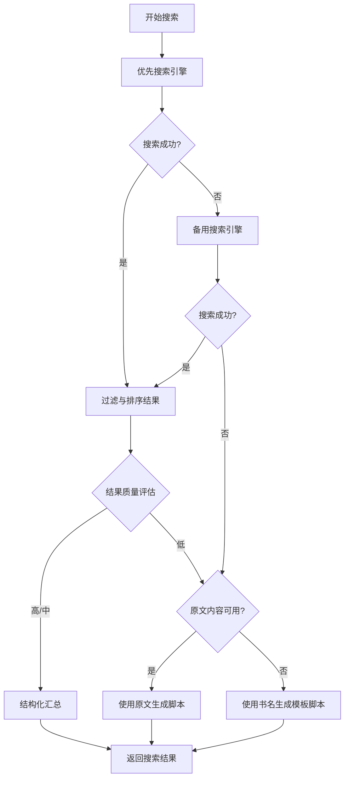

# 搜索功能优化设计

## 1. 背景与目标

### 1.1 当前问题
现有搜索功能(`SearchClient`)在联网检索书籍信息时存在以下问题：
- 搜索结果质量不稳定，可能检索到无关或低质量内容
- 搜索查询词构造简单，缺乏上下文语义优化
- 结果数量固定（默认3条），无法根据内容质量动态调整
- 缺少结果过滤与排序机制，可能混入广告或无效信息
- 单一搜索策略，无法处理不同类型书籍（中文书、外文书、古籍等）的差异化需求
- 搜索结果汇总格式单一，缺少对重复内容的去重处理
- 搜索失败时的回退机制不完善，影响整体流程鲁棒性

### 1.2 优化目标
- 提升搜索结果准确性：确保检索到的信息与书籍高度相关且有价值
- 增强搜索灵活性：支持不同书籍类型和查询场景的自适应策略
- 改善结果质量：通过过滤、去重、排序提升汇总信息质量
- 提高系统鲁棒性：完善异常处理和降级方案，确保流程可持续进行

## 2. 优化策略

### 2.1 查询词智能优化

#### 2.1.1 分层查询策略
根据书籍信息的完整度，采用不同的查询策略：

| 书籍信息完整度 | 查询策略 | 查询词示例 |
|---|---|---|
| 仅书名 | 基础查询 + 类型推断 | "{书名} 简介 作者 出版社" |
| 书名 + 作者 | 精确查询 | "{书名} {作者} 详细解读 核心观点" |
| 含章节内容 | 主题提取查询 | 从内容中提取关键词构造查询 |

#### 2.1.2 书籍类型识别
通过书名和内容特征自动识别书籍类型，并应用差异化查询策略：

| 书籍类型 | 识别特征 | 查询侧重点 |
|---|---|---|
| 经典文学 | 名著关键词、作者知名度 | 作品背景、文学价值、深度解读 |
| 实用工具书 | 技术、方法论关键词 | 核心方法、应用场景、实践案例 |
| 历史传记 | 人物名、历史时期 | 历史背景、人物评价、关键事件 |
| 古籍经典 | 古文特征、朝代关键词 | 原文注释、现代解读、文化背景 |

#### 2.1.3 查询词动态组合
根据搜索轮次动态调整查询词，避免重复检索相似内容：

```
第一轮（基础信息）: "{书名} 内容简介 作者 出版社"
第二轮（深度内容）: "{书名} 核心观点 精彩片段 推荐理由"
第三轮（读者反馈）: "{书名} 读后感 书评 影响力"
```

### 2.2 结果质量提升

#### 2.2.1 结果过滤机制
对搜索结果进行多维度质量评估，过滤低质内容：

| 过滤维度 | 判断标准 | 处理方式 |
|---|---|---|
| 内容长度 | 摘要少于20字符 | 直接过滤 |
| 关键词匹配度 | 未包含书名或相关关键词 | 降低权重或过滤 |
| 广告特征 | 包含"购买"、"优惠"等商业词汇 | 过滤或降权 |
| 内容完整性 | 包含"..."、"查看更多"等截断标记 | 标记为不完整，降低权重 |
| 来源可信度 | 来自知名文学网站、出版社官网 | 提升权重 |

#### 2.2.2 结果去重策略
避免汇总文本中出现重复或高度相似的内容：

| 去重类型 | 检测方法 | 处理策略 |
|---|---|---|
| 完全重复 | 字符串精确匹配 | 保留首次出现的结果 |
| 高度相似 | 计算文本相似度（>80%） | 合并为一条，取较长文本 |
| 包含关系 | 一段文本完全包含另一段 | 保留较长文本 |

#### 2.2.3 结果排序优化
对筛选后的结果按价值进行排序：

```
排序权重计算公式：
score = 内容长度权重(0.3) + 关键词匹配度(0.3) + 来源可信度(0.2) + 完整性(0.2)
```

### 2.3 搜索引擎增强

#### 2.3.1 多引擎协同策略
优化当前的 DuckDuckGo 和 Google 双引擎机制：

| 引擎 | 使用场景 | 优先级 |
|---|---|---|
| DuckDuckGo | 优先使用，隐私保护 | 第一顺位 |
| Google Search | DDG 失败时回退 | 第二顺位 |
| Bing Search | 前两者均失败时补充 | 第三顺位（可选） |

#### 2.3.2 搜索结果数量动态调整
根据结果质量动态调整检索数量：

| 场景 | 初始检索数 | 调整策略 |
|---|---|---|
| 常规书籍 | 3条 | 若有效结果<2条，追加检索3条 |
| 冷门书籍 | 5条 | 提高初始数量，提升成功率 |
| 外文书籍 | 5条 | 增加检索范围 |

#### 2.3.3 搜索超时与重试
为每个搜索引擎设置合理的超时和重试策略：

| 参数 | 取值 | 说明 |
|---|---|---|
| 单次请求超时 | 10秒 | 避免长时间阻塞 |
| 重试次数 | 2次 | 第一次失败后重试1次 |
| 重试间隔 | 随机1-3秒 | 避免触发反爬机制 |

### 2.4 结果汇总优化

#### 2.4.1 结构化汇总格式
改进汇总文本的组织结构，使其更易于LLM理解：

```
【书籍基本信息】
书名：{书名}
作者：{作者}
出版信息：{出版社、出版时间}

【内容简介】
{剧情概要、主题思想}

【核心观点/经典片段】
{精彩语录、核心论点}

【读者评价与影响力】
{书评、读后感、社会影响}
```

#### 2.4.2 内容长度控制
对汇总文本进行长度优化，确保在LLM上下文窗口内：

| 内容类型 | 长度限制 | 超出处理 |
|---|---|---|
| 基本信息 | 200字符 | 截断保留关键信息 |
| 内容简介 | 800字符 | 提取摘要，保留核心剧情 |
| 核心观点 | 600字符 | 优先保留金句和关键论点 |
| 读者评价 | 400字符 | 选择高质量评价，去除冗余 |
| 总计 | 2000字符 | 确保在LLM token限制内 |

#### 2.4.3 信息完整性标记
在汇总结果中标记信息完整度，供后续流程参考：

| 完整度等级 | 判断标准 | 后续处理建议 |
|---|---|---|
| 高（90%+） | 所有维度信息齐全 | 直接生成脚本 |
| 中（60-90%） | 缺少1-2个维度信息 | 补充默认信息后生成 |
| 低（<60%） | 多个维度信息缺失 | 降级使用原文或提示用户 |

### 2.5 异常处理与降级

#### 2.5.1 搜索失败降级策略
当搜索完全失败时，提供多层降级方案：



#### 2.5.2 部分成功处理
当仅部分查询成功时的处理策略：

| 成功项 | 失败项 | 处理方式 |
|---|---|---|
| 简介成功 | 语录失败 | 使用简介生成脚本，注明缺少语录 |
| 语录成功 | 简介失败 | 尝试从语录反推书籍主题 |
| 均失败 | - | 启用降级方案 |

#### 2.5.3 错误日志记录
详细记录搜索过程中的异常，便于问题排查：

| 记录内容 | 记录时机 | 用途 |
|---|---|---|
| 查询词与引擎 | 每次搜索尝试 | 分析哪些查询词效果好 |
| 搜索结果数量 | 每次搜索成功 | 评估引擎质量 |
| 过滤结果数量 | 过滤后 | 优化过滤规则 |
| 失败原因 | 搜索失败 | 定位网络或配置问题 |

## 3. 实现要点

### 3.1 核心模块改造

#### 3.1.1 SearchClient 结构调整
在现有 `SearchClient` 类的基础上增加以下能力模块：

| 模块 | 职责 | 对应方法 |
|---|---|---|
| 查询词优化 | 根据书籍信息生成优化的查询词 | `_build_optimized_query(book_info, query_type)` |
| 书籍类型识别 | 识别书籍类型并返回查询策略 | `_identify_book_type(book_name, content)` |
| 结果过滤 | 过滤低质量和无关结果 | `_filter_results(results, book_name)` |
| 结果去重 | 移除重复和高度相似的内容 | `_deduplicate_results(results)` |
| 结果排序 | 按质量分数排序 | `_sort_results(results, book_name)` |
| 结构化汇总 | 将结果组织为结构化格式 | `_format_structured_summary(results, book_name)` |

#### 3.1.2 数据流程


### 3.2 配置参数化

将搜索相关参数提取为可配置项，便于调优：

| 参数名称 | 默认值 | 说明 |
|---|---|---|
| `max_results_per_query` | 3 | 每次查询的最大结果数 |
| `min_snippet_length` | 20 | 摘要最小长度 |
| `similarity_threshold` | 0.8 | 去重相似度阈值 |
| `search_timeout` | 10 | 单次搜索超时（秒） |
| `retry_attempts` | 2 | 搜索重试次数 |
| `enable_bing_fallback` | false | 是否启用Bing作为第三备选 |
| `max_summary_length` | 2000 | 汇总文本最大长度 |

### 3.3 外部依赖

优化后需要的额外依赖：

| 依赖库 | 用途 | 是否必需 |
|---|---|---|
| `scikit-learn` 或 `sentence-transformers` | 计算文本相似度用于去重 | 推荐 |
| `nltk` 或 `jieba` | 中文分词，用于关键词提取 | 可选 |
| `requests` | 备用搜索引擎接口调用 | 已有 |

### 3.4 性能考虑

| 优化点 | 方案 | 预期效果 |
|---|---|---|
| 搜索并发 | 多引擎查询使用异步并发 | 减少30%搜索耗时 |
| 结果缓存 | 对相同书名的搜索结果缓存1小时 | 避免重复搜索 |
| 文本处理 | 使用高效算法（如快速字符串匹配） | 提升过滤和去重速度 |

## 4. 验证标准

### 4.1 功能验证

| 验证项 | 测试场景 | 预期结果 |
|---|---|---|
| 查询词优化 | 输入"小王子"、"The Little Prince"、"小王子 圣埃克苏佩里" | 生成差异化查询词 |
| 结果过滤 | 搜索结果包含广告、短文本 | 成功过滤低质内容 |
| 去重功能 | 多条结果内容高度重合 | 保留唯一或最优结果 |
| 降级机制 | 搜索完全失败 | 自动使用原文或模板 |
| 多引擎回退 | DDG失败 | 自动切换到Google |

### 4.2 质量验证

| 指标 | 当前基线 | 优化目标 |
|---|---|---|
| 搜索成功率 | 约70% | >85% |
| 有效结果占比 | 约60% | >80% |
| 汇总信息完整度 | 约50% | >70% |
| 搜索平均耗时 | 10-15秒 | <12秒 |

### 4.3 边界测试

| 边界场景 | 处理方式 |
|---|---|
| 极冷门书籍（搜索无结果） | 启用降级，使用原文或提示用户补充 |
| 外文书籍 | 识别语言，使用外文查询词 |
| 书名极短（如"道"） | 增加作者、类型等限定词 |
| 搜索引擎全部不可用 | 直接降级，记录错误日志 |
| 网络延迟严重 | 触发超时机制，快速失败并重试 |

## 5. 实施优先级

### 5.1 第一阶段（高优先级）
- 结果过滤机制：快速提升结果质量
- 去重处理：避免汇总文本冗余
- 结构化汇总：改善LLM输入质量
- 搜索超时与重试：提升系统鲁棒性

### 5.2 第二阶段（中优先级）
- 查询词智能优化：提升搜索准确性
- 书籍类型识别：支持差异化策略
- 结果排序优化：提升有效信息优先级
- 异常日志记录：便于问题排查

### 5.3 第三阶段（低优先级）
- 多引擎协同增强（如增加Bing）：进一步提升覆盖率
- 搜索结果缓存：优化性能
- 高级文本相似度计算：提升去重精度
- 并发搜索：减少耗时

## 6. 风险与应对

| 风险 | 影响 | 应对措施 |
|---|---|---|
| 搜索引擎API变更 | 搜索功能失效 | 保留多引擎备选，增加版本检测 |
| 反爬虫限制 | 搜索频繁失败 | 增加延时随机化，使用代理池（可选） |
| 文本相似度计算耗时 | 影响整体性能 | 使用轻量级算法或限制去重范围 |
| 第三方库兼容性 | 部署失败 | 将高级功能设为可选，保留基础能力 |
| 汇总文本过长 | 超出LLM限制 | 严格控制长度，实现智能截断 |

## 7. 兼容性

### 7.1 接口兼容
优化后的 `SearchClient` 保持向后兼容：
- `search_book_info(book_name)` 方法签名不变
- 返回格式保持为纯文本字符串
- 现有调用代码无需修改

### 7.2 扩展接口
为高级用户提供可选的增强接口：
- `search_book_info_detailed(book_info_dict)` - 接受更详细的书籍信息
- `search_with_options(book_name, options)` - 支持自定义搜索选项
| 经典文学 | 名著关键词、作者知名度 | 作品背景、文学价值、深度解读 |
| 实用工具书 | 技术、方法论关键词 | 核心方法、应用场景、实践案例 |
| 历史传记 | 人物名、历史时期 | 历史背景、人物评价、关键事件 |
| 古籍经典 | 古文特征、朝代关键词 | 原文注释、现代解读、文化背景 |

#### 2.1.3 查询词动态组合
根据搜索轮次动态调整查询词，避免重复检索相似内容：

```
第一轮（基础信息）: "{书名} 内容简介 作者 出版社"
第二轮（深度内容）: "{书名} 核心观点 精彩片段 推荐理由"
第三轮（读者反馈）: "{书名} 读后感 书评 影响力"
```

### 2.2 结果质量提升

#### 2.2.1 结果过滤机制
对搜索结果进行多维度质量评估，过滤低质内容：

| 过滤维度 | 判断标准 | 处理方式 |
|---|---|---|
| 内容长度 | 摘要少于20字符 | 直接过滤 |
| 关键词匹配度 | 未包含书名或相关关键词 | 降低权重或过滤 |
| 广告特征 | 包含"购买"、"优惠"等商业词汇 | 过滤或降权 |
| 内容完整性 | 包含"..."、"查看更多"等截断标记 | 标记为不完整，降低权重 |
| 来源可信度 | 来自知名文学网站、出版社官网 | 提升权重 |

#### 2.2.2 结果去重策略
避免汇总文本中出现重复或高度相似的内容：

| 去重类型 | 检测方法 | 处理策略 |
|---|---|---|
| 完全重复 | 字符串精确匹配 | 保留首次出现的结果 |
| 高度相似 | 计算文本相似度（>80%） | 合并为一条，取较长文本 |
| 包含关系 | 一段文本完全包含另一段 | 保留较长文本 |

#### 2.2.3 结果排序优化
对筛选后的结果按价值进行排序：

```
排序权重计算公式：
score = 内容长度权重(0.3) + 关键词匹配度(0.3) + 来源可信度(0.2) + 完整性(0.2)
```

### 2.3 搜索引擎增强

#### 2.3.1 多引擎协同策略
优化当前的 DuckDuckGo 和 Google 双引擎机制：

| 引擎 | 使用场景 | 优先级 |
|---|---|---|
| DuckDuckGo | 优先使用，隐私保护 | 第一顺位 |
| Google Search | DDG 失败时回退 | 第二顺位 |
| Bing Search | 前两者均失败时补充 | 第三顺位（可选） |

#### 2.3.2 搜索结果数量动态调整
根据结果质量动态调整检索数量：

| 场景 | 初始检索数 | 调整策略 |
|---|---|---|
| 常规书籍 | 3条 | 若有效结果<2条，追加检索3条 |
| 冷门书籍 | 5条 | 提高初始数量，提升成功率 |
| 外文书籍 | 5条 | 增加检索范围 |

#### 2.3.3 搜索超时与重试
为每个搜索引擎设置合理的超时和重试策略：

| 参数 | 取值 | 说明 |
|---|---|---|
| 单次请求超时 | 10秒 | 避免长时间阻塞 |
| 重试次数 | 2次 | 第一次失败后重试1次 |
| 重试间隔 | 随机1-3秒 | 避免触发反爬机制 |

### 2.4 结果汇总优化

#### 2.4.1 结构化汇总格式
改进汇总文本的组织结构，使其更易于LLM理解：

```
【书籍基本信息】
书名：{书名}
作者：{作者}
出版信息：{出版社、出版时间}

【内容简介】
{剧情概要、主题思想}

【核心观点/经典片段】
{精彩语录、核心论点}

【读者评价与影响力】
{书评、读后感、社会影响}
```

#### 2.4.2 内容长度控制
对汇总文本进行长度优化，确保在LLM上下文窗口内：

| 内容类型 | 长度限制 | 超出处理 |
|---|---|---|
| 基本信息 | 200字符 | 截断保留关键信息 |
| 内容简介 | 800字符 | 提取摘要，保留核心剧情 |
| 核心观点 | 600字符 | 优先保留金句和关键论点 |
| 读者评价 | 400字符 | 选择高质量评价，去除冗余 |
| 总计 | 2000字符 | 确保在LLM token限制内 |

#### 2.4.3 信息完整性标记
在汇总结果中标记信息完整度，供后续流程参考：

| 完整度等级 | 判断标准 | 后续处理建议 |
|---|---|---|
| 高（90%+） | 所有维度信息齐全 | 直接生成脚本 |
| 中（60-90%） | 缺少1-2个维度信息 | 补充默认信息后生成 |
| 低（<60%） | 多个维度信息缺失 | 降级使用原文或提示用户 |

### 2.5 异常处理与降级

#### 2.5.1 搜索失败降级策略
当搜索完全失败时，提供多层降级方案：


#### 2.5.2 部分成功处理
当仅部分查询成功时的处理策略：

| 成功项 | 失败项 | 处理方式 |
|---|---|---|
| 简介成功 | 语录失败 | 使用简介生成脚本，注明缺少语录 |
| 语录成功 | 简介失败 | 尝试从语录反推书籍主题 |
| 均失败 | - | 启用降级方案 |

#### 2.5.3 错误日志记录
详细记录搜索过程中的异常，便于问题排查：

| 记录内容 | 记录时机 | 用途 |
|---|---|---|
| 查询词与引擎 | 每次搜索尝试 | 分析哪些查询词效果好 |
| 搜索结果数量 | 每次搜索成功 | 评估引擎质量 |
| 过滤结果数量 | 过滤后 | 优化过滤规则 |
| 失败原因 | 搜索失败 | 定位网络或配置问题 |

## 3. 实现要点

### 3.1 核心模块改造

#### 3.1.1 SearchClient 结构调整
在现有 `SearchClient` 类的基础上增加以下能力模块：

| 模块 | 职责 | 对应方法 |
|---|---|---|
| 查询词优化 | 根据书籍信息生成优化的查询词 | `_build_optimized_query(book_info, query_type)` |
| 书籍类型识别 | 识别书籍类型并返回查询策略 | `_identify_book_type(book_name, content)` |
| 结果过滤 | 过滤低质量和无关结果 | `_filter_results(results, book_name)` |
| 结果去重 | 移除重复和高度相似的内容 | `_deduplicate_results(results)` |
| 结果排序 | 按质量分数排序 | `_sort_results(results, book_name)` |
| 结构化汇总 | 将结果组织为结构化格式 | `_format_structured_summary(results, book_name)` |

#### 3.1.2 数据流程


### 3.2 配置参数化

将搜索相关参数提取为可配置项，便于调优：

| 参数名称 | 默认值 | 说明 |
|---|---|---|
| `max_results_per_query` | 3 | 每次查询的最大结果数 |
| `min_snippet_length` | 20 | 摘要最小长度 |
| `similarity_threshold` | 0.8 | 去重相似度阈值 |
| `search_timeout` | 10 | 单次搜索超时（秒） |
| `retry_attempts` | 2 | 搜索重试次数 |
| `enable_bing_fallback` | false | 是否启用Bing作为第三备选 |
| `max_summary_length` | 2000 | 汇总文本最大长度 |

### 3.3 外部依赖

优化后需要的额外依赖：

| 依赖库 | 用途 | 是否必需 |
|---|---|---|
| `scikit-learn` 或 `sentence-transformers` | 计算文本相似度用于去重 | 推荐 |
| `nltk` 或 `jieba` | 中文分词，用于关键词提取 | 可选 |
| `requests` | 备用搜索引擎接口调用 | 已有 |

### 3.4 性能考虑

| 优化点 | 方案 | 预期效果 |
|---|---|---|
| 搜索并发 | 多引擎查询使用异步并发 | 减少30%搜索耗时 |
| 结果缓存 | 对相同书名的搜索结果缓存1小时 | 避免重复搜索 |
| 文本处理 | 使用高效算法（如快速字符串匹配） | 提升过滤和去重速度 |

## 4. 验证标准

### 4.1 功能验证

| 验证项 | 测试场景 | 预期结果 |
|---|---|---|
| 查询词优化 | 输入"小王子"、"The Little Prince"、"小王子 圣埃克苏佩里" | 生成差异化查询词 |
| 结果过滤 | 搜索结果包含广告、短文本 | 成功过滤低质内容 |
| 去重功能 | 多条结果内容高度重合 | 保留唯一或最优结果 |
| 降级机制 | 搜索完全失败 | 自动使用原文或模板 |
| 多引擎回退 | DDG失败 | 自动切换到Google |

### 4.2 质量验证

| 指标 | 当前基线 | 优化目标 |
|---|---|---|
| 搜索成功率 | 约70% | >85% |
| 有效结果占比 | 约60% | >80% |
| 汇总信息完整度 | 约50% | >70% |
| 搜索平均耗时 | 10-15秒 | <12秒 |

### 4.3 边界测试

| 边界场景 | 处理方式 |
|---|---|
| 极冷门书籍（搜索无结果） | 启用降级，使用原文或提示用户补充 |
| 外文书籍 | 识别语言，使用外文查询词 |
| 书名极短（如"道"） | 增加作者、类型等限定词 |
| 搜索引擎全部不可用 | 直接降级，记录错误日志 |
| 网络延迟严重 | 触发超时机制，快速失败并重试 |

## 5. 实施优先级

### 5.1 第一阶段（高优先级）
- 结果过滤机制：快速提升结果质量
- 去重处理：避免汇总文本冗余
- 结构化汇总：改善LLM输入质量
- 搜索超时与重试：提升系统鲁棒性

### 5.2 第二阶段（中优先级）
- 查询词智能优化：提升搜索准确性
- 书籍类型识别：支持差异化策略
- 结果排序优化：提升有效信息优先级
- 异常日志记录：便于问题排查

### 5.3 第三阶段（低优先级）
- 多引擎协同增强（如增加Bing）：进一步提升覆盖率
- 搜索结果缓存：优化性能
- 高级文本相似度计算：提升去重精度
- 并发搜索：减少耗时

## 6. 风险与应对

| 风险 | 影响 | 应对措施 |
|---|---|---|
| 搜索引擎API变更 | 搜索功能失效 | 保留多引擎备选，增加版本检测 |
| 反爬虫限制 | 搜索频繁失败 | 增加延时随机化，使用代理池（可选） |
| 文本相似度计算耗时 | 影响整体性能 | 使用轻量级算法或限制去重范围 |
| 第三方库兼容性 | 部署失败 | 将高级功能设为可选，保留基础能力 |
| 汇总文本过长 | 超出LLM限制 | 严格控制长度，实现智能截断 |

## 7. 兼容性

### 7.1 接口兼容
优化后的 `SearchClient` 保持向后兼容：
- `search_book_info(book_name)` 方法签名不变
- 返回格式保持为纯文本字符串
- 现有调用代码无需修改

### 7.2 扩展接口
为高级用户提供可选的增强接口：
- `search_book_info_detailed(book_info_dict)` - 接受更详细的书籍信息
- `search_with_options(book_name, options)` - 支持自定义搜索选项
| 经典文学 | 名著关键词、作者知名度 | 作品背景、文学价值、深度解读 |
| 实用工具书 | 技术、方法论关键词 | 核心方法、应用场景、实践案例 |
| 历史传记 | 人物名、历史时期 | 历史背景、人物评价、关键事件 |
| 古籍经典 | 古文特征、朝代关键词 | 原文注释、现代解读、文化背景 |

#### 2.1.3 查询词动态组合
根据搜索轮次动态调整查询词，避免重复检索相似内容：

```
第一轮（基础信息）: "{书名} 内容简介 作者 出版社"
第二轮（深度内容）: "{书名} 核心观点 精彩片段 推荐理由"
第三轮（读者反馈）: "{书名} 读后感 书评 影响力"
```

### 2.2 结果质量提升

#### 2.2.1 结果过滤机制
对搜索结果进行多维度质量评估，过滤低质内容：

| 过滤维度 | 判断标准 | 处理方式 |
|---|---|---|
| 内容长度 | 摘要少于20字符 | 直接过滤 |
| 关键词匹配度 | 未包含书名或相关关键词 | 降低权重或过滤 |
| 广告特征 | 包含"购买"、"优惠"等商业词汇 | 过滤或降权 |
| 内容完整性 | 包含"..."、"查看更多"等截断标记 | 标记为不完整，降低权重 |
| 来源可信度 | 来自知名文学网站、出版社官网 | 提升权重 |

#### 2.2.2 结果去重策略
避免汇总文本中出现重复或高度相似的内容：

| 去重类型 | 检测方法 | 处理策略 |
|---|---|---|
| 完全重复 | 字符串精确匹配 | 保留首次出现的结果 |
| 高度相似 | 计算文本相似度（>80%） | 合并为一条，取较长文本 |
| 包含关系 | 一段文本完全包含另一段 | 保留较长文本 |

#### 2.2.3 结果排序优化
对筛选后的结果按价值进行排序：

```
排序权重计算公式：
score = 内容长度权重(0.3) + 关键词匹配度(0.3) + 来源可信度(0.2) + 完整性(0.2)
```

### 2.3 搜索引擎增强

#### 2.3.1 多引擎协同策略
优化当前的 DuckDuckGo 和 Google 双引擎机制：

| 引擎 | 使用场景 | 优先级 |
|---|---|---|
| DuckDuckGo | 优先使用，隐私保护 | 第一顺位 |
| Google Search | DDG 失败时回退 | 第二顺位 |
| Bing Search | 前两者均失败时补充 | 第三顺位（可选） |

#### 2.3.2 搜索结果数量动态调整
根据结果质量动态调整检索数量：

| 场景 | 初始检索数 | 调整策略 |
|---|---|---|
| 常规书籍 | 3条 | 若有效结果<2条，追加检索3条 |
| 冷门书籍 | 5条 | 提高初始数量，提升成功率 |
| 外文书籍 | 5条 | 增加检索范围 |

#### 2.3.3 搜索超时与重试
为每个搜索引擎设置合理的超时和重试策略：

| 参数 | 取值 | 说明 |
|---|---|---|
| 单次请求超时 | 10秒 | 避免长时间阻塞 |
| 重试次数 | 2次 | 第一次失败后重试1次 |
| 重试间隔 | 随机1-3秒 | 避免触发反爬机制 |

### 2.4 结果汇总优化

#### 2.4.1 结构化汇总格式
改进汇总文本的组织结构，使其更易于LLM理解：

```
【书籍基本信息】
书名：{书名}
作者：{作者}
出版信息：{出版社、出版时间}

【内容简介】
{剧情概要、主题思想}

【核心观点/经典片段】
{精彩语录、核心论点}

【读者评价与影响力】
{书评、读后感、社会影响}
```

#### 2.4.2 内容长度控制
对汇总文本进行长度优化，确保在LLM上下文窗口内：

| 内容类型 | 长度限制 | 超出处理 |
|---|---|---|
| 基本信息 | 200字符 | 截断保留关键信息 |
| 内容简介 | 800字符 | 提取摘要，保留核心剧情 |
| 核心观点 | 600字符 | 优先保留金句和关键论点 |
| 读者评价 | 400字符 | 选择高质量评价，去除冗余 |
| 总计 | 2000字符 | 确保在LLM token限制内 |

#### 2.4.3 信息完整性标记
在汇总结果中标记信息完整度，供后续流程参考：

| 完整度等级 | 判断标准 | 后续处理建议 |
|---|---|---|
| 高（90%+） | 所有维度信息齐全 | 直接生成脚本 |
| 中（60-90%） | 缺少1-2个维度信息 | 补充默认信息后生成 |
| 低（<60%） | 多个维度信息缺失 | 降级使用原文或提示用户 |

### 2.5 异常处理与降级

#### 2.5.1 搜索失败降级策略
当搜索完全失败时，提供多层降级方案：


#### 2.5.2 部分成功处理
当仅部分查询成功时的处理策略：

| 成功项 | 失败项 | 处理方式 |
|---|---|---|
| 简介成功 | 语录失败 | 使用简介生成脚本，注明缺少语录 |
| 语录成功 | 简介失败 | 尝试从语录反推书籍主题 |
| 均失败 | - | 启用降级方案 |

#### 2.5.3 错误日志记录
详细记录搜索过程中的异常，便于问题排查：

| 记录内容 | 记录时机 | 用途 |
|---|---|---|
| 查询词与引擎 | 每次搜索尝试 | 分析哪些查询词效果好 |
| 搜索结果数量 | 每次搜索成功 | 评估引擎质量 |
| 过滤结果数量 | 过滤后 | 优化过滤规则 |
| 失败原因 | 搜索失败 | 定位网络或配置问题 |

## 3. 实现要点

### 3.1 核心模块改造

#### 3.1.1 SearchClient 结构调整
在现有 `SearchClient` 类的基础上增加以下能力模块：

| 模块 | 职责 | 对应方法 |
|---|---|---|
| 查询词优化 | 根据书籍信息生成优化的查询词 | `_build_optimized_query(book_info, query_type)` |
| 书籍类型识别 | 识别书籍类型并返回查询策略 | `_identify_book_type(book_name, content)` |
| 结果过滤 | 过滤低质量和无关结果 | `_filter_results(results, book_name)` |
| 结果去重 | 移除重复和高度相似的内容 | `_deduplicate_results(results)` |
| 结果排序 | 按质量分数排序 | `_sort_results(results, book_name)` |
| 结构化汇总 | 将结果组织为结构化格式 | `_format_structured_summary(results, book_name)` |

#### 3.1.2 数据流程


### 3.2 配置参数化

将搜索相关参数提取为可配置项，便于调优：

| 参数名称 | 默认值 | 说明 |
|---|---|---|
| `max_results_per_query` | 3 | 每次查询的最大结果数 |
| `min_snippet_length` | 20 | 摘要最小长度 |
| `similarity_threshold` | 0.8 | 去重相似度阈值 |
| `search_timeout` | 10 | 单次搜索超时（秒） |
| `retry_attempts` | 2 | 搜索重试次数 |
| `enable_bing_fallback` | false | 是否启用Bing作为第三备选 |
| `max_summary_length` | 2000 | 汇总文本最大长度 |

### 3.3 外部依赖

优化后需要的额外依赖：

| 依赖库 | 用途 | 是否必需 |
|---|---|---|
| `scikit-learn` 或 `sentence-transformers` | 计算文本相似度用于去重 | 推荐 |
| `nltk` 或 `jieba` | 中文分词，用于关键词提取 | 可选 |
| `requests` | 备用搜索引擎接口调用 | 已有 |

### 3.4 性能考虑

| 优化点 | 方案 | 预期效果 |
|---|---|---|
| 搜索并发 | 多引擎查询使用异步并发 | 减少30%搜索耗时 |
| 结果缓存 | 对相同书名的搜索结果缓存1小时 | 避免重复搜索 |
| 文本处理 | 使用高效算法（如快速字符串匹配） | 提升过滤和去重速度 |

## 4. 验证标准

### 4.1 功能验证

| 验证项 | 测试场景 | 预期结果 |
|---|---|---|
| 查询词优化 | 输入"小王子"、"The Little Prince"、"小王子 圣埃克苏佩里" | 生成差异化查询词 |
| 结果过滤 | 搜索结果包含广告、短文本 | 成功过滤低质内容 |
| 去重功能 | 多条结果内容高度重合 | 保留唯一或最优结果 |
| 降级机制 | 搜索完全失败 | 自动使用原文或模板 |
| 多引擎回退 | DDG失败 | 自动切换到Google |

### 4.2 质量验证

| 指标 | 当前基线 | 优化目标 |
|---|---|---|
| 搜索成功率 | 约70% | >85% |
| 有效结果占比 | 约60% | >80% |
| 汇总信息完整度 | 约50% | >70% |
| 搜索平均耗时 | 10-15秒 | <12秒 |

### 4.3 边界测试

| 边界场景 | 处理方式 |
|---|---|
| 极冷门书籍（搜索无结果） | 启用降级，使用原文或提示用户补充 |
| 外文书籍 | 识别语言，使用外文查询词 |
| 书名极短（如"道"） | 增加作者、类型等限定词 |
| 搜索引擎全部不可用 | 直接降级，记录错误日志 |
| 网络延迟严重 | 触发超时机制，快速失败并重试 |

## 5. 实施优先级

### 5.1 第一阶段（高优先级）
- 结果过滤机制：快速提升结果质量
- 去重处理：避免汇总文本冗余
- 结构化汇总：改善LLM输入质量
- 搜索超时与重试：提升系统鲁棒性

### 5.2 第二阶段（中优先级）
- 查询词智能优化：提升搜索准确性
- 书籍类型识别：支持差异化策略
- 结果排序优化：提升有效信息优先级
- 异常日志记录：便于问题排查

### 5.3 第三阶段（低优先级）
- 多引擎协同增强（如增加Bing）：进一步提升覆盖率
- 搜索结果缓存：优化性能
- 高级文本相似度计算：提升去重精度
- 并发搜索：减少耗时

## 6. 风险与应对

| 风险 | 影响 | 应对措施 |
|---|---|---|
| 搜索引擎API变更 | 搜索功能失效 | 保留多引擎备选，增加版本检测 |
| 反爬虫限制 | 搜索频繁失败 | 增加延时随机化，使用代理池（可选） |
| 文本相似度计算耗时 | 影响整体性能 | 使用轻量级算法或限制去重范围 |
| 第三方库兼容性 | 部署失败 | 将高级功能设为可选，保留基础能力 |
| 汇总文本过长 | 超出LLM限制 | 严格控制长度，实现智能截断 |

## 7. 兼容性

### 7.1 接口兼容
优化后的 `SearchClient` 保持向后兼容：
- `search_book_info(book_name)` 方法签名不变
- 返回格式保持为纯文本字符串
- 现有调用代码无需修改

### 7.2 扩展接口
为高级用户提供可选的增强接口：
- `search_book_info_detailed(book_info_dict)` - 接受更详细的书籍信息
- `search_with_options(book_name, options)` - 支持自定义搜索选项
