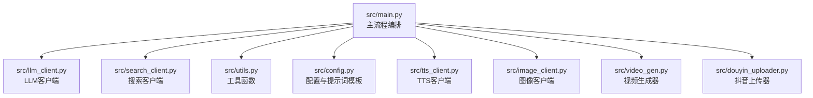
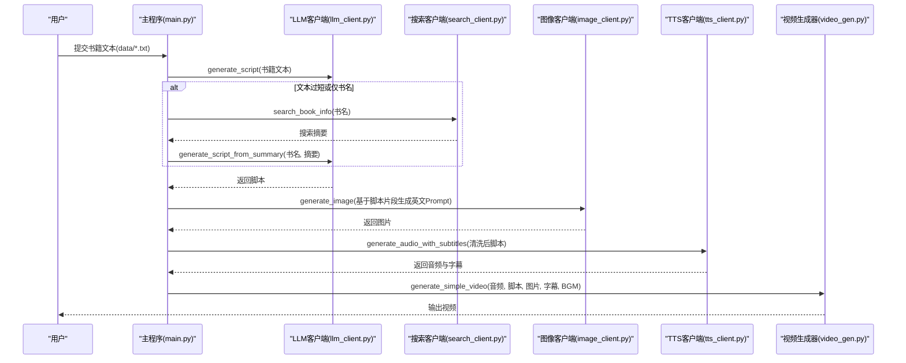
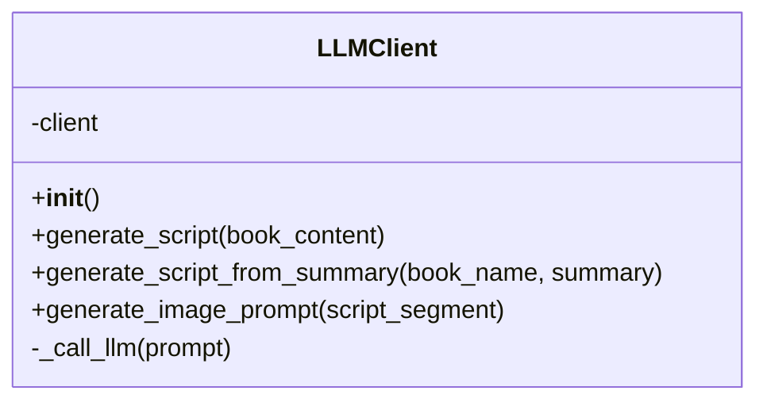
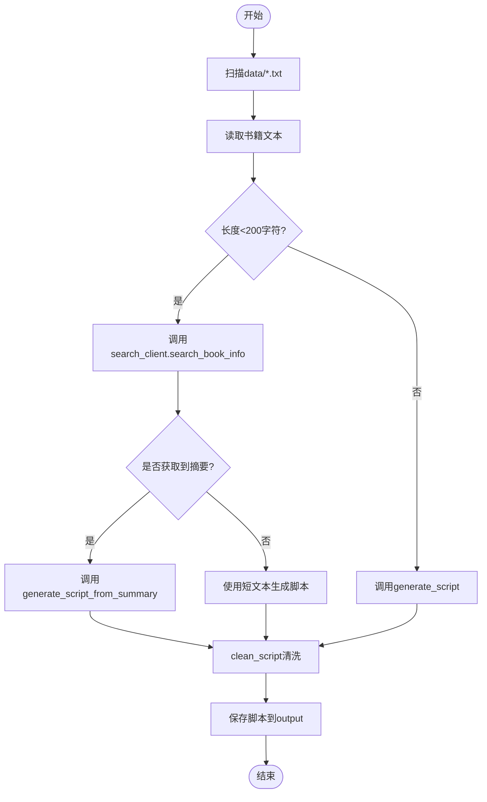
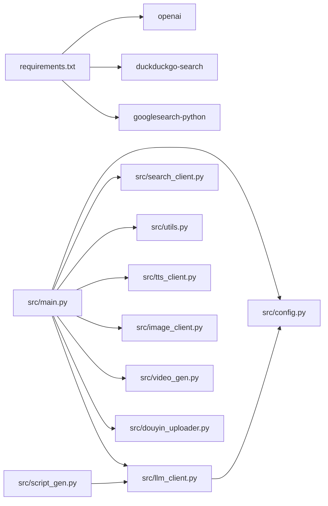

# LLM客户端模块

<cite>
**本文引用的文件**
- [src/llm_client.py](file://src/llm_client.py)
- [src/config.py](file://src/config.py)
- [src/main.py](file://src/main.py)
- [src/script_gen.py](file://src/script_gen.py)
- [src/search_client.py](file://src/search_client.py)
- [src/utils.py](file://src/utils.py)
- [requirements.txt](file://requirements.txt)
- [README.md](file://README.md)
</cite>

## 目录
1. [引言](#引言)
2. [项目结构](#项目结构)
3. [核心组件](#核心组件)
4. [架构总览](#架构总览)
5. [详细组件分析](#详细组件分析)
6. [依赖关系分析](#依赖关系分析)
7. [性能考虑](#性能考虑)
8. [故障排查指南](#故障排查指南)
9. [结论](#结论)
10. [附录](#附录)

## 引言
本文件围绕 src/llm_client.py 的实现，系统性梳理其如何封装对不同LLM提供商（SiliconFlow、OpenAI）的API调用，包括请求构建、响应解析与错误处理；详解脚本生成机制：如何将书籍文本分块、应用提示词模板（包含黄金3秒钩子、口语化要求）生成抖音风格文案；联网搜索功能（通过 search_client.py）如何补充书籍信息以增强脚本内容；以及AI绘画提示词（英文Prompt）的生成逻辑：如何从脚本片段提取视觉化关键词。同时提供调用示例的代码片段路径、提示工程最佳实践与性能优化建议（如流式响应、缓存）。

## 项目结构
该项目采用模块化设计，llm_client.py 作为统一的LLM客户端，负责文本生成与绘画提示词生成；main.py 作为主流程编排，串联脚本生成、图像生成、TTS、视频合成与上传；search_client.py 提供联网搜索能力；utils.py 提供脚本清洗与字幕解析工具；config.py 提供全局配置与提示词模板。

图表来源
- [src/main.py](file://src/main.py#L1-L262)
- [src/llm_client.py](file://src/llm_client.py#L1-L60)
- [src/search_client.py](file://src/search_client.py#L1-L113)
- [src/utils.py](file://src/utils.py#L1-L72)
- [src/config.py](file://src/config.py#L1-L93)

章节来源
- [README.md](file://README.md#L1-L134)
- [requirements.txt](file://requirements.txt#L1-L10)

## 核心组件
- LLMClient：封装OpenAI兼容客户端，支持三种主要能力：
  - generate_script：基于完整书籍文本生成抖音口播脚本
  - generate_script_from_summary：基于搜索摘要生成脚本
  - generate_image_prompt：基于脚本片段生成英文绘画提示词
- 配置与提示词模板：集中定义脚本生成、摘要脚本生成、绘画提示词生成的提示词模板，便于统一管理与迭代
- 主流程编排：在 main.py 中协调LLM、搜索、图像、TTS、视频与上传模块

章节来源
- [src/llm_client.py](file://src/llm_client.py#L1-L60)
- [src/config.py](file://src/config.py#L1-L93)
- [src/main.py](file://src/main.py#L1-L262)

## 架构总览
下图展示了从书籍文本到最终视频的端到端流程，重点体现LLM客户端在脚本生成与绘画提示词生成环节的作用。

图表来源
- [src/main.py](file://src/main.py#L102-L238)
- [src/llm_client.py](file://src/llm_client.py#L19-L55)
- [src/search_client.py](file://src/search_client.py#L11-L53)
- [src/utils.py](file://src/utils.py#L1-L23)

## 详细组件分析

### LLM客户端（llm_client.py）
- 初始化与配置
  - 从环境变量加载API密钥与基础URL，默认指向SiliconFlow兼容服务
  - 使用OpenAI SDK创建客户端实例
- 脚本生成
  - generate_script：将书籍文本注入脚本生成模板，调用内部通用方法完成请求与响应解析
  - generate_script_from_summary：将书名与搜索摘要注入摘要脚本模板，生成更深入的解读文案
- 绘画提示词生成
  - generate_image_prompt：从脚本片段抽取视觉关键词，生成英文Prompt，供图像客户端使用
- 请求构建与响应解析
  - 统一通过chat.completions.create发起请求，设置model、messages、temperature、max_tokens
  - 解析choices[0].message.content作为返回值
- 错误处理
  - 包裹在try/except中，捕获异常并打印错误信息，返回None，便于上层判断与降级策略

图表来源
- [src/llm_client.py](file://src/llm_client.py#L9-L55)

章节来源
- [src/llm_client.py](file://src/llm_client.py#L1-L60)

### 提示词模板与配置（config.py）
- 脚本生成模板：明确黄金3秒钩子、口语化要求、结构与格式约束
- 摘要脚本生成模板：强调从零散信息中拼凑核心脉络与看点
- 绘画提示词模板：要求英文输出、画面描述、风格一致性与简洁格式
- 全局配置：LLM基础URL、模型名、图像模型、TTS参数等

章节来源
- [src/config.py](file://src/config.py#L1-L93)

### 脚本生成流程（main.py）
- 输入扫描：遍历data目录下的.txt文件
- 文本预处理：截断过长文本（MVP阶段限制字符数），清洗脚本（去除Markdown标记等）
- 脚本生成策略：
  - 长文本：直接调用generate_script
  - 短文本或仅书名：触发联网搜索，使用search_client获取摘要，再调用generate_script_from_summary
- 输出：保存脚本至output目录

图表来源
- [src/main.py](file://src/main.py#L114-L159)
- [src/utils.py](file://src/utils.py#L1-L23)

章节来源
- [src/main.py](file://src/main.py#L114-L159)
- [src/utils.py](file://src/utils.py#L1-L23)

### 联网搜索（search_client.py）
- 多引擎回退策略：优先DuckDuckGo，失败则回退到Google Search
- 结果统一：兼容DDG与Google返回格式，提取摘要片段
- 容错与重试：随机延时、多后端尝试、异常捕获与空结果处理

章节来源
- [src/search_client.py](file://src/search_client.py#L1-L113)

### 绘画提示词生成（llm_client.py + config.py）
- 上下文截取：从清洗后的脚本前300字符抽取上下文
- Prompt生成：将脚本片段注入绘画提示词模板，得到英文Prompt
- 图像生成：由图像客户端消费该Prompt生成图片

章节来源
- [src/main.py](file://src/main.py#L167-L188)
- [src/llm_client.py](file://src/llm_client.py#L33-L38)
- [src/config.py](file://src/config.py#L76-L93)

## 依赖关系分析
- 外部依赖：openai、python-dotenv、duckduckgo-search、googlesearch-python等
- 内部耦合：
  - main.py 依赖 llm_client、search_client、utils、config、tts_client、image_client、video_gen、douyin_uploader
  - llm_client 依赖 config 中的提示词模板与模型配置
  - script_gen 作为独立脚本入口，依赖 llm_client 与数据/输出目录

图表来源
- [requirements.txt](file://requirements.txt#L1-L10)
- [src/main.py](file://src/main.py#L1-L64)
- [src/llm_client.py](file://src/llm_client.py#L1-L18)
- [src/script_gen.py](file://src/script_gen.py#L1-L18)

章节来源
- [requirements.txt](file://requirements.txt#L1-L10)
- [src/main.py](file://src/main.py#L1-L64)

## 性能考虑
- 请求参数调优
  - temperature：当前固定为0.7，平衡创造性与稳定性；可根据场景调整
  - max_tokens：当前上限为2000，避免超限；对长文本应分块或RAG
- 文本截断与分块
  - main.py 中对长文本进行截断（MVP阶段限制字符数），建议在生产环境采用分块+摘要+RAG策略
- 并发与重试
  - search_client 已具备多后端回退与重试机制，可进一步引入并发搜索与结果合并
- 缓存策略
  - 建议对LLM调用结果与搜索摘要进行本地缓存，减少重复请求
- 流式响应
  - 当前为一次性返回；若需实时展示，可在SDK支持的情况下启用流式响应，逐步输出并更新UI
- 资源与速率限制
  - 针对第三方API（如DDG、Google、LLM服务）设置合理的重试间隔与最大并发，避免触发限流

## 故障排查指南
- API密钥与基础URL
  - 若初始化时报错提示缺少API Key，检查环境变量配置与.env文件
- LLM调用异常
  - 捕获异常并返回None，上层应判断返回值并记录错误日志
- 搜索失败
  - 检查网络连通性与代理设置；确认DuckDuckGo与GoogleSearch库可用
- 脚本为空
  - clean_script清洗后为空，需检查LLM返回内容与清洗规则
- 图像生成失败
  - 检查生成的英文Prompt质量与图像客户端配置；可尝试简化Prompt或更换模型

章节来源
- [src/llm_client.py](file://src/llm_client.py#L40-L55)
- [src/main.py](file://src/main.py#L161-L188)
- [src/search_client.py](file://src/search_client.py#L74-L106)
- [src/utils.py](file://src/utils.py#L1-L23)

## 结论
llm_client.py 通过统一的OpenAI兼容客户端封装，实现了脚本生成与绘画提示词生成两大核心能力，并与搜索、图像、TTS、视频与上传模块协同工作，形成完整的抖音说书自动化流水线。通过提示词模板与严格的流程控制，确保生成内容符合抖音爆款逻辑与口语化表达。建议在生产环境中引入分块/RAG、缓存与流式响应等优化手段，持续提升稳定性与性能。

## 附录

### 调用示例（代码片段路径）
- 初始化LLM客户端并生成脚本
  - [src/main.py](file://src/main.py#L146-L159)
  - [src/llm_client.py](file://src/llm_client.py#L19-L24)
- 基于搜索摘要生成脚本
  - [src/main.py](file://src/main.py#L124-L133)
  - [src/llm_client.py](file://src/llm_client.py#L26-L31)
- 生成绘画提示词并生成图片
  - [src/main.py](file://src/main.py#L167-L188)
  - [src/llm_client.py](file://src/llm_client.py#L33-L38)
- 清洗脚本用于TTS
  - [src/utils.py](file://src/utils.py#L1-L23)

### 提示工程最佳实践
- 明确角色与约束：在system消息中设定专业助手角色，限定输出格式与风格
- 结构化提示词：使用清晰的标题、编号与示例，降低歧义
- 上下文控制：对长文本进行分块与摘要，避免上下文溢出
- 反馈循环：对生成结果进行人工校验与微调，持续优化模板

### 性能优化建议
- 分块与RAG：对超长文本采用分块+摘要策略，减少token消耗
- 缓存：对LLM与搜索结果进行本地缓存，提高重复任务效率
- 并发与重试：合理设置并发度与重试间隔，提升整体吞吐
- 流式响应：在支持的SDK中启用流式输出，改善用户体验