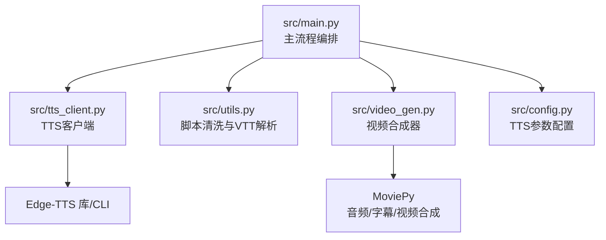
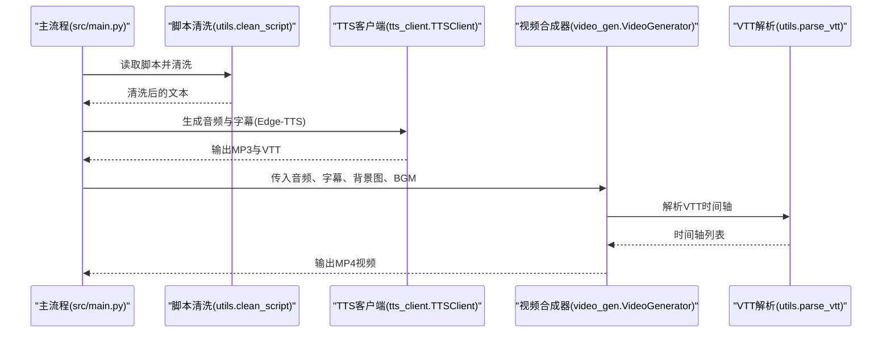
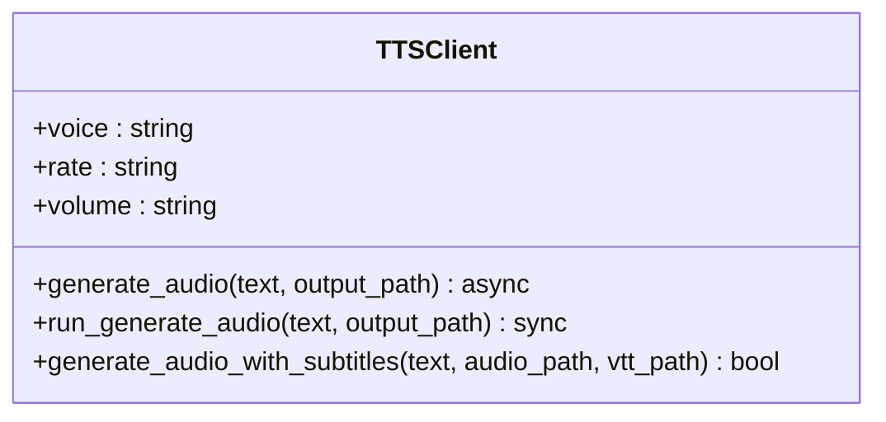
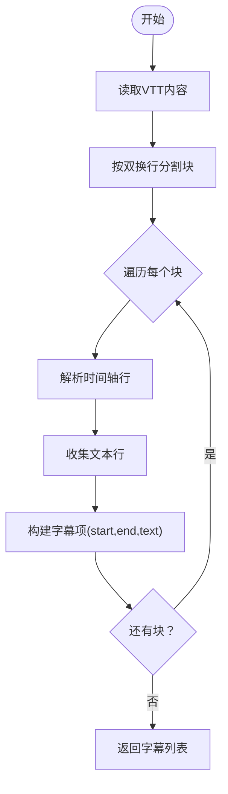
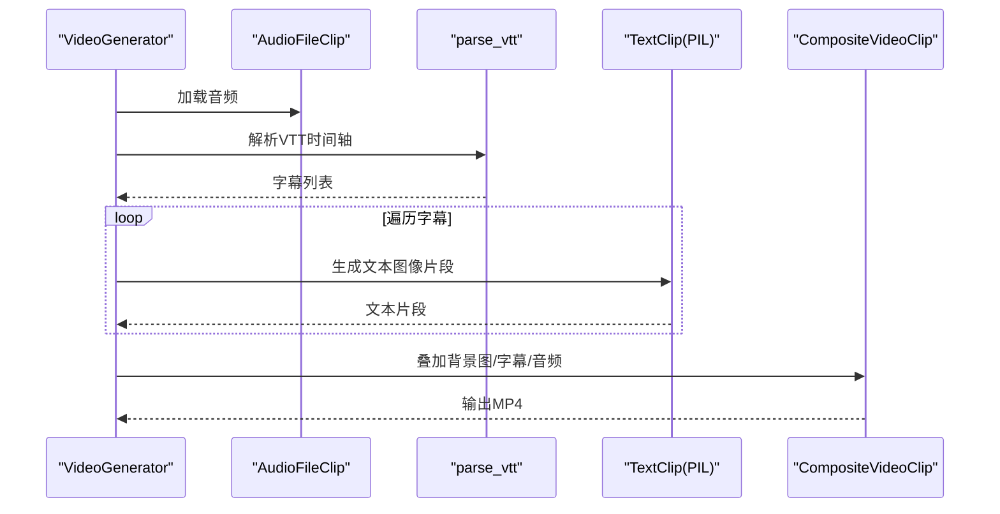
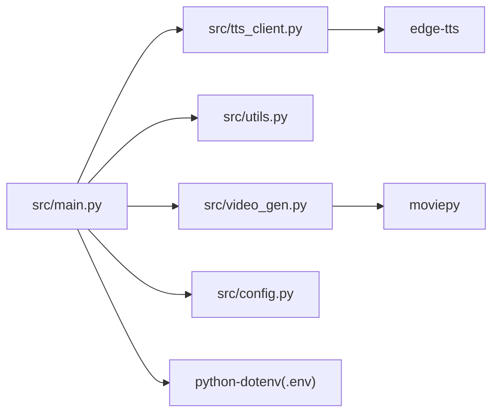

# TTS与字幕生成模块

<cite>
**本文引用的文件**
- [src/main.py](file://src/main.py)
- [src/tts_client.py](file://src/tts_client.py)
- [src/utils.py](file://src/utils.py)
- [src/video_gen.py](file://src/video_gen.py)
- [src/config.py](file://src/config.py)
- [requirements.txt](file://requirements.txt)
- [README.md](file://README.md)
</cite>

## 目录
1. [引言](#引言)
2. [项目结构](#项目结构)
3. [核心组件](#核心组件)
4. [架构总览](#架构总览)
5. [详细组件分析](#详细组件分析)
6. [依赖关系分析](#依赖关系分析)
7. [性能考量](#性能考量)
8. [故障排查指南](#故障排查指南)
9. [结论](#结论)

## 引言
本文件聚焦于TTS与字幕生成模块的技术实现，围绕以下目标展开：
- 解释src/tts_client.py如何调用Edge-TTS命令行工具或库，将清洗后的脚本文本转换为高质量的MP3语音文件。
- 重点描述VTT字幕文件的生成过程，包括如何获取每个单词或句子的时间戳以实现精确的音画同步。
- 讨论语音参数配置（voice、rate、volume）对输出效果的影响。
- 提供处理长文本的分段合成与拼接策略。
- 说明生成的音频和VTT文件如何被后续的视频合成模块消费。
- 包含调试技巧，如如何验证字幕时间轴的准确性。

## 项目结构
本项目采用“功能模块化+流水线”的组织方式，TTS与字幕生成位于主流程的第三步，紧随脚本生成之后，为视频合成阶段提供音频与字幕数据。

图表来源
- [src/main.py](file://src/main.py#L1-L262)
- [src/tts_client.py](file://src/tts_client.py#L1-L80)
- [src/utils.py](file://src/utils.py#L1-L72)
- [src/video_gen.py](file://src/video_gen.py#L1-L162)
- [src/config.py](file://src/config.py#L1-L93)

章节来源
- [src/main.py](file://src/main.py#L1-L262)
- [README.md](file://README.md#L64-L90)

## 核心组件
- TTS客户端：封装Edge-TTS库与CLI两种调用方式，支持异步与同步接口；负责生成MP3音频与VTT字幕。
- 脚本清洗工具：移除Markdown标记、标题与多余空白，确保TTS输入质量。
- VTT解析工具：将VTT字幕文件解析为时间轴列表，供视频合成器使用。
- 视频合成器：加载音频、解析VTT、生成字幕片段并合成最终视频。
- 配置中心：集中管理TTS音色、语速、音量等参数。

章节来源
- [src/tts_client.py](file://src/tts_client.py#L1-L80)
- [src/utils.py](file://src/utils.py#L1-L72)
- [src/video_gen.py](file://src/video_gen.py#L1-L162)
- [src/config.py](file://src/config.py#L1-L93)

## 架构总览
TTS与字幕生成在主流程中的位置如下：

图表来源
- [src/main.py](file://src/main.py#L161-L239)
- [src/tts_client.py](file://src/tts_client.py#L33-L70)
- [src/utils.py](file://src/utils.py#L24-L72)
- [src/video_gen.py](file://src/video_gen.py#L20-L101)

## 详细组件分析

### TTS客户端（src/tts_client.py）
- 功能职责
  - 封装Edge-TTS库的Communicate接口，支持异步生成MP3音频。
  - 提供同步包装方法，便于在主流程中直接调用。
  - 通过Edge-TTS CLI生成带时间轴的VTT字幕，更可靠地实现音画同步。
- 关键实现要点
  - 参数化配置：voice、rate、volume在构造函数中注入，影响发音音色、语速与音量。
  - 异步接口：generate_audio使用edge_tts.Communicate并异步保存音频。
  - CLI集成：generate_audio_with_subtitles通过子进程调用python -m edge_tts，将文本写入临时文件，同时输出MP3与VTT。
  - 错误处理：捕获子进程异常并清理临时文件，返回布尔值表示成功与否。
- 与主流程交互
  - 主流程在第三步调用generate_audio_with_subtitles，产出audio与vtt两个文件，供后续视频合成使用。

图表来源
- [src/tts_client.py](file://src/tts_client.py#L1-L80)

章节来源
- [src/tts_client.py](file://src/tts_client.py#L1-L80)
- [src/main.py](file://src/main.py#L193-L206)

### 脚本清洗与VTT解析（src/utils.py）
- 脚本清洗（clean_script）
  - 移除Markdown加粗、标题与多余空白，保留口语化、可读性强的文本。
  - 为TTS提供干净的输入，减少非必要符号带来的发音问题。
- VTT解析（parse_vtt）
  - 读取VTT文件，按双换行分割字幕块，解析时间轴与文本。
  - parse_time支持毫秒与逗号分隔符，统一转换为秒级浮点数。
  - 返回结构化的字幕列表，供视频合成器逐条渲染。

图表来源
- [src/utils.py](file://src/utils.py#L24-L72)

章节来源
- [src/utils.py](file://src/utils.py#L1-L72)

### 视频合成器（src/video_gen.py）
- 功能职责
  - 加载音频并计算时长，混合背景音乐（可选）。
  - 若提供VTT路径，解析字幕并逐条生成文本图像片段，按时间轴叠加到视频上。
  - 最终合成输出MP4视频。
- 关键实现要点
  - parse_vtt由utils模块提供，返回字幕列表。
  - 文本片段使用PIL绘制，MoviePy合成字幕与背景图，最终附带音频。
  - 对超出音频时长的字幕进行裁剪，保证字幕与音频严格对齐。
- 与TTS/VTT的衔接
  - 主流程将audio与vtt路径传递给视频合成器，后者据此渲染字幕层。

图表来源
- [src/video_gen.py](file://src/video_gen.py#L20-L101)
- [src/utils.py](file://src/utils.py#L24-L72)

章节来源
- [src/video_gen.py](file://src/video_gen.py#L1-L162)

### 配置中心（src/config.py）
- TTS参数
  - TTS_VOICE：默认男声，可切换女声或其他可用音色。
  - TTS_RATE：语速调节，支持正负百分比。
  - TTS_VOLUME：音量调节，支持正负百分比。
- 其他配置
  - LLM、图像生成、提示词模板等，为脚本生成提供上下文。

章节来源
- [src/config.py](file://src/config.py#L1-L93)
- [src/main.py](file://src/main.py#L50-L60)

## 依赖关系分析
- 外部依赖
  - edge-tts：提供TTS能力与VTT时间轴生成。
  - moviepy：提供音频/视频/字幕合成能力。
  - python-dotenv：加载环境变量，支撑LLM与TTS配置。
- 内部依赖
  - main.py依赖tts_client、utils、video_gen、config等模块。
  - video_gen依赖utils.parse_vtt。
  - tts_client依赖edge_tts与subprocess。

图表来源
- [src/main.py](file://src/main.py#L1-L262)
- [requirements.txt](file://requirements.txt#L1-L10)

章节来源
- [requirements.txt](file://requirements.txt#L1-L10)
- [src/main.py](file://src/main.py#L1-L262)

## 性能考量
- 长文本处理
  - 当前脚本生成阶段对超长文本进行截断（示例上限约10000字符），避免LLM调用开销过大与token溢出风险。
  - 若需进一步提升吞吐，可在TTS侧增加分段合成策略：将长文本按句/段切分，分别生成音频与VTT，再在视频合成阶段进行时间轴拼接。
- 并发与I/O
  - TTS异步接口可用于并发批量生成，但当前主流程按文件串行处理，建议在多文件场景下考虑并发队列。
- 音画同步精度
  - 使用Edge-TTS CLI生成的VTT具备逐词/逐句时间戳，优于手动分段；若需更高精度，可结合外部时间对齐工具或调整TTS参数以改善韵律一致性。

[本节为通用性能建议，不直接分析具体文件]

## 故障排查指南
- TTS生成失败
  - 检查Edge-TTS安装与版本兼容性；确认CLI命令参数正确（voice、rate、volume）。
  - 查看子进程错误输出，定位网络或权限问题。
  - 清理临时文本文件残留，避免重复运行导致冲突。
- 字幕时间轴不准确
  - 验证VTT文件格式是否符合标准，时间轴分隔符是否为逗号或点号。
  - 在视频合成阶段打印解析到的字幕数量与起止时间，核对与音频时长是否匹配。
  - 若出现超时或越界，检查视频合成器对超出音频时长的字幕裁剪逻辑。
- 音频与字幕不同步
  - 确认TTS参数（rate、volume）未过度调整导致语速异常，从而影响时间轴。
  - 如需微调，先在小样本上验证VTT时间轴与音频播放的对齐情况。

章节来源
- [src/tts_client.py](file://src/tts_client.py#L33-L70)
- [src/utils.py](file://src/utils.py#L24-L72)
- [src/video_gen.py](file://src/video_gen.py#L69-L91)

## 结论
本模块通过TTS客户端与VTT解析工具，实现了从清洗脚本到高质量音频与时间轴字幕的完整链路，并与视频合成器无缝衔接，最终输出音画同步的视频内容。实践中建议：
- 使用Edge-TTS CLI生成VTT以获得可靠的逐词/逐句时间轴。
- 对长文本采用分段合成与拼接策略，平衡生成质量与时长。
- 在调试阶段重点关注VTT解析与字幕裁剪逻辑，确保与音频严格对齐。

[本节为总结性内容，不直接分析具体文件]