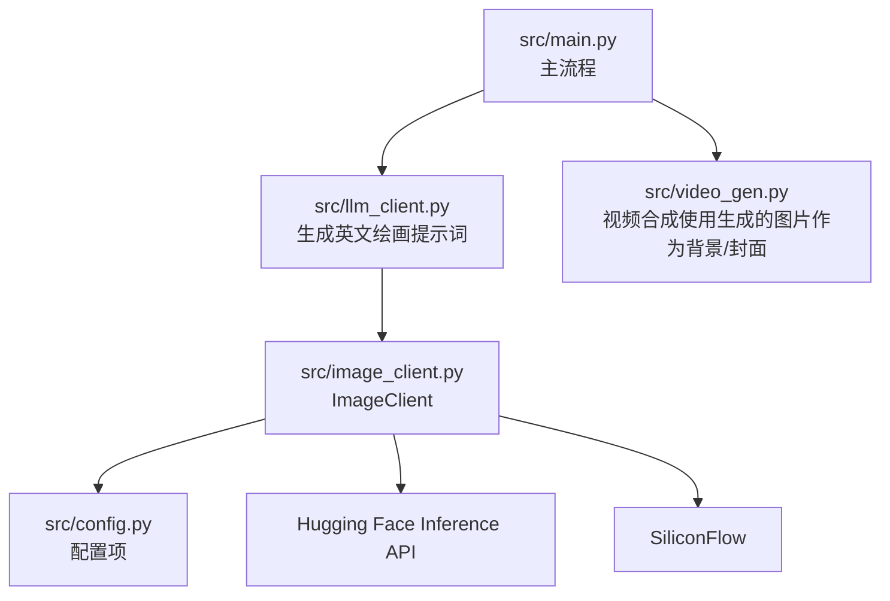
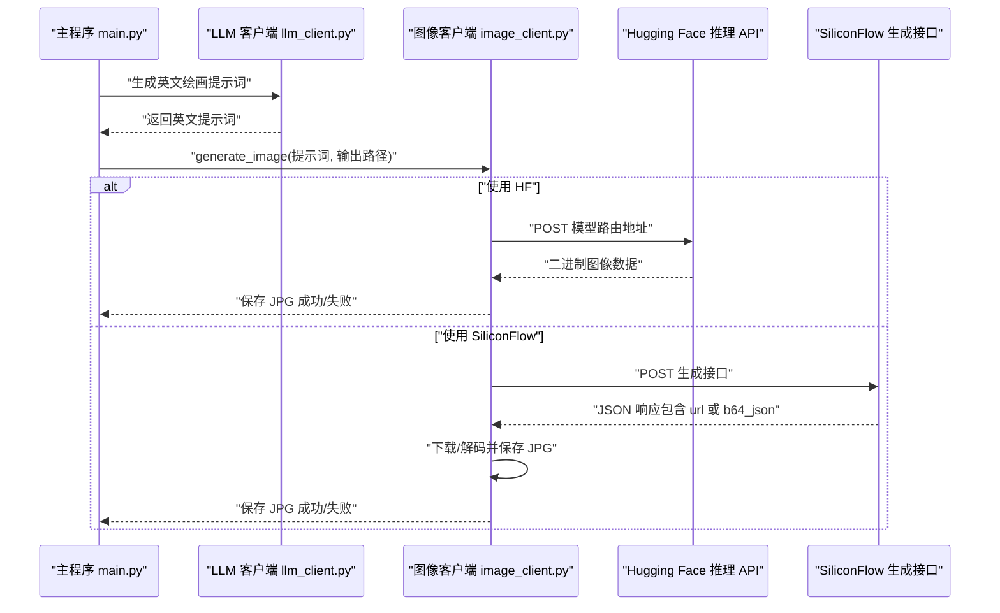
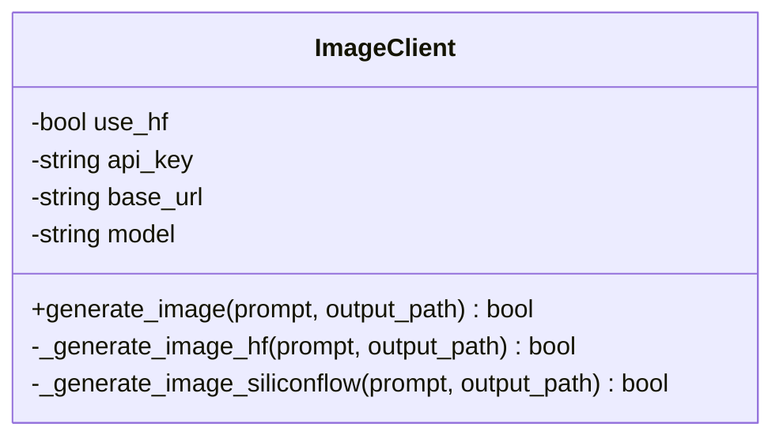
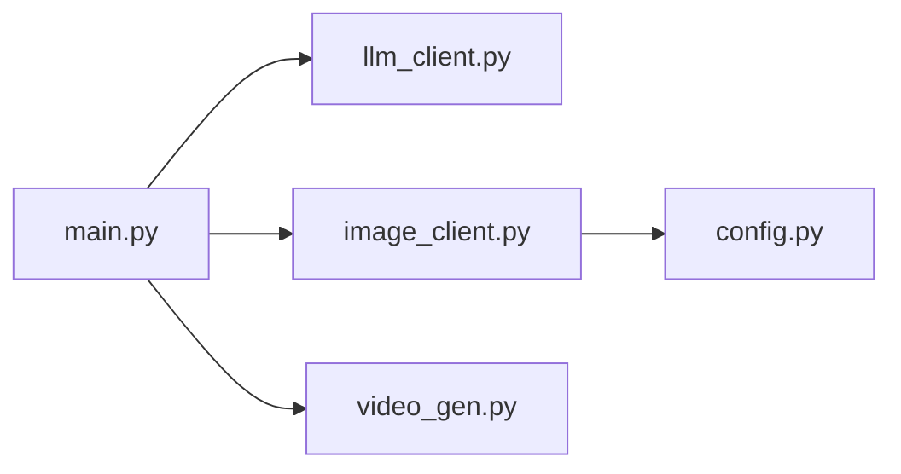

# 图像生成模块

<cite>
**本文引用的文件列表**
- [src/image_client.py](file://src/image_client.py)
- [src/main.py](file://src/main.py)
- [src/config.py](file://src/config.py)
- [src/llm_client.py](file://src/llm_client.py)
- [src/video_gen.py](file://src/video_gen.py)
- [README.md](file://README.md)
- [requirements.txt](file://requirements.txt)
</cite>

## 目录
1. [引言](#引言)
2. [项目结构](#项目结构)
3. [核心组件](#核心组件)
4. [架构总览](#架构总览)
5. [详细组件分析](#详细组件分析)
6. [依赖关系分析](#依赖关系分析)
7. [性能考量](#性能考量)
8. [故障排查指南](#故障排查指南)
9. [结论](#结论)
10. [附录](#附录)

## 引言
本文件面向“图像生成模块”的使用者与维护者，围绕 src/image_client.py 展开，系统阐述其如何支持多后端 AI 图像生成服务（优先 Hugging Face Inference API，备选 SiliconFlow），以及从 LLM 生成的英文提示词到最终 JPG 图片的完整流程。文档还覆盖 API 请求构造、参数设置（如尺寸、步数）、响应处理、错误处理与重试策略、图片在视频中的应用方式，以及优化图像质量与生成速度的建议，并说明如何扩展以支持更多图像生成模型。

## 项目结构
图像生成模块位于 src/image_client.py，是主流程 src/main.py 中“图像生成”步骤的关键参与者。它依赖 src/config.py 提供的配置项（如 API Key、基础 URL、模型名、图像尺寸、HF Token），并与 LLM 客户端交互以获得英文绘画提示词，随后调用后端服务生成图片并保存为 JPG。

图表来源
- [src/main.py](file://src/main.py#L167-L188)
- [src/llm_client.py](file://src/llm_client.py#L33-L38)
- [src/image_client.py](file://src/image_client.py#L37-L121)
- [src/config.py](file://src/config.py#L12-L19)
- [src/video_gen.py](file://src/video_gen.py#L20-L96)

章节来源
- [src/main.py](file://src/main.py#L167-L188)
- [src/image_client.py](file://src/image_client.py#L12-L36)
- [src/config.py](file://src/config.py#L12-L19)

## 核心组件
- ImageClient 类：封装图像生成的统一入口，负责根据配置选择后端（HF 或 SiliconFlow），构造请求，处理响应，并将结果保存为 JPG。
- 关键字段与方法
  - 字段：use_hf（是否使用 HF）、api_key、base_url、model
  - 方法：generate_image、_generate_image_hf、_generate_image_siliconflow
- 选择策略
  - 若配置了 HF_TOKEN 且 IMAGE_MODEL 包含特定关键词，则优先使用 HF 推理 API；否则回退到 SiliconFlow。
  - 若未配置 API_KEY 且 IMAGE_MODEL 为 HF 模型，将尝试公共 HF 推理 API（可能受限）。
- 请求与响应
  - HF：向模型路由地址发起 POST，接收二进制图像数据，保存为 JPG。
  - SiliconFlow：向生成接口发送 JSON，解析返回的 data 数组，支持 url 或 b64_json 两种形式，下载并保存为 JPG。
- 错误处理
  - 统一捕获异常，打印错误信息；HF 模式下若返回非 JSON，尝试打印文本内容；SiliconFlow 模式下若返回格式异常，打印原始响应并返回失败。

章节来源
- [src/image_client.py](file://src/image_client.py#L12-L36)
- [src/image_client.py](file://src/image_client.py#L37-L71)
- [src/image_client.py](file://src/image_client.py#L73-L121)

## 架构总览
图像生成在主流程中的位置如下：主程序读取书籍文本，调用 LLM 生成英文绘画提示词，再调用 ImageClient 生成图片，最终将图片作为视频背景或封面使用。

图表来源
- [src/main.py](file://src/main.py#L167-L188)
- [src/llm_client.py](file://src/llm_client.py#L33-L38)
- [src/image_client.py](file://src/image_client.py#L37-L121)

## 详细组件分析

### ImageClient 类设计与关系

图表来源
- [src/image_client.py](file://src/image_client.py#L12-L36)
- [src/image_client.py](file://src/image_client.py#L37-L121)

章节来源
- [src/image_client.py](file://src/image_client.py#L12-L36)
- [src/image_client.py](file://src/image_client.py#L37-L121)

### 从提示词到图片的完整流程
- 输入：英文绘画提示词（由 LLM 生成）
- 选择后端：依据配置与模型名决定 HF 或 SiliconFlow
- HF 模式
  - 构造请求：向模型路由地址 POST，请求头包含 Content-Type，若存在 HF_TOKEN 则附加 Authorization。
  - 发送负载：payload 为 { "inputs": 提示词 }。
  - 响应处理：直接读取二进制响应，使用 PIL 打开并保存为 JPG。
- SiliconFlow 模式
  - 构造请求：向生成接口 POST，请求头包含 Authorization、Content-Type。
  - 发送负载：包含 model、prompt、image_size、batch_size、num_inference_steps、guidance_scale 等参数。
  - 响应处理：解析 JSON，若 data[0] 含 url 则下载图片，若含 b64_json 则解码后保存；否则打印异常格式并返回失败。
- 输出：JPG 文件保存至指定路径

章节来源
- [src/image_client.py](file://src/image_client.py#L46-L71)
- [src/image_client.py](file://src/image_client.py#L73-L121)
- [src/llm_client.py](file://src/llm_client.py#L33-L38)

### API 请求与参数设置
- HF 模式
  - URL：基于 base_url 与 model 拼接的模型路由地址
  - 头部：Content-Type；可选 Authorization（HF_TOKEN）
  - 负载：inputs 为英文提示词
- SiliconFlow 模式
  - URL：基于 base_url 的 images/generations
  - 头部：Authorization（API_KEY）、Content-Type
  - 负载：model、prompt、image_size、batch_size、num_inference_steps、guidance_scale
- 全局配置
  - IMAGE_MODEL、IMAGE_SIZE、HF_TOKEN、API_KEY、BASE_URL 均来自配置文件

章节来源
- [src/image_client.py](file://src/image_client.py#L46-L71)
- [src/image_client.py](file://src/image_client.py#L73-L121)
- [src/config.py](file://src/config.py#L12-L19)

### 错误处理与重试策略
- 统一异常捕获：在 HF 与 SiliconFlow 两套分支均使用 try/except 捕获异常并打印错误信息。
- HF 模式：若底层请求失败，尝试打印 JSON 错误或文本内容，便于定位问题。
- SiliconFlow 模式：若返回格式不符合预期（缺少 url 或 b64_json），打印原始响应并返回失败。
- 重试策略：当前实现未内置重试逻辑。建议在上层调用处增加指数退避重试，或在业务层对失败的图片生成进行降级处理（例如使用默认背景图）。

章节来源
- [src/image_client.py](file://src/image_client.py#L54-L71)
- [src/image_client.py](file://src/image_client.py#L116-L121)

### 图片在视频中的应用
- 作为背景图：主程序在合成视频时，优先使用生成的 AI 图片作为背景；若不存在则使用 data/background.jpg；若仍不存在则使用黑色背景。
- 作为封面：主程序在上传至抖音时，可将生成的图片作为视频封面。
- 视频合成细节：VideoGenerator 会将音频与背景图合成视频，支持叠加字幕与背景音乐。

章节来源
- [src/main.py](file://src/main.py#L209-L239)
- [src/video_gen.py](file://src/video_gen.py#L20-L96)

### 优化图像质量与生成速度的建议
- 选择合适模型与尺寸
  - IMAGE_MODEL：优先选择高质量模型（如稳定扩散系列），并在配置中调整 IMAGE_SIZE 以平衡清晰度与生成耗时。
- 控制推理步数与引导强度
  - num_inference_steps：步数越多通常质量越高但耗时越长；guidance_scale：数值越大越贴合提示词但可能引入伪影。
- 降低并发与批量
  - batch_size：当前固定为 1，避免资源争用；如需并发可在上层队列化处理。
- 缓存与降级
  - 对相同提示词的结果进行缓存，减少重复请求。
  - 失败时回退到默认背景图或静态颜色背景，保证流程可用性。
- 网络与速率限制
  - HF Token：配置 HF_TOKEN 可提升速率限制；若使用公共 HF 推理 API，注意限流风险。

章节来源
- [src/image_client.py](file://src/image_client.py#L81-L88)
- [src/config.py](file://src/config.py#L12-L19)

### 扩展以支持更多图像生成模型
- 新增后端
  - 在 __init__ 中新增判断条件，根据新的后端特征（如特定关键字或环境变量）切换到新后端。
  - 实现 _generate_image_xxx 方法，遵循现有请求/响应处理模式。
- 统一接口
  - 保持 generate_image(prompt, output_path) 返回布尔值，便于上层流程统一处理。
- 配置管理
  - 在 config.py 中新增对应环境变量与默认值，确保部署一致性。
- 参数适配
  - 针对不同后端的参数差异（如步数、引导强度、尺寸），在 _generate_image_xxx 内进行差异化设置。

章节来源
- [src/image_client.py](file://src/image_client.py#L12-L36)
- [src/image_client.py](file://src/image_client.py#L37-L121)
- [src/config.py](file://src/config.py#L12-L19)

## 依赖关系分析
- 模块间依赖
  - main.py 依赖 llm_client.py 生成英文提示词，再调用 image_client.py 生成图片。
  - image_client.py 依赖 config.py 提供的 API Key、基础 URL、模型名、尺寸与 HF Token。
  - video_gen.py 在合成视频时使用生成的图片作为背景。
- 外部依赖
  - requests：用于 HTTP 请求。
  - PIL：用于打开与保存图像。
  - MoviePy：用于视频合成（间接影响图片使用）。

图表来源
- [src/main.py](file://src/main.py#L167-L188)
- [src/llm_client.py](file://src/llm_client.py#L33-L38)
- [src/image_client.py](file://src/image_client.py#L12-L36)
- [src/config.py](file://src/config.py#L12-L19)
- [src/video_gen.py](file://src/video_gen.py#L20-L96)

章节来源
- [src/main.py](file://src/main.py#L167-L188)
- [src/llm_client.py](file://src/llm_client.py#L33-L38)
- [src/image_client.py](file://src/image_client.py#L12-L36)
- [src/config.py](file://src/config.py#L12-L19)
- [src/video_gen.py](file://src/video_gen.py#L20-L96)

## 性能考量
- 生成耗时
  - 步数与引导强度直接影响耗时与质量；建议在开发阶段调参，在生产阶段固定参数以稳定性能。
- 网络与并发
  - 单次请求为主，建议在上层进行队列化与限速，避免触发后端限流。
- I/O 与内存
  - 图像下载与解码为内存操作，建议在失败时及时释放资源，避免长时间占用。
- 降级策略
  - 当图片生成失败时，使用默认背景图可显著缩短整体耗时并保证产出。

## 故障排查指南
- 常见问题
  - API Key 缺失：检查 .env 中的 API_KEY/HF_TOKEN 是否正确配置。
  - 模型不可用：确认 IMAGE_MODEL 是否在所选后端可用。
  - 响应格式异常：检查 SiliconFlow 返回的 data 结构，确保包含 url 或 b64_json。
  - 网络超时/限流：提高请求超时阈值或增加重试次数。
- 定位手段
  - 打印错误信息与响应内容，便于快速定位问题。
  - 在上层对失败的图片生成进行降级处理（使用默认背景图）。
- 参考路径
  - HF 模式错误处理与响应打印
  - SiliconFlow 模式错误处理与响应打印
  - 主流程中对图片生成失败的降级逻辑

章节来源
- [src/image_client.py](file://src/image_client.py#L54-L71)
- [src/image_client.py](file://src/image_client.py#L116-L121)
- [src/main.py](file://src/main.py#L209-L239)

## 结论
图像生成模块通过统一的 ImageClient 接口，实现了对 Hugging Face Inference API 与 SiliconFlow 的无缝切换。其流程清晰、错误处理明确，能够稳定地将英文提示词转换为 JPG 图片，并在视频合成阶段作为背景或封面使用。通过合理配置模型与参数、实施重试与降级策略，可进一步提升质量与稳定性，并为扩展更多图像生成模型奠定基础。

## 附录
- 使用与部署要点
  - 确保 .env 中配置了正确的 API Key 与模型信息。
  - 如需更高吞吐与更稳定的速率限制，建议配置 HF_TOKEN。
  - 在主流程中可通过命令行参数跳过图像生成步骤，使用已有图片或默认背景。
- 相关文件参考
  - 主流程与图像生成调用链
  - LLM 生成英文提示词
  - 视频合成与图片使用
  - 依赖与环境

章节来源
- [README.md](file://README.md#L41-L97)
- [requirements.txt](file://requirements.txt#L1-L10)
- [src/main.py](file://src/main.py#L167-L188)
- [src/llm_client.py](file://src/llm_client.py#L33-L38)
- [src/video_gen.py](file://src/video_gen.py#L20-L96)