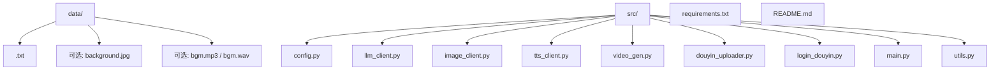
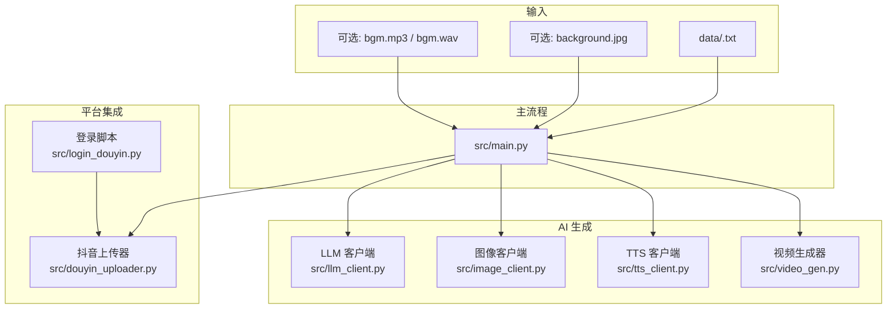
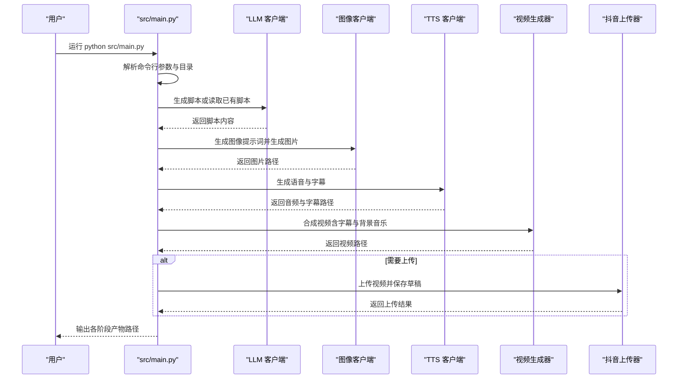
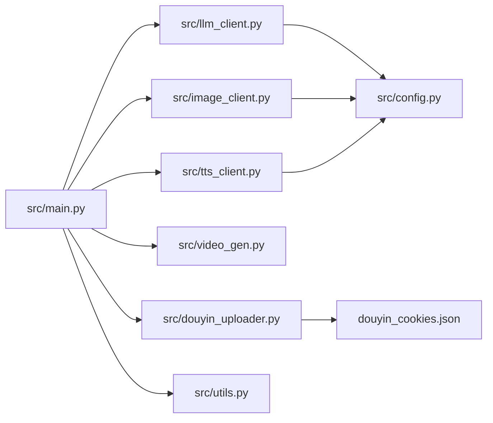

# 快速入门指南

<cite>
**本文引用的文件**
- [README.md](file://README.md)
- [requirements.txt](file://requirements.txt)
- [src/config.py](file://src/config.py)
- [src/llm_client.py](file://src/llm_client.py)
- [src/image_client.py](file://src/image_client.py)
- [src/tts_client.py](file://src/tts_client.py)
- [src/utils.py](file://src/utils.py)
- [src/video_gen.py](file://src/video_gen.py)
- [src/douyin_uploader.py](file://src/douyin_uploader.py)
- [src/login_douyin.py](file://src/login_douyin.py)
- [src/main.py](file://src/main.py)
- [data/history/little_prince.txt](file://data/history/little_prince.txt)
</cite>

## 目录
1. [简介](#简介)
2. [项目结构](#项目结构)
3. [核心组件](#核心组件)
4. [架构总览](#架构总览)
5. [详细组件分析](#详细组件分析)
6. [依赖关系分析](#依赖关系分析)
7. [性能注意事项](#性能注意事项)
8. [故障排查指南](#故障排查指南)
9. [结论](#结论)
10. [附录](#附录)

## 简介
本指南面向新手，带你从零开始运行抖音说书 Agent 项目。你将学会克隆仓库、创建虚拟环境、安装依赖、安装 Playwright 浏览器驱动、配置 LLM 与图像生成服务的 API 密钥、准备书籍 TXT 文件、可选地添加背景图与背景音乐、首次扫码登录保存 Cookies、运行主流程并观察预期输出，以及常见初始化错误的排查方法。

## 项目结构
项目采用“功能模块化 + 源码分层”的组织方式：
- data/：存放书籍 TXT、可选背景图 background.jpg、可选背景音乐 bgm.mp3
- src/：核心业务模块，包括配置、LLM、图像、TTS、视频合成、上传、登录、主流程等
- requirements.txt：Python 依赖清单
- README.md：项目说明、使用指南、常见问题

图表来源
- [README.md](file://README.md#L98-L116)
- [src/main.py](file://src/main.py#L81-L99)

章节来源
- [README.md](file://README.md#L98-L116)
- [src/main.py](file://src/main.py#L81-L99)

## 核心组件
- 配置模块：集中管理 LLM、图像生成、TTS、提示词模板等配置
- LLM 客户端：负责脚本生成、图像提示词生成
- 图像客户端：支持 SiliconFlow 与 Hugging Face 推理 API
- TTS 客户端：基于 edge-tts 生成语音与字幕
- 视频生成器：使用 MoviePy 合成视频、字幕与背景音乐
- 抖音上传器：基于 Playwright 自动化上传并保存草稿
- 登录脚本：扫码登录抖音创作平台并保存 Cookies
- 主流程：串联各模块，按步骤生成脚本、图像、语音、视频，并可选上传

章节来源
- [src/config.py](file://src/config.py#L1-L24)
- [src/llm_client.py](file://src/llm_client.py#L1-L20)
- [src/image_client.py](file://src/image_client.py#L12-L36)
- [src/tts_client.py](file://src/tts_client.py#L1-L20)
- [src/video_gen.py](file://src/video_gen.py#L1-L20)
- [src/douyin_uploader.py](file://src/douyin_uploader.py#L1-L15)
- [src/login_douyin.py](file://src/login_douyin.py#L1-L10)
- [src/main.py](file://src/main.py#L20-L48)

## 架构总览
下图展示了从数据输入到最终上传的端到端流程，以及各模块之间的依赖关系。

图表来源
- [src/main.py](file://src/main.py#L100-L159)
- [src/llm_client.py](file://src/llm_client.py#L19-L39)
- [src/image_client.py](file://src/image_client.py#L37-L45)
- [src/tts_client.py](file://src/tts_client.py#L33-L69)
- [src/video_gen.py](file://src/video_gen.py#L20-L95)
- [src/douyin_uploader.py](file://src/douyin_uploader.py#L10-L20)
- [src/login_douyin.py](file://src/login_douyin.py#L1-L10)

## 详细组件分析

### 1. 环境准备与依赖安装
- 克隆仓库并进入项目目录
- 创建虚拟环境（建议使用 venv）
- 安装 Python 依赖：pip install -r requirements.txt
- 安装 Playwright 浏览器驱动：playwright install
- 复制示例环境文件为 .env 并填入 LLM 与图像生成服务的 API 密钥

章节来源
- [README.md](file://README.md#L16-L33)
- [requirements.txt](file://requirements.txt#L1-L10)

### 2. 配置 API 密钥
- LLM 配置：LLM_API_KEY、LLM_BASE_URL、LLM_MODEL（默认 SiliconFlow 免费模型）
- 图像生成配置：HF_TOKEN（可选，提高速率限制）、IMAGE_MODEL（默认 SDXL）
- TTS 配置：TTS_VOICE、TTS_RATE、TTS_VOLUME（默认中文男声）

章节来源
- [src/config.py](file://src/config.py#L1-L24)

### 3. 准备书籍与媒体素材
- 将书籍 TXT 文件放入 data/ 目录（如 little_prince.txt）
- 可选：在 data/ 放入 background.jpg 作为默认背景图；在 data/ 放入 bgm.mp3 或 bgm.wav 作为背景音乐

章节来源
- [README.md](file://README.md#L43-L47)
- [src/main.py](file://src/main.py#L210-L221)

### 4. 首次扫码登录并保存 Cookies
- 运行登录脚本：python src/login_douyin.py
- 弹出浏览器窗口，请用抖音 App 扫码登录
- 登录成功后，Cookies 会自动保存到 douyin_cookies.json

章节来源
- [README.md](file://README.md#L48-L55)
- [src/login_douyin.py](file://src/login_douyin.py#L1-L20)
- [src/douyin_uploader.py](file://src/douyin_uploader.py#L16-L25)

### 5. 运行主流程并观察预期输出
- 运行主程序：python src/main.py
- 主流程按顺序执行：脚本生成 → 图像生成 → 语音与字幕生成 → 视频合成 → 自动上传（可选）
- 每个步骤会在控制台打印阶段性输出，最终在 output/ 生成对应产物

章节来源
- [README.md](file://README.md#L56-L61)
- [src/main.py](file://src/main.py#L100-L159)

### 6. 各步骤详解与预期输出
- 脚本生成（Script Generation）
  - 输入：data/<book>.txt
  - 输出：output/script_<book>.txt
  - 行为：若文本过短，会尝试联网搜索书籍摘要再生成脚本
- 图像生成（Image Generation）
  - 输入：脚本内容
  - 输出：output/image_<book>.jpg
  - 行为：根据脚本片段生成英文绘图提示词，调用绘图模型生成封面/背景图
- 语音与字幕生成（TTS & Subtitles）
  - 输入：清洗后的脚本
  - 输出：output/audio_<book>.mp3、output/audio_<book>.vtt
  - 行为：使用 edge-tts 生成语音与字幕
- 视频合成（Video Composition）
  - 输入：音频、字幕、图片、BGM（可选）
  - 输出：output/video_<book>.mp4
  - 行为：将音频、字幕、背景图、背景音乐合成最终视频
- 自动上传（Upload）
  - 输入：最终视频文件、标题、封面
  - 输出：抖音创作者中心草稿箱中的新条目
  - 行为：使用保存的 Cookies 登录并上传，保存草稿

章节来源
- [README.md](file://README.md#L62-L97)
- [src/main.py](file://src/main.py#L100-L239)
- [src/utils.py](file://src/utils.py#L1-L23)
- [src/video_gen.py](file://src/video_gen.py#L20-L95)
- [src/douyin_uploader.py](file://src/douyin_uploader.py#L10-L20)

### 7. 关键流程时序图（主流程）

图表来源
- [src/main.py](file://src/main.py#L100-L259)
- [src/llm_client.py](file://src/llm_client.py#L19-L39)
- [src/image_client.py](file://src/image_client.py#L37-L45)
- [src/tts_client.py](file://src/tts_client.py#L33-L69)
- [src/video_gen.py](file://src/video_gen.py#L20-L95)
- [src/douyin_uploader.py](file://src/douyin_uploader.py#L10-L20)

## 依赖关系分析
- 模块耦合与职责
  - main.py 作为编排者，依赖 llm_client、image_client、tts_client、video_gen、douyin_uploader、search_client、utils
  - llm_client 依赖 config 中的 LLM 配置与提示词模板
  - image_client 依据 config 决定使用 SiliconFlow 或 Hugging Face 推理 API
  - tts_client 依赖 edge-tts 与系统子进程
  - video_gen 依赖 moviepy、PIL、numpy
  - douyin_uploader 依赖 playwright，读取 cookies.json
  - utils 提供脚本清洗与字幕解析
- 外部依赖
  - Python 包：openai、python-dotenv、edge-tts、asyncio、moviepy、requests、playwright、duckduckgo-search、googlesearch-python
  - 浏览器驱动：playwright 安装 Chromium

图表来源
- [src/main.py](file://src/main.py#L10-L19)
- [src/llm_client.py](file://src/llm_client.py#L1-L10)
- [src/image_client.py](file://src/image_client.py#L8-L11)
- [src/tts_client.py](file://src/tts_client.py#L1-L8)
- [src/video_gen.py](file://src/video_gen.py#L1-L10)
- [src/douyin_uploader.py](file://src/douyin_uploader.py#L1-L10)
- [src/utils.py](file://src/utils.py#L1-L10)
- [src/config.py](file://src/config.py#L1-L10)

章节来源
- [requirements.txt](file://requirements.txt#L1-L10)
- [src/main.py](file://src/main.py#L10-L19)

## 性能注意事项
- 视频合成与字幕生成会占用较多 CPU/GPU 资源，渲染时间较长，请耐心等待
- TTS 生成依赖外网访问，网络不稳定可能导致耗时增加
- 图像生成与 LLM 调用受 API 速率限制影响，建议配置 HF_TOKEN 以提升稳定性

章节来源
- [README.md](file://README.md#L128-L133)
- [src/image_client.py](file://src/image_client.py#L12-L28)

## 故障排查指南
- 依赖缺失
  - 症状：运行时报错找不到模块
  - 处理：确保已执行 pip install -r requirements.txt
- Playwright 浏览器驱动未安装
  - 症状：上传功能报错或浏览器无法启动
  - 处理：执行 playwright install 安装浏览器驱动
- API 密钥错误或未配置
  - 症状：LLM 初始化时报错，或图像生成失败
  - 处理：检查 .env 中 LLM_API_KEY、HF_TOKEN 等配置是否正确；LLM_BASE_URL、LLM_MODEL、IMAGE_MODEL 是否符合预期
- 登录 Cookies 失效或缺失
  - 症状：上传失败或需要重复扫码
  - 处理：删除旧的 douyin_cookies.json，重新运行 python src/login_douyin.py 扫码登录
- 文本内容不足
  - 症状：脚本生成失败或仅生成短文本
  - 处理：在 data/<book>.txt 中填入更丰富的书籍内容或简介
- TTS 生成失败
  - 症状：音频与字幕未生成
  - 处理：检查网络连通性，确保 edge-tts 可正常访问
- 视频合成失败
  - 症状：output/video_<book>.mp4 未生成
  - 处理：确认音频与字幕已生成，检查 BGM 文件是否存在且格式正确

章节来源
- [README.md](file://README.md#L126-L134)
- [src/llm_client.py](file://src/llm_client.py#L11-L12)
- [src/image_client.py](file://src/image_client.py#L22-L36)
- [src/douyin_uploader.py](file://src/douyin_uploader.py#L16-L25)
- [src/main.py](file://src/main.py#L138-L159)

## 结论
按照本指南逐步完成环境准备、依赖安装、API 密钥配置、素材准备、扫码登录与主流程运行，你将能够从零开始完成“从书籍到短视频”的全流程自动化生产。遇到问题时，可参考故障排查指南定位并解决。

## 附录
- 常用命令
  - 克隆仓库：git clone <repository_url> && cd douyin_book
  - 安装依赖：pip install -r requirements.txt
  - 安装浏览器驱动：playwright install
  - 首次登录：python src/login_douyin.py
  - 运行主流程：python src/main.py
- 目录与文件
  - data/history/little_prince.txt：示例书籍文本
  - output/：生成产物目录（脚本、图片、音频、字幕、视频）
  - .env：环境变量配置文件（复制 .env.example 后填写密钥）

章节来源
- [README.md](file://README.md#L16-L61)
- [data/history/little_prince.txt](file://data/history/little_prince.txt)