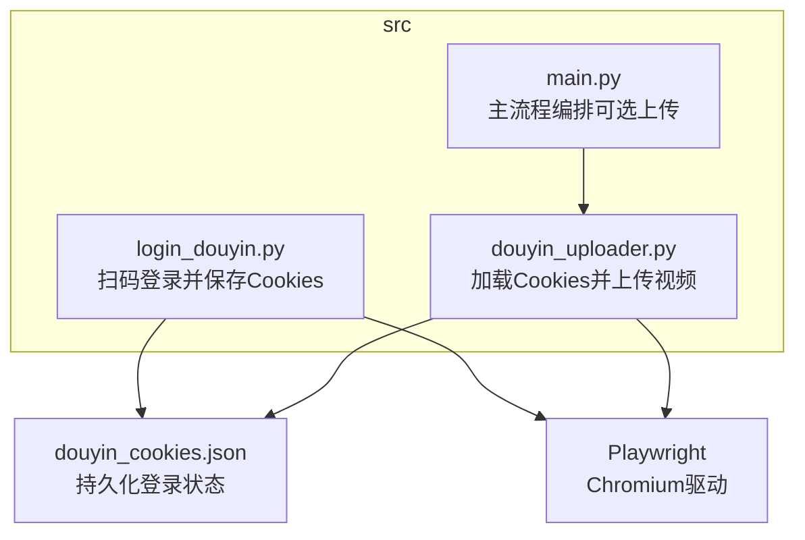
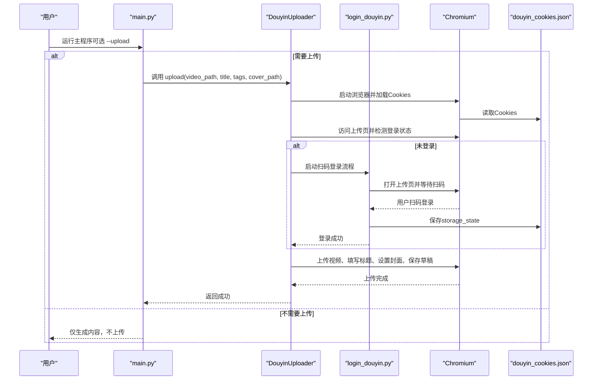
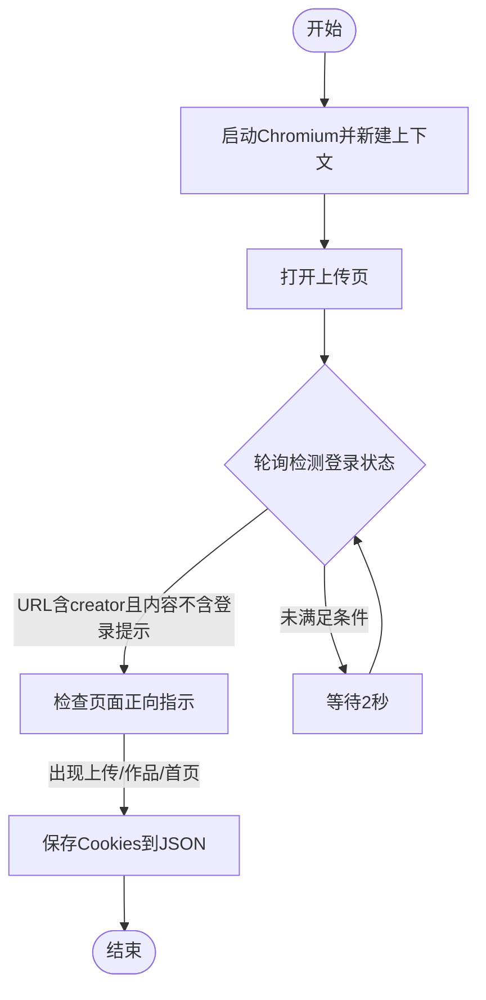
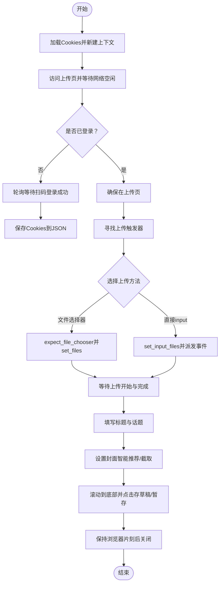
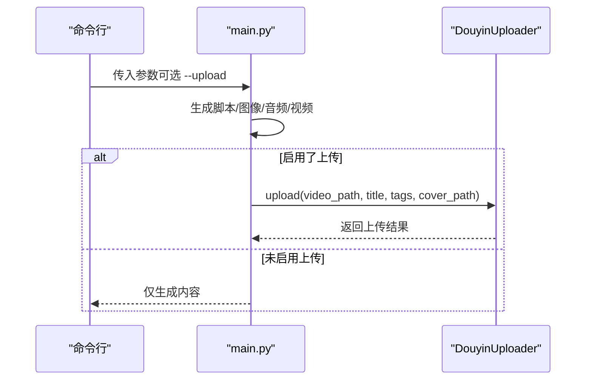
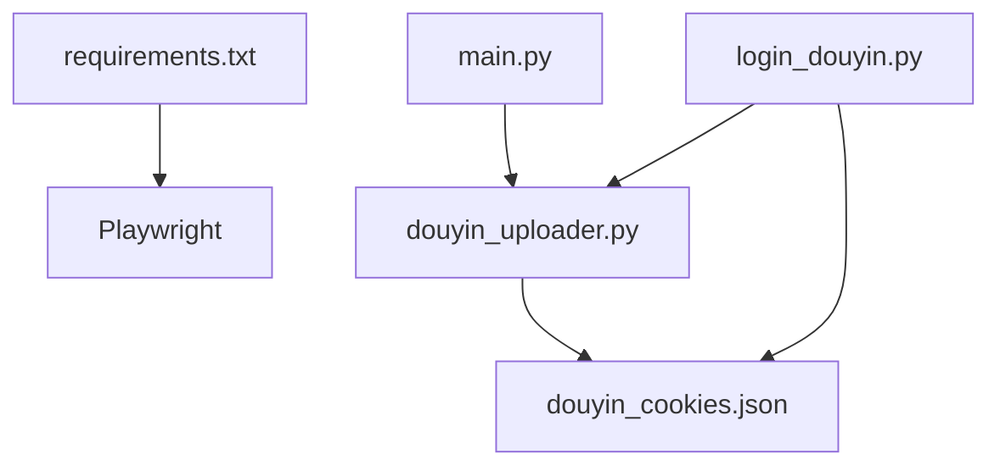

# 抖音上传模块

<cite>
**本文引用的文件**
- [src/douyin_uploader.py](file://src/douyin_uploader.py)
- [src/login_douyin.py](file://src/login_douyin.py)
- [src/main.py](file://src/main.py)
- [README.md](file://README.md)
- [requirements.txt](file://requirements.txt)
</cite>

## 目录
1. [引言](#引言)
2. [项目结构](#项目结构)
3. [核心组件](#核心组件)
4. [架构总览](#架构总览)
5. [详细组件分析](#详细组件分析)
6. [依赖关系分析](#依赖关系分析)
7. [性能考量](#性能考量)
8. [故障排除指南](#故障排除指南)
9. [结论](#结论)
10. [附录](#附录)

## 引言
本文件面向希望使用 Playwright 实现抖音自动化上传的开发者与运营人员，系统性梳理 src/douyin_uploader.py 与 src/login_douyin.py 的设计与实现，覆盖以下主题：
- 如何使用 Playwright 启动 Chromium 浏览器并进行无头/有头模式的自动化操作
- 登录流程：在浏览器中扫码登录抖音创作平台，并将登录状态（Cookies）持久化到本地文件
- 上传流程：加载 Cookies、上传视频文件、填写标题、选择封面、保存为草稿
- Cookies 的管理与失效处理策略
- 常见问题排查：登录超时、上传失败、页面元素变更等
- 重要提示：该方案为模拟用户操作，非官方 API，存在稳定性风险

## 项目结构
抖音上传模块位于 src 目录，核心文件如下：
- src/login_douyin.py：负责启动浏览器、打开抖音创作平台上传页、等待扫码登录成功并保存 Cookies
- src/douyin_uploader.py：负责加载 Cookies、进入上传页、上传视频、填写标题与封面、保存草稿
- src/main.py：主程序入口，串联脚本生成、图像生成、TTS、视频合成与自动上传（可选）
- README.md：使用说明、流程说明与常见问题
- requirements.txt：项目依赖，包含 Playwright

图表来源
- [src/login_douyin.py](file://src/login_douyin.py#L1-L76)
- [src/douyin_uploader.py](file://src/douyin_uploader.py#L1-L380)
- [src/main.py](file://src/main.py#L1-L262)

章节来源
- [README.md](file://README.md#L41-L61)
- [requirements.txt](file://requirements.txt#L1-L10)

## 核心组件
- 登录模块（login_douyin.py）
  - 启动 Chromium 浏览器，打开抖音创作平台上传页
  - 循环检测登录状态，一旦检测到登录成功即保存 storage_state 到本地 JSON 文件
  - 提供最长等待时间，超时自动结束
- 上传模块（douyin_uploader.py）
  - 读取本地 Cookies，新建带存储状态的浏览器上下文
  - 访问上传页，检测登录状态；若未登录则轮询等待扫码登录成功并自动保存 Cookies
  - 上传视频文件，支持多种触发方式与回退策略
  - 填写标题与话题，选择封面（智能推荐/截取），保存为草稿
  - 上传完成后保留浏览器短暂开启以确保请求发送，随后关闭

章节来源
- [src/login_douyin.py](file://src/login_douyin.py#L1-L76)
- [src/douyin_uploader.py](file://src/douyin_uploader.py#L1-L380)

## 架构总览
下图展示从主程序到登录与上传模块的整体调用关系与数据流。

图表来源
- [src/main.py](file://src/main.py#L247-L259)
- [src/douyin_uploader.py](file://src/douyin_uploader.py#L10-L120)
- [src/login_douyin.py](file://src/login_douyin.py#L1-L76)

## 详细组件分析

### 登录模块（login_douyin.py）
- 关键行为
  - 启动浏览器并打开上传页
  - 轮询检测 URL 与页面内容，判断是否处于登录成功状态
  - 成功后调用 storage_state(path=...) 将 Cookies 写入本地文件
  - 超时控制与循环节流
- 设计要点
  - 使用同步 Playwright，便于在登录阶段阻塞等待
  - 通过 URL 包含“creator”、页面内容不含“扫码登录/登录/注册”、出现“上传/作品/首页”等正向指示，综合判定登录成功
  - 保存 Cookies 后关闭浏览器，避免资源泄漏

图表来源
- [src/login_douyin.py](file://src/login_douyin.py#L1-L76)

章节来源
- [src/login_douyin.py](file://src/login_douyin.py#L1-L76)

### 上传模块（douyin_uploader.py）
- 关键行为
  - 加载 Cookies 并新建带 storage_state 的上下文
  - 访问上传页，检测登录状态；若未登录则轮询等待并自动保存 Cookies
  - 上传视频：优先通过文件选择器触发上传，若失败则回退到直接设置 input[type='file'] 并手动触发 change/input 事件
  - 填写标题与话题，设置封面（智能推荐/截取），保存为草稿
  - 上传完成后等待一段时间确保请求发送，然后关闭浏览器
- 设计要点
  - 使用 headless=False，便于用户扫码登录
  - 对上传触发器采用多种定位策略（文本匹配、拖拽区域、文件输入框），并提供事件派发回退
  - 对上传完成状态采用多种选择器组合等待，提高鲁棒性
  - 对“存草稿/暂存离开”按钮采用精确查找与二次确认弹窗处理

图表来源
- [src/douyin_uploader.py](file://src/douyin_uploader.py#L10-L380)

章节来源
- [src/douyin_uploader.py](file://src/douyin_uploader.py#L10-L380)

### 主程序集成（src/main.py）
- 关键行为
  - 解析命令行参数，支持跳过各步骤与启用上传
  - 生成脚本、图像、音频与视频
  - 当启用上传时，调用 DouyinUploader.upload(video_path, title, tags, cover_path)
- 设计要点
  - 通过参数控制是否执行上传，便于调试与断点续传
  - 上传标题与话题由脚本生成逻辑推导，封面优先使用生成的图片

图表来源
- [src/main.py](file://src/main.py#L247-L259)
- [src/douyin_uploader.py](file://src/douyin_uploader.py#L10-L120)

章节来源
- [src/main.py](file://src/main.py#L1-L262)

## 依赖关系分析
- 外部依赖
  - Playwright：驱动 Chromium，实现浏览器自动化
  - Python 标准库与第三方库：requests、moviepy、edge-tts、duckduckgo-search、googlesearch-python 等
- 模块间依赖
  - main.py 依赖 DouyinUploader 进行上传
  - login_douyin.py 与 douyin_uploader.py 共同依赖 Playwright 与 Cookies 文件
  - README.md 提供使用说明与环境准备

图表来源
- [requirements.txt](file://requirements.txt#L1-L10)
- [src/main.py](file://src/main.py#L1-L262)
- [src/douyin_uploader.py](file://src/douyin_uploader.py#L1-L380)
- [src/login_douyin.py](file://src/login_douyin.py#L1-L76)

章节来源
- [requirements.txt](file://requirements.txt#L1-L10)
- [src/main.py](file://src/main.py#L1-L262)
- [src/douyin_uploader.py](file://src/douyin_uploader.py#L1-L380)
- [src/login_douyin.py](file://src/login_douyin.py#L1-L76)

## 性能考量
- 浏览器启动与页面加载
  - 使用 wait_until="networkidle" 与合理的超时设置，平衡加载完整性与等待时间
  - SPA 页面路由后增加短暂等待，确保前端路由稳定
- 上传过程
  - 多种上传触发策略与事件派发回退，提升成功率
  - 上传完成等待采用多种选择器组合，避免误判
- Cookies 管理
  - 登录成功后立即保存 Cookies，减少重复扫码
  - 上传前检测登录状态，避免无效操作

[本节为通用性能建议，无需特定文件引用]

## 故障排除指南
- 登录超时
  - 现象：扫码登录长时间未检测到成功
  - 排查要点
    - 检查网络连通性与抖音服务可用性
    - 确认浏览器窗口可见，扫码后页面内容变化是否被正确识别
    - 若超时，重新运行登录脚本
  - 参考实现位置
    - 登录轮询与超时控制
      - [src/login_douyin.py](file://src/login_douyin.py#L26-L73)
    - 上传流程中的登录检测与轮询
      - [src/douyin_uploader.py](file://src/douyin_uploader.py#L50-L90)

- 上传失败或页面元素变更
  - 现象：找不到上传按钮、文件未被识别、页面布局变化导致选择器失效
  - 排查要点
    - 上传触发器采用多种策略（文本匹配、拖拽区域、input[type='file']），并提供事件派发回退
    - 上传完成后等待多种状态指示（重新上传、上传成功、播放器容器、video）
    - 若按钮文本变化，使用 get_by_text 精确匹配并提供备选文案
  - 参考实现位置
    - 上传触发与回退
      - [src/douyin_uploader.py](file://src/douyin_uploader.py#L118-L218)
    - 上传完成等待
      - [src/douyin_uploader.py](file://src/douyin_uploader.py#L228-L249)
    - 草稿按钮与确认弹窗
      - [src/douyin_uploader.py](file://src/douyin_uploader.py#L324-L365)

- Cookies 失效或丢失
  - 现象：访问上传页后仍提示未登录
  - 排查要点
    - 确认 douyin_cookies.json 是否存在且可读
    - 重新运行登录脚本刷新 Cookies
    - 上传流程在检测到登录成功后会自动保存最新 Cookies
  - 参考实现位置
    - Cookies 加载与保存
      - [src/douyin_uploader.py](file://src/douyin_uploader.py#L15-L30)
      - [src/douyin_uploader.py](file://src/douyin_uploader.py#L88-L90)
      - [src/login_douyin.py](file://src/login_douyin.py#L57-L60)

- 页面跳转异常
  - 现象：URL 指向上传页但实际停留在首页
  - 排查要点
    - 上传模块会再次 goto 上传页并等待，确保进入正确的页面
  - 参考实现位置
    - 上传页跳转与等待
      - [src/douyin_uploader.py](file://src/douyin_uploader.py#L92-L100)

- 封面设置失败
  - 现象：无法打开封面设置弹窗或确认按钮不可见
  - 排查要点
    - 优先选择智能推荐封面，若不可用则切换到截取封面
    - 若确认按钮不可见，尝试关闭弹窗或检查页面文案变化
  - 参考实现位置
    - 封面设置流程
      - [src/douyin_uploader.py](file://src/douyin_uploader.py#L269-L317)

- 环境与依赖
  - 确保已安装 Playwright 并完成浏览器安装
  - 参考使用说明
    - [README.md](file://README.md#L29-L33)

章节来源
- [src/login_douyin.py](file://src/login_douyin.py#L26-L73)
- [src/douyin_uploader.py](file://src/douyin_uploader.py#L50-L90)
- [src/douyin_uploader.py](file://src/douyin_uploader.py#L118-L218)
- [src/douyin_uploader.py](file://src/douyin_uploader.py#L228-L249)
- [src/douyin_uploader.py](file://src/douyin_uploader.py#L324-L365)
- [README.md](file://README.md#L29-L33)

## 结论
本模块通过 Playwright 驱动 Chromium，实现了从扫码登录到自动上传的完整流程。其设计重点在于：
- 登录阶段的稳健轮询与 Cookies 持久化
- 上传阶段的多策略触发与状态等待
- 对页面元素变更的容错与回退机制
同时，由于该方案为模拟用户操作而非官方 API，存在页面结构变化、风控策略调整等不确定性，建议定期维护选择器与流程逻辑，并在生产环境中做好监控与告警。

[本节为总结性内容，无需特定文件引用]

## 附录
- 使用说明与环境准备
  - 参考 README 中的环境准备与使用指南
    - [README.md](file://README.md#L29-L61)
- 常见问题
  - 参考 README 中的常见问题章节
    - [README.md](file://README.md#L126-L134)

章节来源
- [README.md](file://README.md#L29-L61)
- [README.md](file://README.md#L126-L134)