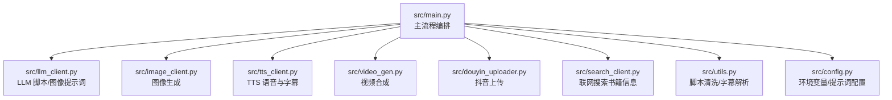
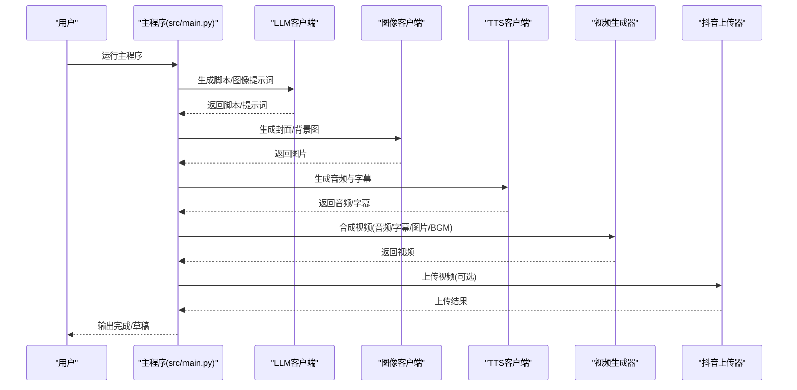
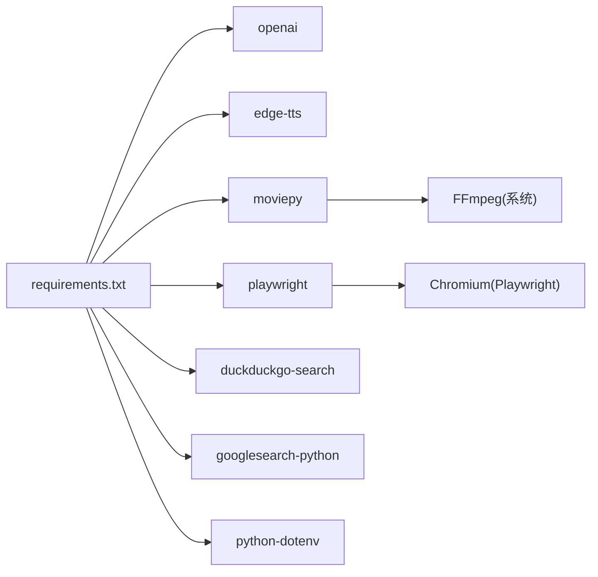

# 故障排除

<cite>
**本文引用的文件**
- [README.md](file://README.md)
- [requirements.txt](file://requirements.txt)
- [src/config.py](file://src/config.py)
- [src/main.py](file://src/main.py)
- [src/utils.py](file://src/utils.py)
- [src/llm_client.py](file://src/llm_client.py)
- [src/tts_client.py](file://src/tts_client.py)
- [src/image_client.py](file://src/image_client.py)
- [src/video_gen.py](file://src/video_gen.py)
- [src/douyin_uploader.py](file://src/douyin_uploader.py)
- [src/login_douyin.py](file://src/login_douyin.py)
- [src/search_client.py](file://src/search_client.py)
</cite>

## 目录
1. [引言](#引言)
2. [项目结构](#项目结构)
3. [核心组件](#核心组件)
4. [架构总览](#架构总览)
5. [详细组件分析](#详细组件分析)
6. [依赖关系分析](#依赖关系分析)
7. [性能注意事项](#性能注意事项)
8. [故障排除指南](#故障排除指南)
9. [结论](#结论)
10. [附录](#附录)

## 引言
本指南面向使用“抖音说书 Agent”的创作者，聚焦常见问题的定位与解决。文档按模块组织：环境与依赖、配置问题、LLM 调用失败、TTS 问题、视频合成问题、上传问题，并提供症状、原因与步骤，同时建议检查日志输出以辅助诊断。

## 项目结构
项目采用模块化设计，主流程由主程序串联各子模块，包括 LLM 脚本生成、图像生成、TTS 语音与字幕、视频合成以及抖音上传。

图表来源
- [src/main.py](file://src/main.py#L1-L262)
- [src/llm_client.py](file://src/llm_client.py#L1-L60)
- [src/image_client.py](file://src/image_client.py#L1-L132)
- [src/tts_client.py](file://src/tts_client.py#L1-L80)
- [src/video_gen.py](file://src/video_gen.py#L1-L162)
- [src/douyin_uploader.py](file://src/douyin_uploader.py#L1-L380)
- [src/search_client.py](file://src/search_client.py#L1-L113)
- [src/utils.py](file://src/utils.py#L1-L72)
- [src/config.py](file://src/config.py#L1-L93)

章节来源
- [README.md](file://README.md#L1-L134)
- [src/main.py](file://src/main.py#L1-L262)

## 核心组件
- 配置模块：负责加载环境变量、模型与提示词配置。
- LLM 客户端：封装 OpenAI SDK，生成脚本、图像提示词。
- 图像客户端：支持 Hugging Face 推理 API 与 SiliconFlow，生成封面/背景图。
- TTS 客户端：基于 edge-tts，生成音频与字幕。
- 视频生成器：基于 MoviePy，合成音频、字幕、背景与 BGM。
- 抖音上传器：基于 Playwright，扫码登录并上传草稿。
- 搜索客户端：聚合 DuckDuckGo 与 Google 搜索结果，汇总书籍信息。
- 工具模块：脚本清洗与字幕解析。

章节来源
- [src/config.py](file://src/config.py#L1-L93)
- [src/llm_client.py](file://src/llm_client.py#L1-L60)
- [src/image_client.py](file://src/image_client.py#L1-L132)
- [src/tts_client.py](file://src/tts_client.py#L1-L80)
- [src/video_gen.py](file://src/video_gen.py#L1-L162)
- [src/douyin_uploader.py](file://src/douyin_uploader.py#L1-L380)
- [src/search_client.py](file://src/search_client.py#L1-L113)
- [src/utils.py](file://src/utils.py#L1-L72)

## 架构总览
主程序按步骤驱动：脚本生成 → 图像生成 → TTS 与字幕 → 视频合成 → 抖音上传。各模块通过配置与工具模块解耦，便于独立排查。

图表来源
- [src/main.py](file://src/main.py#L1-L262)
- [src/llm_client.py](file://src/llm_client.py#L1-L60)
- [src/image_client.py](file://src/image_client.py#L1-L132)
- [src/tts_client.py](file://src/tts_client.py#L1-L80)
- [src/video_gen.py](file://src/video_gen.py#L1-L162)
- [src/douyin_uploader.py](file://src/douyin_uploader.py#L1-L380)

## 详细组件分析

### LLM 客户端
- 关键行为：初始化时校验 API Key；调用 chat.completions 接口生成脚本与提示词。
- 典型风险：API Key 缺失、网络异常、模型不可用。
- 日志与错误：捕获异常并打印，便于定位。

章节来源
- [src/llm_client.py](file://src/llm_client.py#L1-L60)
- [src/config.py](file://src/config.py#L1-L20)

### 图像客户端
- 关键行为：优先使用 Hugging Face 推理 API（可选 HF_TOKEN），否则使用 SiliconFlow；支持公共 HF API 回退。
- 典型风险：HF_TOKEN 缺失、网络异常、返回格式不符合预期。
- 日志与错误：打印请求与响应摘要，便于定位。

章节来源
- [src/image_client.py](file://src/image_client.py#L1-L132)
- [src/config.py](file://src/config.py#L1-L20)

### TTS 客户端
- 关键行为：异步生成音频；通过 edge-tts CLI 生成带时间轴的字幕；失败时打印 stderr。
- 典型风险：网络访问受限、CLI 参数不兼容、临时文件清理失败。
- 日志与错误：打印命令与 stderr，便于复现。

章节来源
- [src/tts_client.py](file://src/tts_client.py#L1-L80)

### 视频生成器
- 关键行为：加载音频、混合 BGM、合成静态背景或图片、按字幕生成文本片段；写入 MP4。
- 典型风险：MoviePy 依赖缺失、字体/ImageMagick 问题、内存不足。
- 日志与错误：捕获异常并打印堆栈，便于定位。

章节来源
- [src/video_gen.py](file://src/video_gen.py#L1-L162)
- [src/utils.py](file://src/utils.py#L1-L72)

### 抖音上传器
- 关键行为：启动 Chromium，加载 Cookies；扫码登录；上传文件；填写标题与封面；保存草稿。
- 典型风险：Cookies 过期、扫码无响应、页面交互变化、上传超时。
- 日志与错误：打印页面状态、等待轮询、上传尝试与结果。

章节来源
- [src/douyin_uploader.py](file://src/douyin_uploader.py#L1-L380)

### 搜索客户端
- 关键行为：优先 DuckDuckGo，失败回退 Google；抽取摘要；统一返回格式。
- 典型风险：网络受限、搜索结果为空、第三方 API 限流。
- 日志与错误：打印后端切换与异常。

章节来源
- [src/search_client.py](file://src/search_client.py#L1-L113)

## 依赖关系分析
- Python 包：OpenAI、edge-tts、moviepy、requests、playwright、duckduckgo-search、googlesearch-python、python-dotenv。
- 外部服务：LLM 服务（SiliconFlow 或自定义 BaseURL）、Hugging Face 推理 API、抖音上传页。
- 平台依赖：Playwright 需要浏览器驱动；MoviePy 需要 FFmpeg；TTS 需要外网访问。

图表来源
- [requirements.txt](file://requirements.txt#L1-L10)

章节来源
- [requirements.txt](file://requirements.txt#L1-L10)
- [README.md](file://README.md#L24-L32)

## 性能注意事项
- LLM 与图像生成：网络与 API 速率限制可能导致延迟；建议在稳定网络环境下运行。
- TTS：Edge-TTS 生成音频与字幕，耗时取决于文本长度与网络状况。
- 视频合成：MoviePy 渲染占用 CPU/GPU，大文件或复杂字幕会显著增加耗时。
- 抖音上传：浏览器自动化受网络与平台页面交互影响，建议在非高峰时段运行。

[本节为通用指导，无需列出具体文件来源]

## 故障排除指南

### 1) 环境与依赖
- 症状
  - 安装依赖时报错或模块导入失败。
  - 运行时报错提示缺少 Playwright 浏览器驱动。
  - MoviePy 报错或无法生成视频。
- 根因
  - 依赖未正确安装或版本冲突。
  - 未安装 Playwright 浏览器驱动。
  - MoviePy 依赖 FFmpeg 未安装或未加入 PATH。
- 解决步骤
  - 重新安装依赖：确保在干净环境中执行安装命令。
  - 安装 Playwright 浏览器：按照项目说明安装浏览器驱动。
  - 安装并配置 FFmpeg：将 FFmpeg 加入系统 PATH，重启终端后重试。
- 变通方法
  - 使用虚拟环境隔离依赖，避免全局污染。
  - 如遇网络问题，考虑更换国内镜像源或代理。
- 建议日志
  - 记录 pip 安装过程与错误堆栈，便于定位具体包版本问题。

章节来源
- [README.md](file://README.md#L24-L32)
- [requirements.txt](file://requirements.txt#L1-L10)
- [src/video_gen.py](file://src/video_gen.py#L1-L162)

### 2) 配置问题
- 症状
  - LLM 初始化时报错，提示未找到 API Key。
  - 图像生成失败，提示未配置 API Key。
  - 环境变量未生效，导致默认模型或 BaseURL 不正确。
- 根因
  - .env 文件未正确复制或未加载。
  - 环境变量未设置或拼写错误。
- 解决步骤
  - 复制示例环境文件并填写必要字段（如 LLM API Key、Base URL、模型名等）。
  - 确认 .env 文件位于项目根目录，且已加载。
  - 重启终端或重新运行程序以使环境变量生效。
- 变通方法
  - 在代码中显式设置环境变量（开发调试阶段）。
  - 使用 Python-dotenv 的 debug 模式验证加载情况。
- 建议日志
  - 检查配置模块加载日志，确认变量读取是否成功。

章节来源
- [README.md](file://README.md#L34-L40)
- [src/config.py](file://src/config.py#L1-L20)
- [src/llm_client.py](file://src/llm_client.py#L1-L20)
- [src/image_client.py](file://src/image_client.py#L1-L36)

### 3) LLM 调用失败
- 症状
  - LLM 初始化抛出异常，提示未设置 API Key。
  - 脚本生成或图像提示词生成返回空或失败。
  - 网络不稳定导致请求超时或返回错误。
- 根因
  - API Key 缺失或错误。
  - Base URL 不可用或被墙。
  - 第三方服务限流或维护。
- 解决步骤
  - 检查 .env 中的 API Key 与 Base URL 是否正确。
  - 更换可用的 Base URL 或代理。
  - 降低并发或重试策略，避开高峰期。
- 变通方法
  - 使用搜索客户端在文本内容不足时联网获取书籍摘要，再生成脚本。
- 建议日志
  - 记录 LLM 错误信息与响应内容，便于定位服务端问题。

章节来源
- [src/llm_client.py](file://src/llm_client.py#L1-L60)
- [src/search_client.py](file://src/search_client.py#L1-L113)
- [src/main.py](file://src/main.py#L114-L159)

### 4) TTS 问题
- 症状
  - TTS 生成失败，stderr 显示命令执行错误。
  - 语音生成中断，字幕未生成。
  - 外网访问受限导致无法生成。
- 根因
  - edge-tts CLI 参数不兼容或网络受限。
  - 临时文件未清理或权限不足。
- 解决步骤
  - 确保可访问外网，或在代理环境下运行。
  - 检查 edge-tts CLI 是否可用，必要时升级包版本。
  - 手动清理临时文件，确保磁盘空间充足。
- 变通方法
  - 使用同步封装方法生成音频，观察异常信息。
  - 降低文本长度或分段生成，减少单次调用压力。
- 建议日志
  - 记录命令行参数与 stderr 输出，便于复现与对比。

章节来源
- [src/tts_client.py](file://src/tts_client.py#L1-L80)
- [README.md](file://README.md#L128-L130)

### 5) 视频合成问题
- 症状
  - 视频合成失败，提示依赖缺失或渲染异常。
  - 合成卡顿或内存不足导致崩溃。
  - 字幕解析失败或显示异常。
- 根因
  - MoviePy 未正确安装或 FFmpeg 未配置。
  - 字体文件缺失或路径不可用。
  - 文本渲染与字幕时间轴不匹配。
- 解决步骤
  - 安装并配置 FFmpeg，确保其在 PATH 中。
  - 检查字体文件是否存在，或降级为系统默认字体。
  - 简化字幕样式或减少字幕数量，降低渲染开销。
- 变通方法
  - 使用更简单的背景图或禁用字幕，验证流程是否正常。
  - 降低视频分辨率或帧率以节省资源。
- 建议日志
  - 记录 MoviePy 报错与堆栈，定位具体模块。

章节来源
- [src/video_gen.py](file://src/video_gen.py#L1-L162)
- [src/utils.py](file://src/utils.py#L1-L72)

### 6) 上传问题
- 症状
  - Cookies 过期或未加载，扫码登录无响应。
  - 页面交互变化导致上传按钮无法定位。
  - 上传超时或未检测到进度。
- 根因
  - Cookies 文件不存在或已过期。
  - 抖音页面改版导致选择器失效。
  - 网络波动或浏览器自动化不稳定。
- 解决步骤
  - 重新运行登录脚本，保存最新 Cookies。
  - 确认浏览器窗口可见，允许扫码登录。
  - 适当延长等待时间，或手动触发事件后再继续。
- 变通方法
  - 手动上传：在浏览器中打开上传页，完成登录与上传。
  - 降低并发：一次只上传一个视频，避免页面状态混乱。
- 建议日志
  - 记录页面 URL、内容与等待轮询状态，便于定位页面差异。

章节来源
- [src/douyin_uploader.py](file://src/douyin_uploader.py#L1-L380)
- [src/login_douyin.py](file://src/login_douyin.py#L1-L76)
- [README.md](file://README.md#L48-L55)

## 结论
通过模块化排查与日志记录，大多数问题可在环境、配置、网络与平台交互层面得到定位与解决。建议在执行关键步骤前后检查日志输出，必要时启用更详细的日志级别以辅助诊断。

[本节为总结性内容，无需列出具体文件来源]

## 附录
- 常见命令与文件
  - 安装依赖：pip install -r requirements.txt
  - 安装 Playwright 浏览器：playwright install
  - 登录抖音：python src/login_douyin.py
  - 运行主程序：python src/main.py
- 建议的日志收集
  - 每个模块的异常堆栈与关键参数。
  - 网络请求的响应状态与错误信息。
  - 浏览器自动化过程中的页面状态与元素定位结果。

[本节为通用指导，无需列出具体文件来源]