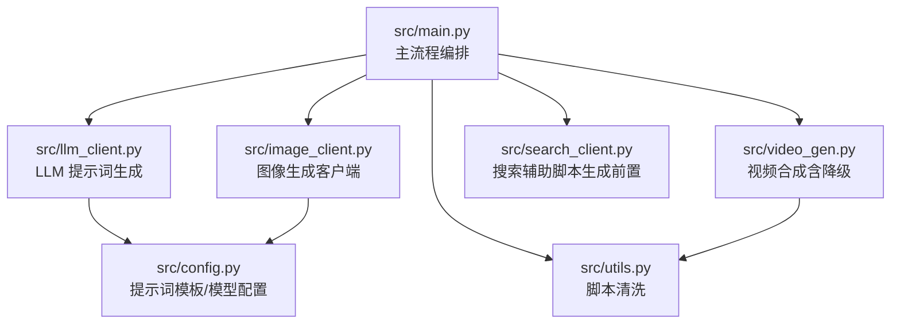
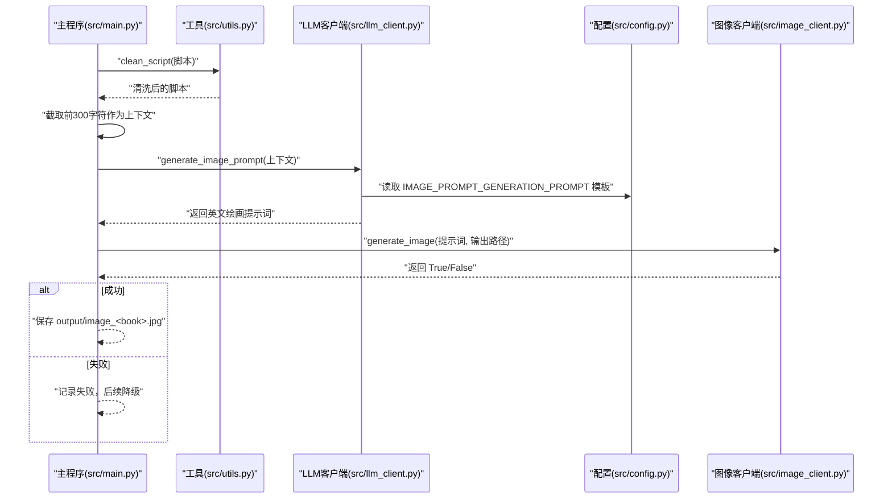
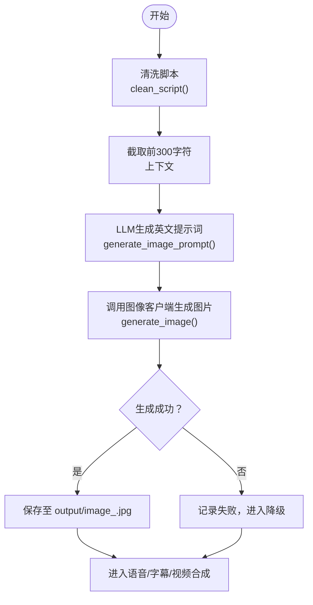
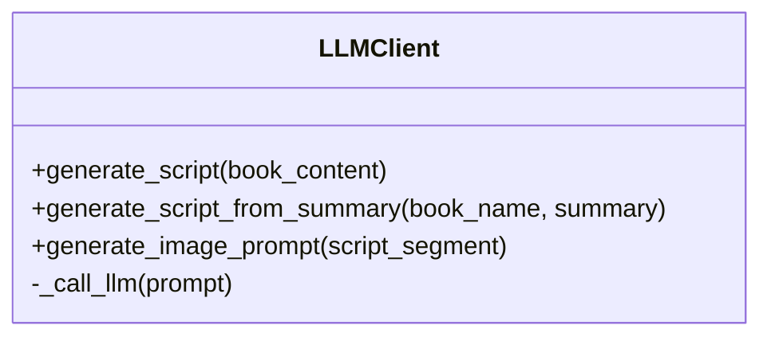
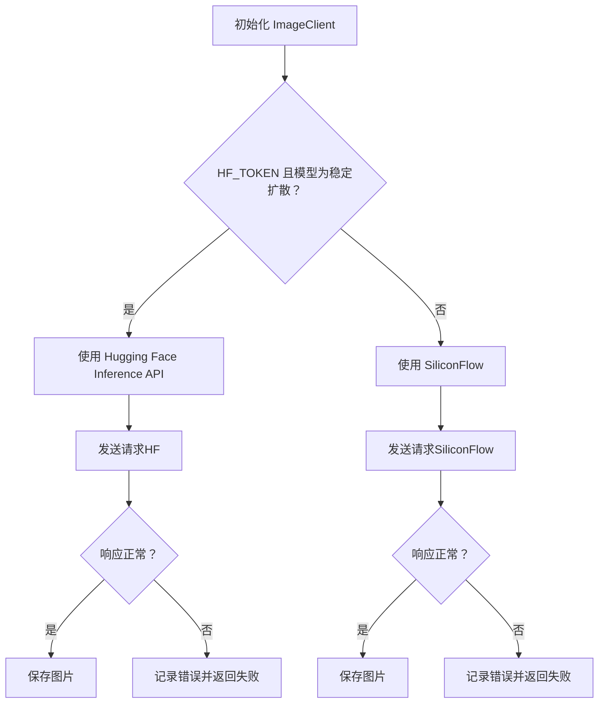
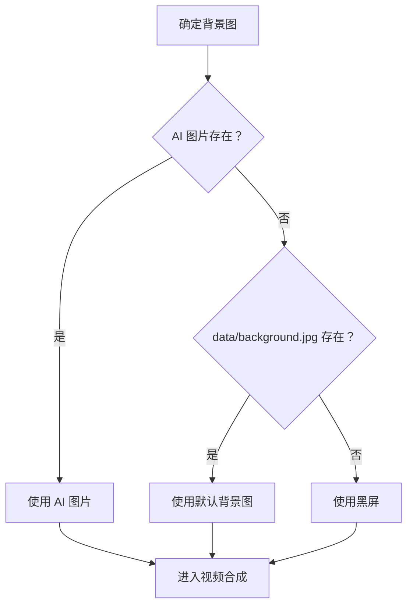
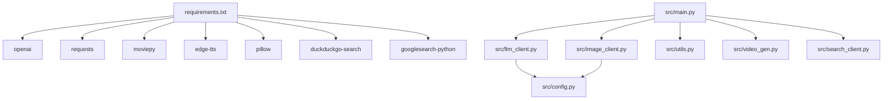

# 图像生成

<cite>
**本文引用的文件**
- [src/main.py](file://src/main.py)
- [src/llm_client.py](file://src/llm_client.py)
- [src/image_client.py](file://src/image_client.py)
- [src/config.py](file://src/config.py)
- [src/utils.py](file://src/utils.py)
- [src/video_gen.py](file://src/video_gen.py)
- [src/search_client.py](file://src/search_client.py)
- [README.md](file://README.md)
- [requirements.txt](file://requirements.txt)
- [data/history/little_prince.txt](file://data/history/little_prince.txt)
</cite>

## 目录
1. [引言](#引言)
2. [项目结构](#项目结构)
3. [核心组件](#核心组件)
4. [架构总览](#架构总览)
5. [详细组件分析](#详细组件分析)
6. [依赖关系分析](#依赖关系分析)
7. [性能考虑](#性能考虑)
8. [故障排查指南](#故障排查指南)
9. [结论](#结论)
10. [附录](#附录)

## 引言
本文件围绕“图像生成”子流程，系统性解析主程序如何在 src/main.py 中协调 LLMClient 与 ImageClient 完成配图任务：先截取清洗后脚本的前 300 个字符作为上下文，调用 LLMClient 的 generate_image_prompt 方法生成英文绘画提示词（prompt），随后由 ImageClient 调用外部 API（如 Hugging Face 或 SiliconFlow）生成 1080x1920 竖版图片并保存至 output/image_<book_name>.jpg。文档还解释图像生成失败时的降级策略（使用 data/background.jpg 或黑屏），以及 --skip-image 参数如何跳过此步骤并复用已有图片。最后提供提示词优化技巧、API 调用重试机制与图片路径管理逻辑，兼顾初学者易懂与高级用户的扩展指导。

## 项目结构
- 入口与编排：src/main.py
- 提示词生成：src/llm_client.py
- 图像生成：src/image_client.py
- 配置与提示词模板：src/config.py
- 工具函数：src/utils.py
- 视频合成（含降级策略）：src/video_gen.py
- 搜索辅助（脚本生成前置）：src/search_client.py
- 文档与依赖：README.md、requirements.txt
- 示例输入：data/history/little_prince.txt

图表来源
- [src/main.py](file://src/main.py#L1-L262)
- [src/llm_client.py](file://src/llm_client.py#L1-L60)
- [src/image_client.py](file://src/image_client.py#L1-L132)
- [src/config.py](file://src/config.py#L1-L93)
- [src/utils.py](file://src/utils.py#L1-L72)
- [src/video_gen.py](file://src/video_gen.py#L1-L162)
- [src/search_client.py](file://src/search_client.py#L1-L113)

章节来源
- [src/main.py](file://src/main.py#L1-L262)
- [README.md](file://README.md#L1-L134)

## 核心组件
- 主流程编排（src/main.py）
  - 解析命令行参数（--skip-image 等）
  - 读取书籍文本，生成脚本（或跳过）
  - 清洗脚本，截取前 300 字符作为上下文
  - 调用 LLMClient 生成英文绘画提示词
  - 调用 ImageClient 生成图片并保存
  - 视频合成阶段根据图片是否存在选择降级策略
- LLM 客户端（src/llm_client.py）
  - 基于 OpenAI SDK 调用模型
  - 提供 generate_image_prompt 接口，使用 IMAGE_PROMPT_GENERATION_PROMPT 模板
- 图像客户端（src/image_client.py）
  - 自动选择 Hugging Face 或 SiliconFlow 后端
  - 统一封装 HF 与 SiliconFlow 的请求与响应解析
  - 支持错误打印与失败返回
- 配置与提示词模板（src/config.py）
  - 提供 IMAGE_PROMPT_GENERATION_PROMPT 模板
  - 提供 IMAGE_MODEL、IMAGE_SIZE、HF_TOKEN、API_KEY、BASE_URL 等
- 工具函数（src/utils.py）
  - clean_script：去除 Markdown 标记、章节头等，便于 TTS
- 视频合成（src/video_gen.py）
  - 降级策略：若无图片则使用 data/background.jpg，否则使用黑屏

章节来源
- [src/main.py](file://src/main.py#L167-L214)
- [src/llm_client.py](file://src/llm_client.py#L1-L60)
- [src/image_client.py](file://src/image_client.py#L1-L132)
- [src/config.py](file://src/config.py#L76-L93)
- [src/utils.py](file://src/utils.py#L1-L23)
- [src/video_gen.py](file://src/video_gen.py#L56-L70)

## 架构总览
下图展示了“图像生成”在主流程中的调用序列与数据流。

图表来源
- [src/main.py](file://src/main.py#L167-L188)
- [src/utils.py](file://src/utils.py#L1-L23)
- [src/llm_client.py](file://src/llm_client.py#L33-L38)
- [src/config.py](file://src/config.py#L76-L93)
- [src/image_client.py](file://src/image_client.py#L37-L45)

## 详细组件分析

### 主流程中的图像生成步骤
- 参数与路径
  - --skip-image：若存在 output/image_<book>.jpg 则直接复用
  - 输出路径：output/image_<book>.jpg
- 清洗与截取
  - 使用 clean_script 去除 Markdown 标记与多余空白
  - 截取 cleaned_script[:300] 作为上下文
- 提示词生成
  - 调用 LLMClient.generate_image_prompt 上下文
  - 返回英文绘画提示词
- 图像生成
  - 调用 ImageClient.generate_image(prompt, output_path)
  - 成功保存图片，失败记录并进入降级
- 降级策略（视频合成阶段）
  - 若图片存在：使用该图片作为背景
  - 若不存在：优先 data/background.jpg，否则使用黑屏

图表来源
- [src/main.py](file://src/main.py#L167-L188)
- [src/utils.py](file://src/utils.py#L1-L23)
- [src/llm_client.py](file://src/llm_client.py#L33-L38)
- [src/image_client.py](file://src/image_client.py#L37-L45)

章节来源
- [src/main.py](file://src/main.py#L167-L214)
- [src/utils.py](file://src/utils.py#L1-L23)

### LLM 客户端（提示词生成）
- 关键点
  - 初始化：校验 API_KEY，构造 OpenAI 客户端
  - generate_image_prompt：使用 IMAGE_PROMPT_GENERATION_PROMPT 模板
  - _call_llm：统一调用 chat.completions.create，异常捕获并返回 None
- 提示词模板要点
  - 英文输出
  - 场景化画面描述
  - 保持一致的插画风格
  - 直接输出 Prompt，不附加解释

图表来源
- [src/llm_client.py](file://src/llm_client.py#L1-L60)
- [src/config.py](file://src/config.py#L76-L93)

章节来源
- [src/llm_client.py](file://src/llm_client.py#L1-L60)
- [src/config.py](file://src/config.py#L76-L93)

### 图像客户端（API 调用与降级）
- 后端选择策略
  - 若 HF_TOKEN 且 IMAGE_MODEL 包含稳定性扩散模型：优先使用 Hugging Face Inference API
  - 否则使用 SiliconFlow（需要 API_KEY）
  - 若两者都不可用：抛出错误或尝试公共 HF API（视具体实现）
- 请求封装
  - HF：POST /models/{model}，返回二进制图像，保存为 JPG
  - SiliconFlow：POST /images/generations，支持 url 或 b64_json 两种返回形式
- 错误处理
  - 捕获异常并打印错误信息
  - HF：打印 JSON 错误或文本内容
  - SiliconFlow：打印响应文本
- 重试机制
  - 当前实现未内置显式重试逻辑，可在调用方或客户端层增加指数退避重试

图表来源
- [src/image_client.py](file://src/image_client.py#L12-L121)

章节来源
- [src/image_client.py](file://src/image_client.py#L1-L132)

### 视频合成中的降级策略
- 背景图选择逻辑
  - 优先使用生成的 AI 图片
  - 其次使用 data/background.jpg
  - 最后使用黑屏（None）
- BGM 与字幕
  - BGM 可选，若存在则与语音混合
  - 字幕可选，若存在则叠加在画面底部

图表来源
- [src/main.py](file://src/main.py#L209-L214)
- [src/video_gen.py](file://src/video_gen.py#L56-L70)

章节来源
- [src/main.py](file://src/main.py#L209-L214)
- [src/video_gen.py](file://src/video_gen.py#L56-L70)

### 命令行参数与复用策略
- --skip-image
  - 若存在 output/image_<book>.jpg 则跳过图像生成，直接复用
- --skip-llm、--skip-tts、--skip-video
  - 控制各阶段是否跳过，便于调试与断点续传
- 上传阶段
  - --upload：上传至抖音，封面优先使用生成的 AI 图片

章节来源
- [src/main.py](file://src/main.py#L37-L47)
- [src/main.py](file://src/main.py#L167-L171)
- [src/main.py](file://src/main.py#L247-L259)

## 依赖关系分析
- 外部依赖
  - openai：LLM 调用
  - requests：HTTP 请求（HF/SiliconFlow）
  - moviepy：视频合成
  - edge-tts：语音合成
  - pillow：图像处理
  - duckduckgo-search/googlesearch-python：搜索辅助
- 内部模块耦合
  - main.py 依赖 llm_client、image_client、utils、video_gen、search_client
  - llm_client 依赖 config 的提示词模板
  - image_client 依赖 config 的 API 配置与模型参数

图表来源
- [requirements.txt](file://requirements.txt#L1-L10)
- [src/main.py](file://src/main.py#L1-L262)
- [src/llm_client.py](file://src/llm_client.py#L1-L60)
- [src/image_client.py](file://src/image_client.py#L1-L132)
- [src/config.py](file://src/config.py#L1-L93)

章节来源
- [requirements.txt](file://requirements.txt#L1-L10)
- [src/main.py](file://src/main.py#L1-L262)

## 性能考虑
- API 调用
  - HF/SiliconFlow 为网络请求，耗时取决于网络与模型负载
  - 可在客户端层增加指数退避重试与超时设置
- 图像尺寸
  - config 中 IMAGE_SIZE 默认 1024x1024，主流程合成视频时会裁剪为 1080x1920
  - 如需更高清晰度，可调整 IMAGE_SIZE 并同步修改视频合成参数
- 脚本截取
  - 截取前 300 字符平衡上下文与 token 开销，可根据模型最大上下文长度调整
- 视频合成
  - BGM 循环与混合会增加处理时间，可按需关闭或降低音量

[本节为通用建议，无需特定文件引用]

## 故障排查指南
- 图像生成失败
  - 检查 HF_TOKEN 或 API_KEY 是否正确配置
  - 查看 HF/SiliconFlow 返回错误信息（客户端已打印）
  - 尝试更换 IMAGE_MODEL 或降低 num_inference_steps/guidance_scale
- 降级策略生效
  - 确认 data/background.jpg 是否存在
  - 若无图片且无背景图，将使用黑屏
- 提示词质量不佳
  - 优化提示词模板（src/config.py 中 IMAGE_PROMPT_GENERATION_PROMPT）
  - 增加更具体的画面描述与风格约束
- 重试与稳定性
  - 当前实现未内置重试，可在调用方或 image_client 层增加重试逻辑

章节来源
- [src/image_client.py](file://src/image_client.py#L37-L121)
- [src/main.py](file://src/main.py#L209-L214)
- [src/config.py](file://src/config.py#L76-L93)

## 结论
本流程以 src/main.py 为核心，串联 LLM 提示词生成与图像生成客户端，形成“脚本清洗—提示词生成—图像生成—视频合成”的完整链路。通过 --skip-image 参数与降级策略，系统在失败时仍能产出可用视频。建议在生产环境中增强 API 调用的重试与超时控制，并持续优化提示词模板以提升图像质量与一致性。

[本节为总结性内容，无需特定文件引用]

## 附录

### 提示词优化技巧（基于模板）
- 明确输出语言：英文输出，避免混杂中文
- 场景化描述：根据脚本片段构建具体画面
- 风格统一：保持插画风格一致（如 Dreamy、Storybook illustration、Digital art、Soft lighting）
- 直接输出：不附加解释，仅输出 Prompt

章节来源
- [src/config.py](file://src/config.py#L76-L93)

### API 调用重试机制建议
- 在 image_client.py 的 _generate_image_hf/_generate_image_siliconflow 中增加：
  - 指数退避重试（如最多 3 次，间隔 1s、2s、4s）
  - 超时设置（如 30s）
  - 对常见错误（如 429/5xx）触发重试
- 在主流程中对 generate_image 返回值进行条件判断并记录重试次数

[本节为通用建议，无需特定文件引用]

### 图片路径管理逻辑
- 输出路径：output/image_<book_name>.jpg
- 复用策略：--skip-image 且文件存在则直接使用
- 降级策略：优先 AI 图片，其次 data/background.jpg，最后黑屏

章节来源
- [src/main.py](file://src/main.py#L93-L100)
- [src/main.py](file://src/main.py#L167-L171)
- [src/main.py](file://src/main.py#L209-L214)

### 示例输入参考
- data/history/little_prince.txt：示例书籍文本，可用于验证脚本生成与图像生成流程

章节来源
- [data/history/little_prince.txt](file://data/history/little_prince.txt#L1-L22)