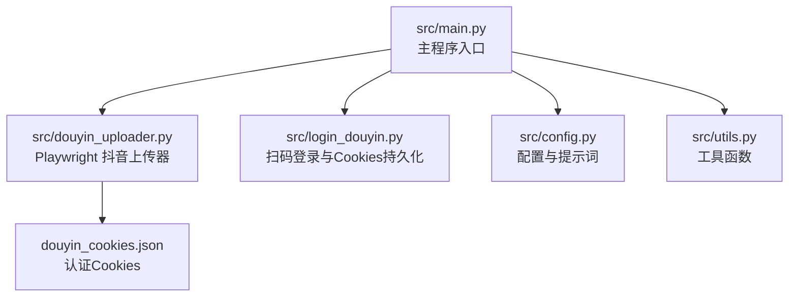
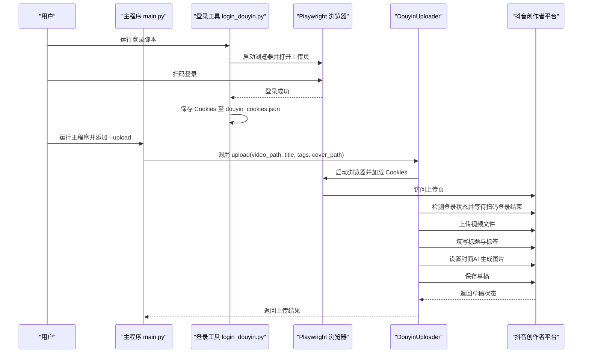
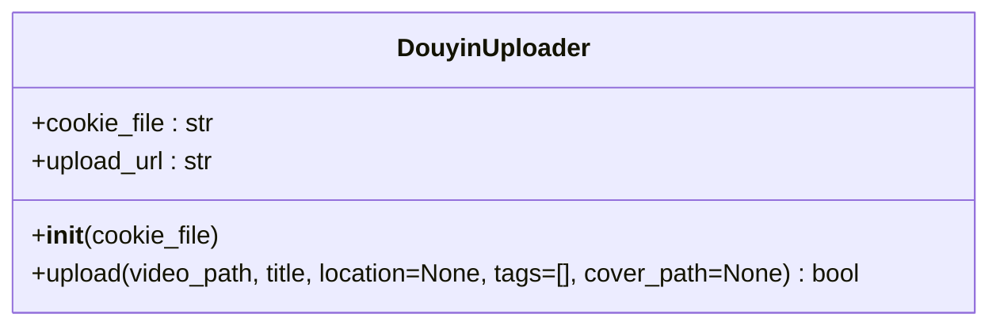
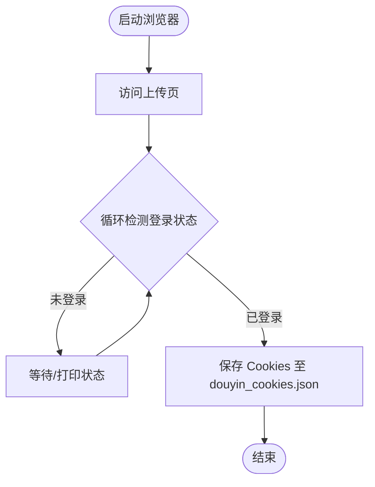
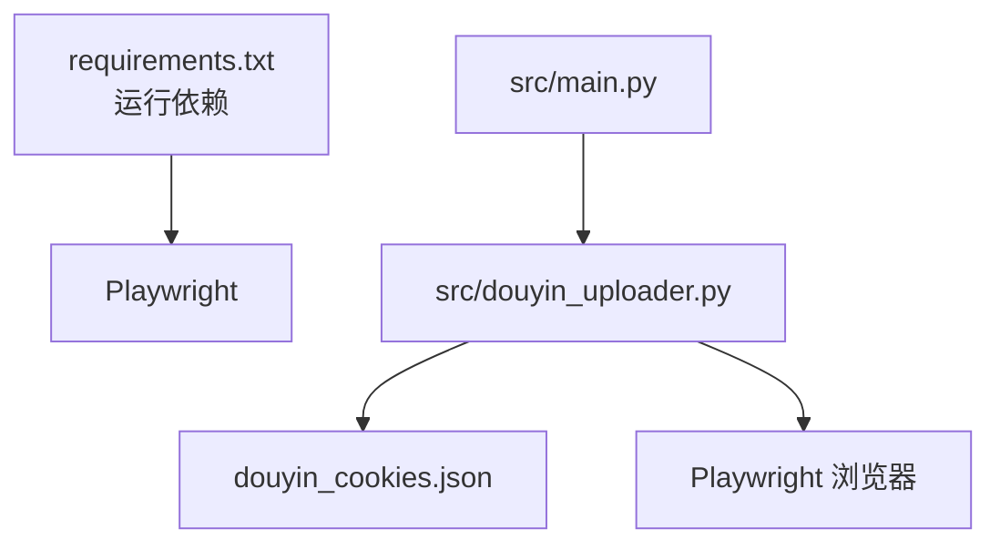
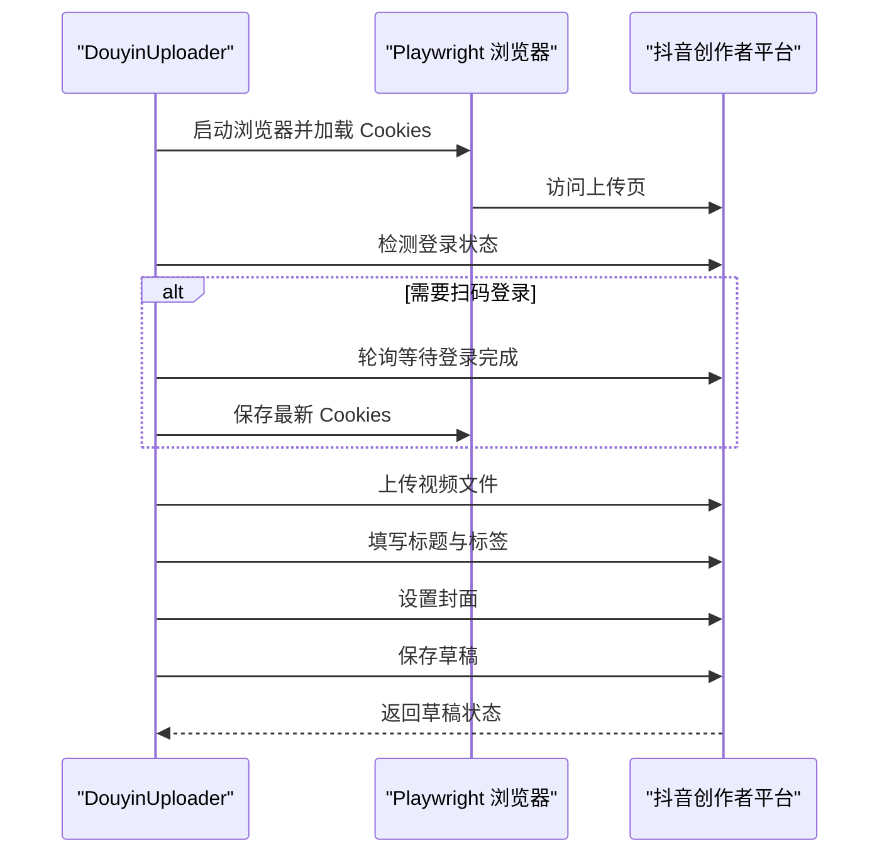

# 抖音自动上传

<cite>
**本文引用的文件列表**
- [README.md](file://README.md)
- [requirements.txt](file://requirements.txt)
- [src/main.py](file://src/main.py)
- [src/douyin_uploader.py](file://src/douyin_uploader.py)
- [src/login_douyin.py](file://src/login_douyin.py)
- [src/config.py](file://src/config.py)
- [src/utils.py](file://src/utils.py)
</cite>

## 目录
1. [引言](#引言)
2. [项目结构](#项目结构)
3. [核心组件](#核心组件)
4. [架构总览](#架构总览)
5. [详细组件分析](#详细组件分析)
6. [依赖关系分析](#依赖关系分析)
7. [性能与稳定性考量](#性能与稳定性考量)
8. [故障排查指南](#故障排查指南)
9. [结论](#结论)
10. [附录](#附录)

## 引言
本文件面向希望使用 Playwright 实现抖音创作者平台自动上传的开发者与运营人员。文档围绕以下目标展开：
- 解析 douyin_uploader.py 如何通过加载 douyin_cookies.json 中的认证信息免扫码登录创作者平台，并模拟用户操作完成视频上传。
- 详解 upload 方法的关键步骤：定位文件输入框、注入视频文件路径、填写标题（如《书名》深度解读...）、添加标签（#读书 #知识分享）及设置 AI 生成的图片为封面。
- 说明 login_douyin.py 在首次运行时启动浏览器供用户扫码以持久化 Cookies 的重要性。
- 解释 --upload 参数如何触发此流程，并提供上传失败的常见原因（Cookies 过期、网络波动）及恢复策略。
- 提供安全建议，如 Cookies 文件的权限管理与多账号支持的扩展思路，确保文档既实用又具备前瞻性。

## 项目结构
该项目采用模块化设计，围绕“主流程编排 + 各功能模块 + 自动化上传”组织代码。关键文件职责如下：
- src/main.py：主程序入口，负责读取命令行参数、串联各模块（LLM/TTS/图像/视频生成），并在开启 --upload 时调用上传器。
- src/douyin_uploader.py：基于 Playwright 的抖音上传自动化实现，负责登录态管理、页面交互、表单填写与草稿保存。
- src/login_douyin.py：首次登录工具，启动浏览器供用户扫码登录并持久化 Cookies 至 douyin_cookies.json。
- src/config.py：配置项集中地，包括 LLM/TTS/图像等参数，以及提示词模板。
- src/utils.py：通用工具函数，如脚本清洗与字幕解析。
- README.md：使用说明、流程与常见问题。
- requirements.txt：运行依赖清单。

图表来源
- [src/main.py](file://src/main.py#L1-L262)
- [src/douyin_uploader.py](file://src/douyin_uploader.py#L1-L380)
- [src/login_douyin.py](file://src/login_douyin.py#L1-L76)
- [src/config.py](file://src/config.py#L1-L93)
- [src/utils.py](file://src/utils.py#L1-L72)

章节来源
- [README.md](file://README.md#L1-L134)
- [requirements.txt](file://requirements.txt#L1-L10)

## 核心组件
- 抖音上传器 DouyinUploader
  - 负责启动浏览器、加载 Cookies、进入上传页、检测登录状态、上传视频、填写标题与标签、设置封面、保存草稿。
  - 关键字段：cookie_file、upload_url；关键方法：upload。
- 登录工具 login_and_save_cookies
  - 启动浏览器，打开上传页，等待用户扫码登录，检测登录成功后保存 Cookies。
- 主程序 main
  - 解析命令行参数，按流程生成脚本/图像/音频/视频，当启用 --upload 时调用上传器并传入标题、标签与封面路径。

章节来源
- [src/douyin_uploader.py](file://src/douyin_uploader.py#L1-L380)
- [src/login_douyin.py](file://src/login_douyin.py#L1-L76)
- [src/main.py](file://src/main.py#L1-L262)

## 架构总览
整体流程由主程序驱动，上传器通过 Playwright 模拟真实用户操作，借助持久化的 Cookies 实现免扫码登录。上传完成后将视频保存为草稿，便于后续发布。

图表来源
- [src/main.py](file://src/main.py#L247-L259)
- [src/login_douyin.py](file://src/login_douyin.py#L1-L76)
- [src/douyin_uploader.py](file://src/douyin_uploader.py#L10-L110)

## 详细组件分析

### 抖音上传器 DouyinUploader
DouyinUploader 是整个上传流程的核心，其 upload 方法实现了从登录态检测到草稿保存的完整链路。

- 初始化与登录态
  - 通过 storage_state 加载本地 Cookies，若不存在则新建上下文。
  - 访问上传页后，检测 URL 与页面内容，识别是否处于登录态或需要扫码登录。
  - 若检测到登录需求，进入轮询等待，直到不再出现“扫码登录”字样且 URL 指向创作中心。
  - 成功登录后立即保存 Cookies，确保后续无需扫码。

- 上传视频
  - 定位上传触发区域（如“点击上传”或拖拽区域），通过 expect_file_chooser 或直接 set_input_files 注入视频路径。
  - 为提升成功率，提供多次重试与事件派发（change/input）以触发前端监听。
  - 等待上传开始信号（如“重新上传”“上传成功”“播放器容器”等），并等待“上传成功”。

- 填写标题与标签
  - 通过可编辑区域或标题输入框定位，拼接标题与标签后填充。
  - 保证标题与话题的可读性与合规性。

- 设置封面
  - 点击“设置封面/选择封面”，进入封面选择面板。
  - 优先选择“智能推荐封面”，若不可用则回退到“截取封面”。
  - 点击“完成/确定/裁剪完成”确认，或在找不到确认按钮时尝试 ESC 关闭。

- 保存草稿
  - 滚动至底部，查找“暂存离开/存草稿”按钮并点击。
  - 若出现确认弹窗，点击“确定/保存”。
  - 等待“成功”提示或静默完成。

图表来源
- [src/douyin_uploader.py](file://src/douyin_uploader.py#L1-L380)

章节来源
- [src/douyin_uploader.py](file://src/douyin_uploader.py#L10-L380)

### 登录工具 login_and_save_cookies
- 启动浏览器并打开上传页，打印提示信息，等待用户扫码登录。
- 循环检测 URL 与页面内容，满足“URL 包含 creator 且不包含扫码登录/登录/注册，且包含上传/作品/首页等正向元素”时判定登录成功。
- 登录成功后保存 Cookies 至 douyin_cookies.json，供上传器复用。

图表来源
- [src/login_douyin.py](file://src/login_douyin.py#L1-L76)

章节来源
- [src/login_douyin.py](file://src/login_douyin.py#L1-L76)

### 主程序 main 的上传触发与参数
- 命令行参数 --upload：启用自动上传流程。
- 标题与标签：根据书名生成标题与标签集合，封面使用 AI 生成图片。
- 调用上传器：将视频路径、标题、标签与封面路径传递给 DouyinUploader.upload。

章节来源
- [src/main.py](file://src/main.py#L247-L259)
- [README.md](file://README.md#L48-L61)

## 依赖关系分析
- 运行时依赖
  - Playwright：用于自动化浏览器控制与页面交互。
  - 其他模块：LLM/TTS/图像/视频生成等，为主流程提供素材。
- 上传器依赖
  - 本地 Cookies 文件 douyin_cookies.json：用于免扫码登录。
  - 抖音创作者平台上传页 URL：作为自动化入口。

图表来源
- [requirements.txt](file://requirements.txt#L1-L10)
- [src/main.py](file://src/main.py#L1-L262)
- [src/douyin_uploader.py](file://src/douyin_uploader.py#L1-L380)

章节来源
- [requirements.txt](file://requirements.txt#L1-L10)
- [src/main.py](file://src/main.py#L1-L262)
- [src/douyin_uploader.py](file://src/douyin_uploader.py#L1-L380)

## 性能与稳定性考量
- 上传重试与事件派发
  - 上传阶段提供多次重试与事件派发（change/input），以应对前端监听延迟或页面交互差异。
- 超时与等待
  - 页面加载、上传开始、上传完成均设置合理超时，避免长时间阻塞。
- 页面导航与状态校验
  - 上传前校验 URL 与页面内容，防止停留在仪表盘首页导致误判。
- 网络波动与 Cookies 过期
  - 上传过程中遇到网络波动或 Cookies 失效，应主动触发重新登录流程并保存最新 Cookies。

章节来源
- [src/douyin_uploader.py](file://src/douyin_uploader.py#L118-L251)
- [src/login_douyin.py](file://src/login_douyin.py#L26-L73)

## 故障排查指南
- 常见失败原因
  - Cookies 过期：上传器检测到登录态失效时会等待扫码登录，若长时间未登录成功，将返回失败。
  - 网络波动：页面加载超时、上传等待超时，需在网络稳定后再试。
  - 页面结构变化：上传区选择器或按钮文案更新，导致定位失败。
- 排查步骤
  - 确认 douyin_cookies.json 是否存在且未过期，必要时重新运行登录脚本。
  - 检查 Playwright 浏览器是否正常启动，headless=False 便于观察扫码过程。
  - 在上传器中增加日志输出，定位上传触发、事件派发与等待节点。
  - 若页面文案变化，调整选择器或按钮文案匹配逻辑。
- 恢复策略
  - 重新扫码登录并保存 Cookies。
  - 降低视频大小或提高网络质量后重试。
  - 在主程序中加入 --retry 参数，对上传失败的视频进行重试。

章节来源
- [README.md](file://README.md#L126-L134)
- [src/douyin_uploader.py](file://src/douyin_uploader.py#L39-L110)
- [src/login_douyin.py](file://src/login_douyin.py#L26-L73)

## 结论
本项目通过 Playwright 将抖音上传流程自动化，借助持久化的 Cookies 实现免扫码登录。DouyinUploader 的 upload 方法覆盖了从登录态检测、视频上传、标题标签填写到封面设置与草稿保存的完整链路。配合主程序的参数化控制与登录工具的扫码登录能力，形成了一套可复用、可扩展的自动化上传方案。针对 Cookies 过期与网络波动等常见问题，建议在生产环境中加入重试与监控告警，并持续关注页面结构变化以维护稳定性。

## 附录

### 关键流程时序（上传）

图表来源
- [src/douyin_uploader.py](file://src/douyin_uploader.py#L10-L110)
- [src/douyin_uploader.py](file://src/douyin_uploader.py#L118-L251)

### 安全建议
- Cookies 文件权限管理
  - 将 douyin_cookies.json 的文件权限设置为仅当前用户可读写，避免泄露登录态。
  - 在 CI/CD 环境中，使用受控密钥管理服务存储 Cookies，避免明文提交到仓库。
- 多账号支持
  - 为不同账号维护独立的 Cookies 文件（如 douyin_cookies_1.json、douyin_cookies_2.json），在调用上传器时传入对应 cookie_file。
  - 在主程序中增加 --account 参数，按账号选择不同的 Cookies 文件与封面资源。
- 稳健性增强
  - 在上传前校验视频文件完整性与尺寸，减少无效上传。
  - 对上传失败的视频记录日志与重试队列，支持断点续传与人工干预。

章节来源
- [src/douyin_uploader.py](file://src/douyin_uploader.py#L1-L380)
- [src/main.py](file://src/main.py#L247-L259)