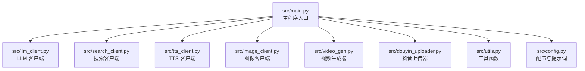
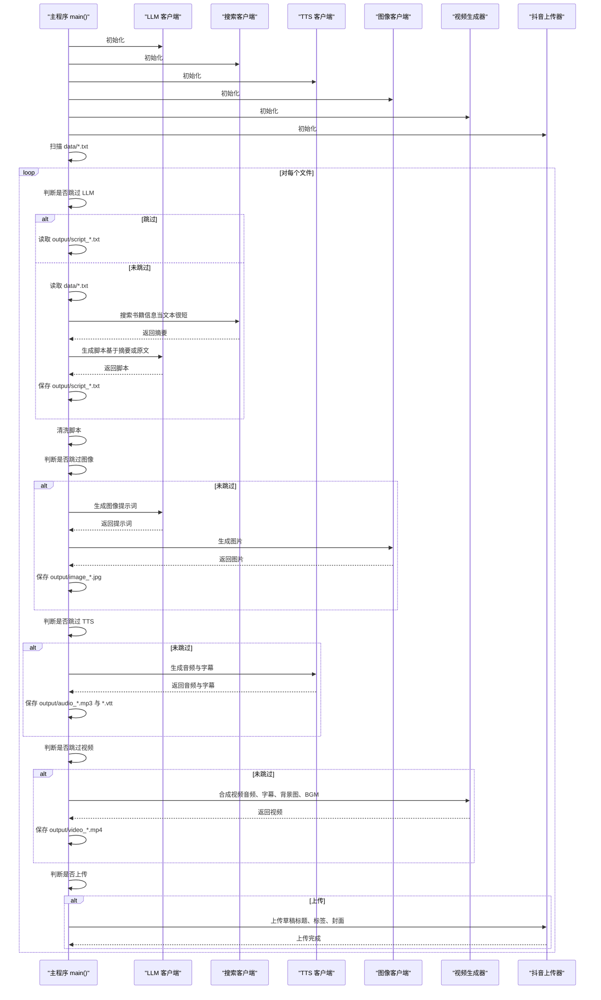
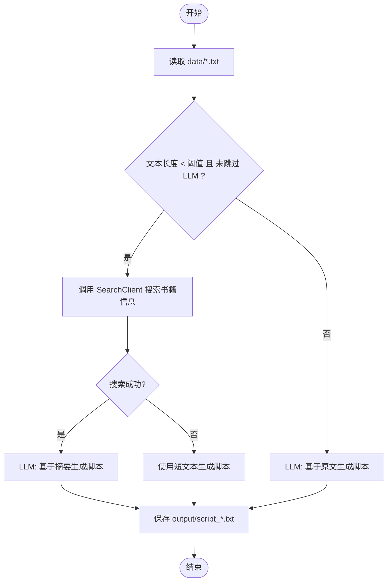
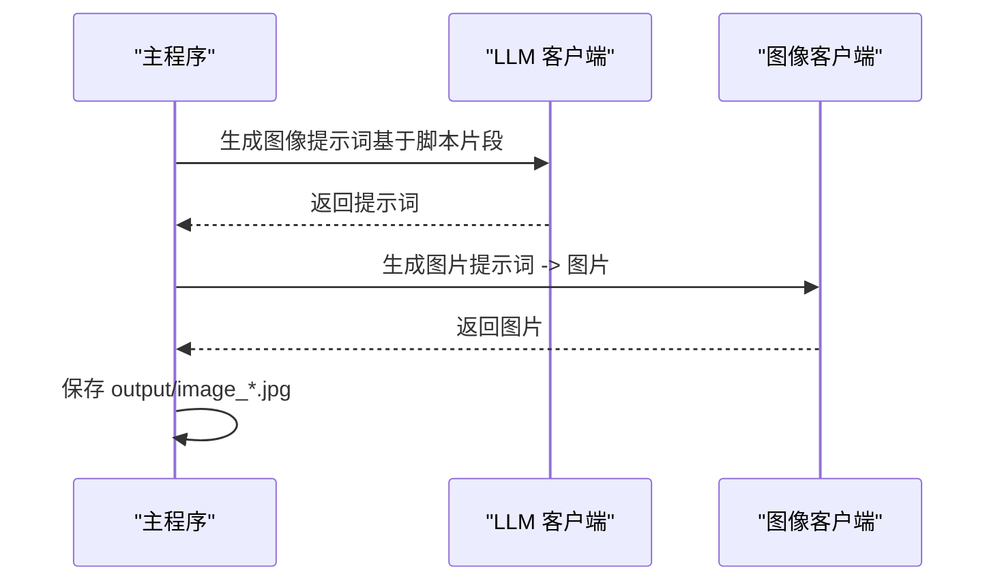
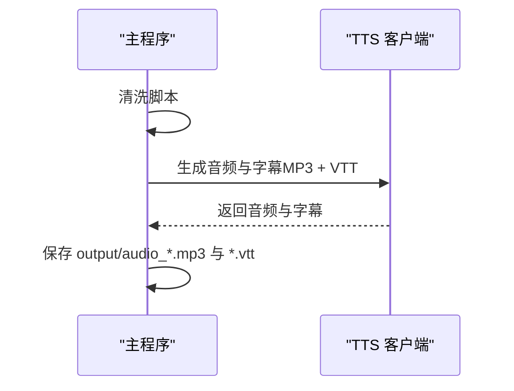
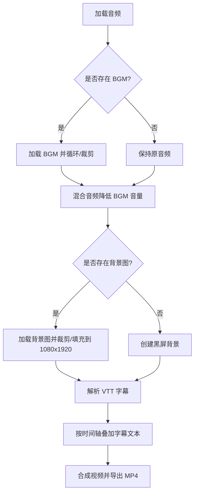
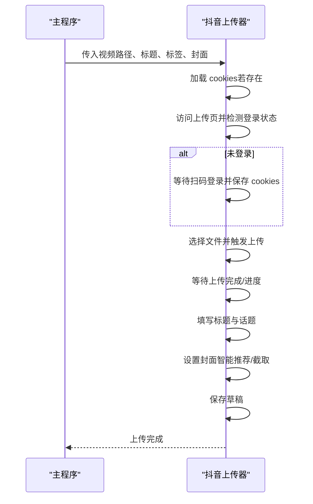
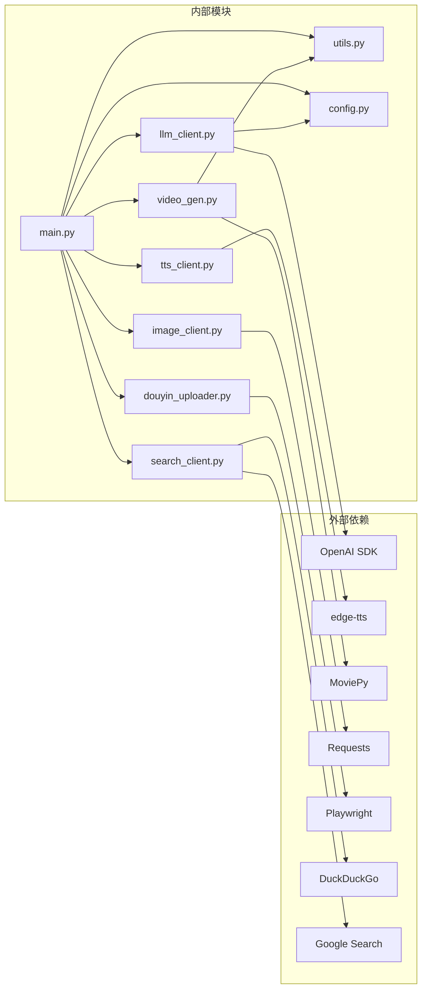

# 核心工作流程

<cite>
**本文引用的文件**
- [src/main.py](file://src/main.py)
- [src/llm_client.py](file://src/llm_client.py)
- [src/search_client.py](file://src/search_client.py)
- [src/tts_client.py](file://src/tts_client.py)
- [src/image_client.py](file://src/image_client.py)
- [src/video_gen.py](file://src/video_gen.py)
- [src/douyin_uploader.py](file://src/douyin_uploader.py)
- [src/utils.py](file://src/utils.py)
- [src/config.py](file://src/config.py)
- [README.md](file://README.md)
- [requirements.txt](file://requirements.txt)
</cite>

## 目录
1. [引言](#引言)
2. [项目结构](#项目结构)
3. [核心组件](#核心组件)
4. [架构总览](#架构总览)
5. [详细组件分析](#详细组件分析)
6. [依赖关系分析](#依赖关系分析)
7. [性能考量](#性能考量)
8. [故障排查指南](#故障排查指南)
9. [结论](#结论)
10. [附录](#附录)

## 引言
本文件围绕 src/main.py 协调控制的自动化工作流进行深入解析，覆盖五大阶段：脚本生成、图像生成、语音与字幕生成、视频合成、自动上传。文档同时解释命令行参数如何实现流程跳过与部分重运行，以支持调试与增量开发。

## 项目结构
- 输入目录 data/：存放书籍 TXT 文本、可选背景图 background.jpg、可选背景音乐 bgm.mp3/bgm.wav。
- 输出目录 output/：存放脚本、图片、音频、字幕、视频等中间与最终产物。
- 核心模块：
  - 主程序入口：src/main.py
  - LLM 客户端：src/llm_client.py
  - 搜索客户端：src/search_client.py
  - TTS 客户端：src/tts_client.py
  - 图像客户端：src/image_client.py
  - 视频生成器：src/video_gen.py
  - 抖音上传器：src/douyin_uploader.py
  - 工具函数：src/utils.py
  - 配置与提示词：src/config.py

图表来源
- [src/main.py](file://src/main.py#L1-L262)
- [src/llm_client.py](file://src/llm_client.py#L1-L60)
- [src/search_client.py](file://src/search_client.py#L1-L113)
- [src/tts_client.py](file://src/tts_client.py#L1-L80)
- [src/image_client.py](file://src/image_client.py#L1-L132)
- [src/video_gen.py](file://src/video_gen.py#L1-L162)
- [src/douyin_uploader.py](file://src/douyin_uploader.py#L1-L380)
- [src/utils.py](file://src/utils.py#L1-L72)
- [src/config.py](file://src/config.py#L1-L93)

章节来源
- [README.md](file://README.md#L1-L134)
- [requirements.txt](file://requirements.txt#L1-L10)

## 核心组件
- 主程序 main()：负责参数解析、客户端初始化、目录扫描、循环处理每个 TXT 文件、按阶段执行各子流程、条件跳过与最终上传。
- LLM 客户端：封装 OpenAI 客户端，提供脚本生成、基于搜索摘要的脚本生成、图像提示词生成。
- 搜索客户端：聚合 DuckDuckGo 与 Google 搜索结果，形成书籍信息摘要。
- TTS 客户端：基于 edge-tts 的异步音频生成与字幕生成（VTT）。
- 图像客户端：支持 Hugging Face 与 SiliconFlow 推理后端，生成图片。
- 视频生成器：基于 MoviePy 合成视频，叠加字幕与背景音乐，输出竖屏 1080x1920。
- 抖音上传器：Playwright 自动化，加载 Cookies，扫码登录，上传草稿并保存。

章节来源
- [src/main.py](file://src/main.py#L1-L262)
- [src/llm_client.py](file://src/llm_client.py#L1-L60)
- [src/search_client.py](file://src/search_client.py#L1-L113)
- [src/tts_client.py](file://src/tts_client.py#L1-L80)
- [src/image_client.py](file://src/image_client.py#L1-L132)
- [src/video_gen.py](file://src/video_gen.py#L1-L162)
- [src/douyin_uploader.py](file://src/douyin_uploader.py#L1-L380)
- [src/utils.py](file://src/utils.py#L1-L72)
- [src/config.py](file://src/config.py#L1-L93)

## 架构总览
下图展示主程序与各子模块之间的调用关系与数据流向。

图表来源
- [src/main.py](file://src/main.py#L1-L262)
- [src/llm_client.py](file://src/llm_client.py#L1-L60)
- [src/search_client.py](file://src/search_client.py#L1-L113)
- [src/tts_client.py](file://src/tts_client.py#L1-L80)
- [src/image_client.py](file://src/image_client.py#L1-L132)
- [src/video_gen.py](file://src/video_gen.py#L1-L162)
- [src/douyin_uploader.py](file://src/douyin_uploader.py#L1-L380)

## 详细组件分析

### 阶段一：脚本生成（LLM）
- 输入：data/<book_name>.txt（书籍文本）
- 关键逻辑：
  - 若文本长度小于阈值且未跳过 LLM，先尝试联网搜索书籍信息（简介、剧情、经典语录、评价），再基于摘要生成脚本。
  - 若文本较长或未跳过 LLM，直接基于原文生成脚本。
  - 生成后写入 output/script_<book_name>.txt。
- 关键调用链：
  - main() 读取 TXT → 调用 SearchClient 搜索 → LLMClient.generate_script_from_summary 或 generate_script → 写入脚本文件。
- 命令行参数：
  - --skip-llm：若 output/script_<book_name>.txt 已存在则直接读取，跳过 LLM 生成。

图表来源
- [src/main.py](file://src/main.py#L100-L160)
- [src/search_client.py](file://src/search_client.py#L1-L113)
- [src/llm_client.py](file://src/llm_client.py#L1-L60)

章节来源
- [src/main.py](file://src/main.py#L100-L160)
- [src/search_client.py](file://src/search_client.py#L1-L113)
- [src/llm_client.py](file://src/llm_client.py#L1-L60)
- [src/config.py](file://src/config.py#L1-L93)

### 阶段二：图像生成（AI 绘图）
- 输入：脚本前段内容（用于生成英文绘画提示词）
- 关键逻辑：
  - LLM 生成英文绘画提示词（prompt）。
  - 调用 ImageClient 生成图片，保存为 output/image_<book_name>.jpg。
  - 若失败，后续视频合成将使用默认背景或黑屏。
- 命令行参数：
  - --skip-image：若 output/image_<book_name>.jpg 已存在则跳过绘图。

图表来源
- [src/main.py](file://src/main.py#L167-L188)
- [src/llm_client.py](file://src/llm_client.py#L1-L60)
- [src/image_client.py](file://src/image_client.py#L1-L132)

章节来源
- [src/main.py](file://src/main.py#L167-L188)
- [src/llm_client.py](file://src/llm_client.py#L1-L60)
- [src/image_client.py](file://src/image_client.py#L1-L132)
- [src/config.py](file://src/config.py#L1-L93)

### 阶段三：语音与字幕生成（TTS）
- 输入：清洗后的脚本（去除 Markdown 标记等）
- 关键逻辑：
  - 使用 edge-tts CLI 生成音频（MP3）与字幕（VTT）。
  - 字幕时间轴由 edge-tts 生成，便于视频合成时对齐。
- 命令行参数：
  - --skip-tts：若 output/audio_<book_name>.mp3 与 *.vtt 已存在则跳过 TTS。

图表来源
- [src/main.py](file://src/main.py#L189-L207)
- [src/tts_client.py](file://src/tts_client.py#L1-L80)
- [src/utils.py](file://src/utils.py#L1-L72)

章节来源
- [src/main.py](file://src/main.py#L189-L207)
- [src/tts_client.py](file://src/tts_client.py#L1-L80)
- [src/utils.py](file://src/utils.py#L1-L72)

### 阶段四：视频合成（MoviePy）
- 输入：音频（MP3）、字幕（VTT）、背景图（AI 图片或 data/background.jpg）、背景音乐（可选 bgm.mp3/bgm.wav）
- 关键逻辑：
  - 加载音频，可选叠加背景音乐（循环与音量缩放）。
  - 创建背景（图片或黑屏），按字幕时间轴叠加文本片段。
  - 输出竖屏 1080x1920 MP4。
- 命令行参数：
  - --skip-video：若 output/video_<book_name>.mp4 已存在则跳过合成。

图表来源
- [src/main.py](file://src/main.py#L208-L239)
- [src/video_gen.py](file://src/video_gen.py#L1-L162)
- [src/utils.py](file://src/utils.py#L1-L72)

章节来源
- [src/main.py](file://src/main.py#L208-L239)
- [src/video_gen.py](file://src/video_gen.py#L1-L162)
- [src/utils.py](file://src/utils.py#L1-L72)

### 阶段五：自动上传（Playwright）
- 输入：output/video_<book_name>.mp4、标题、标签、封面（可选）
- 关键逻辑：
  - 使用 Playwright 打开上传页，加载 cookies（若存在）。
  - 若未登录，等待扫码登录并保存 cookies。
  - 上传视频，填写标题与话题，设置封面，保存草稿。
- 命令行参数：
  - --upload：启用上传流程。

图表来源
- [src/main.py](file://src/main.py#L247-L259)
- [src/douyin_uploader.py](file://src/douyin_uploader.py#L1-L380)

章节来源
- [src/main.py](file://src/main.py#L247-L259)
- [src/douyin_uploader.py](file://src/douyin_uploader.py#L1-L380)

## 依赖关系分析
- 外部依赖：
  - OpenAI SDK：调用 LLM。
  - edge-tts：TTS 与字幕生成。
  - MoviePy：视频合成。
  - Requests：图像生成后端请求。
  - Playwright：抖音上传自动化。
  - DuckDuckGo 与 Google 搜索：书籍信息检索。
- 内部模块耦合：
  - main() 作为编排者，依赖各客户端与工具函数。
  - LLM 客户端依赖 config 中的提示词模板与模型配置。
  - 视频生成依赖 utils 的 VTT 解析。
  - 上传器依赖 cookies 文件与抖音页面元素定位策略。

图表来源
- [src/main.py](file://src/main.py#L1-L262)
- [src/llm_client.py](file://src/llm_client.py#L1-L60)
- [src/search_client.py](file://src/search_client.py#L1-L113)
- [src/tts_client.py](file://src/tts_client.py#L1-L80)
- [src/image_client.py](file://src/image_client.py#L1-L132)
- [src/video_gen.py](file://src/video_gen.py#L1-L162)
- [src/douyin_uploader.py](file://src/douyin_uploader.py#L1-L380)
- [src/utils.py](file://src/utils.py#L1-L72)
- [src/config.py](file://src/config.py#L1-L93)
- [requirements.txt](file://requirements.txt#L1-L10)

章节来源
- [requirements.txt](file://requirements.txt#L1-L10)

## 性能考量
- LLM 与图像生成：
  - LLM 与绘图均为高延迟外部服务，建议在调试阶段使用 --skip-llm/--skip-image 跳过，以缩短迭代周期。
- TTS：
  - edge-tts 依赖网络，建议在稳定网络环境下运行，或使用 --skip-tts 跳过以验证其他流程。
- 视频合成：
  - MoviePy 渲染耗时与音频长度、字幕数量、背景图尺寸相关。建议在本地 GPU 加速环境下运行，或使用 --skip-video 跳过以验证字幕与音频。
- 抖音上传：
  - Playwright 自动化受页面交互影响较大，建议首次运行时手动登录并保存 cookies，后续可重复使用。

## 故障排查指南
- LLM 初始化失败：
  - 检查 .env 中 LLM_API_KEY、BASE_URL、MODEL_NAME 是否正确配置。
- 搜索失败：
  - 网络不稳定或被限流，可重试或更换网络环境。
- 图像生成失败：
  - 检查 HF_TOKEN 或 API_KEY 配置，确认所选模型可用。
- TTS 失败：
  - 检查网络连通性与 edge-tts CLI 可用性。
- 视频合成失败：
  - 检查音频与字幕文件完整性，确认 MoviePy 依赖安装。
- 抖音上传失败：
  - 检查 douyin_cookies.json 是否存在且有效；必要时重新扫码登录。

章节来源
- [src/llm_client.py](file://src/llm_client.py#L1-L60)
- [src/image_client.py](file://src/image_client.py#L1-L132)
- [src/tts_client.py](file://src/tts_client.py#L1-L80)
- [src/video_gen.py](file://src/video_gen.py#L1-L162)
- [src/douyin_uploader.py](file://src/douyin_uploader.py#L1-L380)
- [README.md](file://README.md#L1-L134)

## 结论
src/main.py 将 LLM、TTS、图像生成、视频合成与抖音上传串联为完整的自动化流水线。通过 --skip-llm/--skip-tts/--skip-image/--skip-video/--upload 等参数，开发者可在任一阶段跳过或重跑，显著提升调试效率与增量开发体验。建议在本地逐步验证各阶段输出，确保数据一致性后再进行端到端运行。

## 附录
- 命令行参数说明
  - --skip-llm：跳过 LLM 脚本生成，直接使用 output/ 下现有脚本文件。
  - --skip-tts：跳过 TTS 语音生成，直接使用 output/ 下现有音频文件。
  - --skip-image：跳过 AI 绘图，直接使用 output/ 下现有图片文件。
  - --skip-video：跳过视频合成，直接使用 output/ 下现有视频文件。
  - --upload：生成完成后，自动将视频上传至抖音创作者平台草稿箱。

章节来源
- [src/main.py](file://src/main.py#L37-L46)
- [README.md](file://README.md#L62-L97)