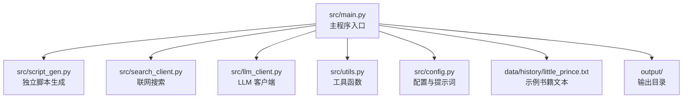
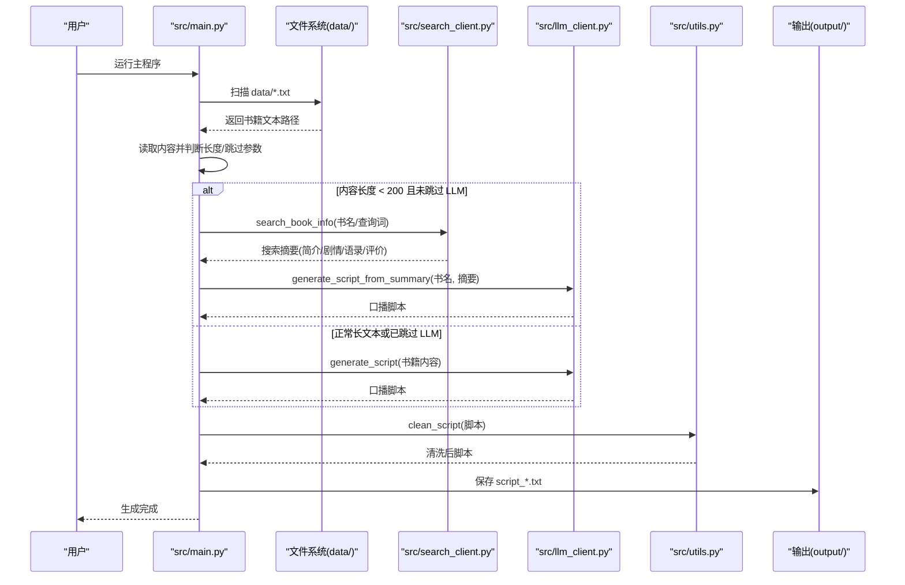
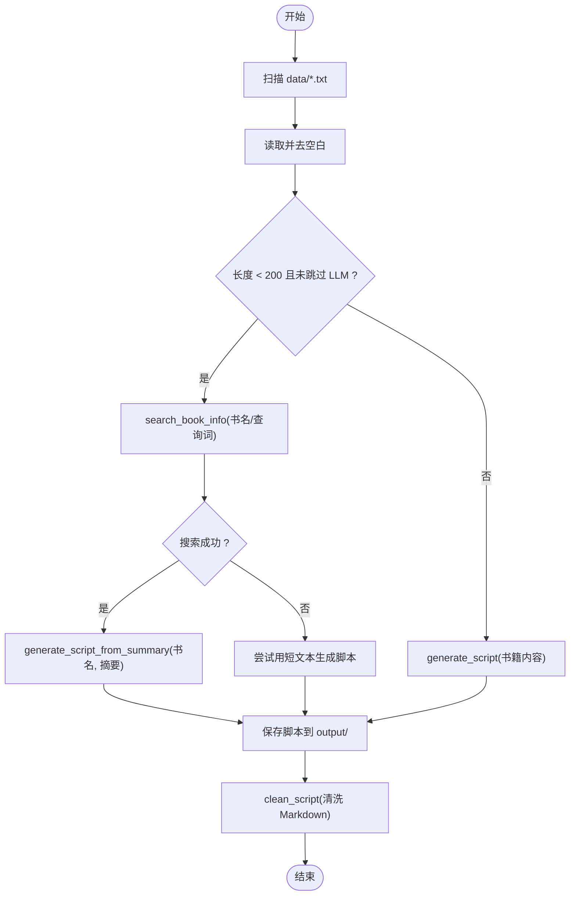
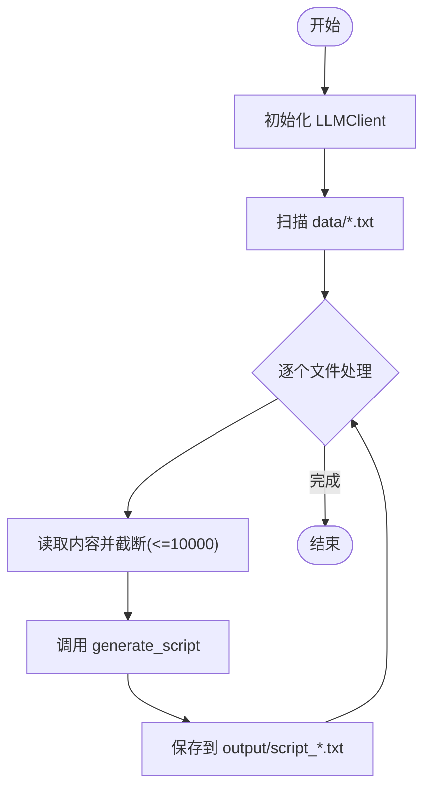
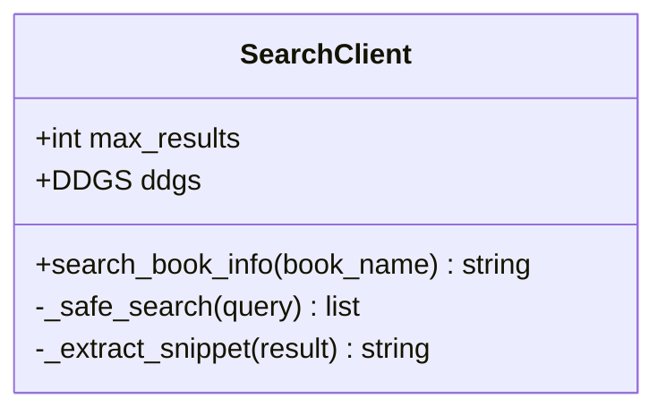
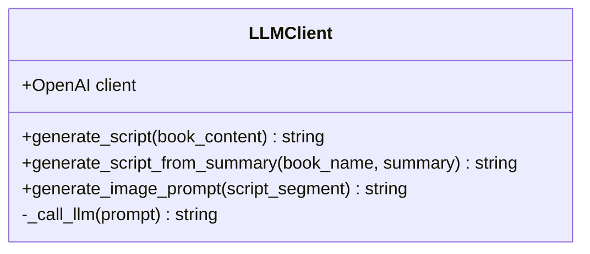
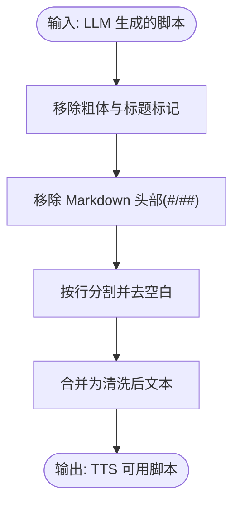
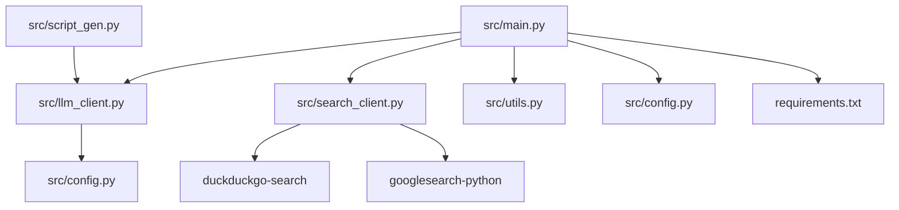

# 脚本生成

<cite>
**本文引用的文件**
- [src/main.py](file://src/main.py)
- [src/script_gen.py](file://src/script_gen.py)
- [src/search_client.py](file://src/search_client.py)
- [src/llm_client.py](file://src/llm_client.py)
- [src/utils.py](file://src/utils.py)
- [src/config.py](file://src/config.py)
- [README.md](file://README.md)
- [requirements.txt](file://requirements.txt)
- [data/history/little_prince.txt](file://data/history/little_prince.txt)
</cite>

## 目录
1. [引言](#引言)
2. [项目结构](#项目结构)
3. [核心组件](#核心组件)
4. [架构总览](#架构总览)
5. [详细组件分析](#详细组件分析)
6. [依赖关系分析](#依赖关系分析)
7. [性能考量](#性能考量)
8. [故障排查指南](#故障排查指南)
9. [结论](#结论)
10. [附录](#附录)

## 引言
本文件聚焦“脚本生成模块”的实现机制，它是整个自动化流程的起点。模块工作流程如下：
- 从 data/ 目录读取书籍 TXT 文件内容；
- 若内容长度小于 200 字符且未跳过 LLM 步骤，则触发“联网搜索模式”，调用 search_client.py 中的 search_book_info 方法，通过 DuckDuckGo 或 Google 检索书籍简介与评价，随后将结果传递给 LLMClient 的 generate_script_from_summary 方法生成口播文案；
- 对于正常长度文本，则直接调用 generate_script 进行内容提炼；
- 提示词工程采用抖音风格指令模板，确保生成口语化、有吸引力的三分钟解读脚本；
- 使用 clean_script 工具函数清洗 Markdown 格式并适配 TTS 输入要求；
- 提供实际代码示例展示文本截断（10000 字符限制）、错误处理及输出文件保存逻辑；
- --skip-llm 参数实现断点续传，支持开发者调试与迭代优化。

## 项目结构
脚本生成相关的关键文件与职责：
- src/main.py：主程序入口，负责扫描 data/、执行脚本生成、图像生成、TTS、视频合成与上传等全流程编排；
- src/script_gen.py：独立脚本生成入口（仅生成脚本，不进入完整流水线）；
- src/search_client.py：封装联网搜索客户端，统一 DuckDuckGo 与 Google 的搜索结果格式；
- src/llm_client.py：封装 LLM 调用，提供 generate_script 与 generate_script_from_summary 两个关键方法；
- src/utils.py：提供 clean_script 清洗脚本、parse_vtt 解析字幕等工具；
- src/config.py：集中管理 LLM API 配置与提示词模板；
- data/history/little_prince.txt：示例书籍文本，用于演示脚本生成流程；
- README.md：项目使用说明与流程概览；
- requirements.txt：项目依赖清单。

图表来源
- [src/main.py](file://src/main.py#L1-L262)
- [src/script_gen.py](file://src/script_gen.py#L1-L58)
- [src/search_client.py](file://src/search_client.py#L1-L113)
- [src/llm_client.py](file://src/llm_client.py#L1-L60)
- [src/utils.py](file://src/utils.py#L1-L72)
- [src/config.py](file://src/config.py#L1-L93)
- [data/history/little_prince.txt](file://data/history/little_prince.txt#L1-L22)

章节来源
- [src/main.py](file://src/main.py#L1-L262)
- [README.md](file://README.md#L1-L134)

## 核心组件
- 脚本生成主流程（src/main.py）：扫描 data/ 下的 .txt 文件，判断内容长度与跳过参数，决定走“联网搜索+LLM”还是“直接LLM”，并保存脚本；
- 独立脚本生成（src/script_gen.py）：简化版入口，直接读取 data/ 下的 .txt 并生成脚本；
- 联网搜索（src/search_client.py）：封装 DuckDuckGo 与 Google 的搜索策略，统一结果格式；
- LLM 客户端（src/llm_client.py）：封装 OpenAI 兼容客户端，提供 generate_script 与 generate_script_from_summary；
- 提示词与配置（src/config.py）：定义抖音风格提示词模板与 LLM 配置；
- 工具函数（src/utils.py）：clean_script 清洗 Markdown，parse_vtt 解析字幕；
- 示例数据（data/history/little_prince.txt）：演示脚本生成输入。

章节来源
- [src/main.py](file://src/main.py#L98-L195)
- [src/script_gen.py](file://src/script_gen.py#L1-L58)
- [src/search_client.py](file://src/search_client.py#L1-L113)
- [src/llm_client.py](file://src/llm_client.py#L1-L60)
- [src/config.py](file://src/config.py#L1-L93)
- [src/utils.py](file://src/utils.py#L1-L72)
- [data/history/little_prince.txt](file://data/history/little_prince.txt#L1-L22)

## 架构总览
脚本生成模块在主程序中的位置与交互如下：

图表来源
- [src/main.py](file://src/main.py#L98-L195)
- [src/search_client.py](file://src/search_client.py#L1-L113)
- [src/llm_client.py](file://src/llm_client.py#L1-L60)
- [src/utils.py](file://src/utils.py#L1-L23)

## 详细组件分析

### 组件A：脚本生成主流程（src/main.py）
- 输入输出
  - 输入：data/<book>.txt
  - 输出：output/script_<book>.txt
- 关键逻辑
  - 扫描 data/ 下的 .txt 文件；
  - 读取内容并去空白；
  - 判断长度阈值（<200 字符）与 --skip-llm 参数；
  - 若满足“短文本+未跳过”，走“联网搜索+LLM”分支；
  - 否则走“直接LLM”分支；
  - 截断长文本（MVP 阶段限制 10000 字符）；
  - 保存脚本；
  - 调用 clean_script 清洗 Markdown，为后续 TTS 做准备。
- 错误处理
  - 搜索失败时，若原文为空则跳过该文件；
  - LLM 生成失败则跳过后续步骤；
  - 文件不存在或读取失败时打印提示并继续下一个文件。
- 断点续传
  - --skip-llm：若 output/script_<book>.txt 存在，则直接读取，跳过 LLM 生成。

图表来源
- [src/main.py](file://src/main.py#L98-L195)
- [src/utils.py](file://src/utils.py#L1-L23)

章节来源
- [src/main.py](file://src/main.py#L98-L195)
- [src/utils.py](file://src/utils.py#L1-L23)

### 组件B：独立脚本生成（src/script_gen.py）
- 作用：简化入口，仅生成脚本，不进入完整流水线；
- 关键逻辑
  - 初始化 LLMClient；
  - 扫描 data/*.txt；
  - 读取内容并截断（10000 字符）；
  - 调用 LLMClient.generate_script；
  - 保存 output/script_*.txt。

图表来源
- [src/script_gen.py](file://src/script_gen.py#L1-L58)

章节来源
- [src/script_gen.py](file://src/script_gen.py#L1-L58)

### 组件C：联网搜索（src/search_client.py）
- 作用：统一 DuckDuckGo 与 Google 的搜索结果格式，返回书籍简介、剧情、经典语录与评价的汇总文本；
- 关键逻辑
  - 优先 DuckDuckGo（api/html/lite 三种后端轮询）；
  - 失败则回退到 Google Search；
  - 统一提取 snippet/description/title；
  - 返回汇总文本，供 LLM 生成脚本使用。

图表来源
- [src/search_client.py](file://src/search_client.py#L1-L113)

章节来源
- [src/search_client.py](file://src/search_client.py#L1-L113)

### 组件D：LLM 客户端（src/llm_client.py）
- 作用：封装 OpenAI 兼容客户端，提供 generate_script 与 generate_script_from_summary；
- 关键逻辑
  - 从 config.py 读取提示词模板；
  - 调用 chat.completions 接口；
  - 统一异常处理，返回 None 并打印错误信息；
  - 提供 generate_image_prompt 用于图像生成提示词。

图表来源
- [src/llm_client.py](file://src/llm_client.py#L1-L60)
- [src/config.py](file://src/config.py#L1-L93)

章节来源
- [src/llm_client.py](file://src/llm_client.py#L1-L60)
- [src/config.py](file://src/config.py#L1-L93)

### 组件E：提示词工程（src/config.py）
- 抖音风格指令模板
  - SCRIPT_GENERATION_PROMPT：面向长文本，强调“开头黄金3秒”“口语化”“分段”“400-800字时长”等；
  - SCRIPT_GENERATION_FROM_SUMMARY_PROMPT：面向短文本/搜索摘要，强调“整合信息”“从痛点切入”“结合评价与语录”“深度解读”等；
  - IMAGE_PROMPT_GENERATION_PROMPT：面向图像生成，要求英文输出、具体画面、一致风格。
- 设计要点
  - 明确任务目标、核心要求、语言风格与格式约束；
  - 针对不同输入（长文本 vs 搜索摘要）提供差异化提示词；
  - 为后续图像生成提供高质量英文提示词。

章节来源
- [src/config.py](file://src/config.py#L1-L93)

### 组件F：脚本清洗（src/utils.py）
- clean_script
  - 移除 Markdown 标题、粗体、冒号变体；
  - 移除空行与多余空白；
  - 返回清洗后的纯文本，适配 TTS 输入；
- parse_vtt 与 parse_time
  - 解析 VTT 时间轴，便于视频合成阶段对齐字幕。

图表来源
- [src/utils.py](file://src/utils.py#L1-L23)

章节来源
- [src/utils.py](file://src/utils.py#L1-L72)

## 依赖关系分析
- 外部依赖
  - openai：调用 LLM；
  - duckduckgo-search / googlesearch-python：联网搜索；
  - edge-tts / moviepy / requests / playwright：TTS、视频合成、HTTP 请求、上传；
  - python-dotenv：加载 .env；
- 内部模块耦合
  - main.py 依赖 llm_client、search_client、utils、config；
  - script_gen.py 依赖 llm_client；
  - search_client.py 依赖 duckduckgo-search 与 googlesearch-python；
  - llm_client.py 依赖 config；
  - utils.py 为通用工具，低耦合。

图表来源
- [src/main.py](file://src/main.py#L1-L262)
- [src/script_gen.py](file://src/script_gen.py#L1-L58)
- [src/search_client.py](file://src/search_client.py#L1-L113)
- [src/llm_client.py](file://src/llm_client.py#L1-L60)
- [src/utils.py](file://src/utils.py#L1-L72)
- [src/config.py](file://src/config.py#L1-L93)
- [requirements.txt](file://requirements.txt#L1-L10)

章节来源
- [requirements.txt](file://requirements.txt#L1-L10)
- [src/main.py](file://src/main.py#L1-L262)

## 性能考量
- 文本截断
  - 长文本在 LLM 调用前截断至 10000 字符，避免 token 溢出与超时；
  - 该策略在主程序与独立脚本生成中均有体现。
- 搜索回退
  - DuckDuckGo 多后端轮询失败后回退 Google Search，提升成功率；
  - 增加随机延时，降低被限流风险。
- 错误处理
  - LLM 调用异常捕获并返回 None，避免中断；
  - 搜索失败时提供降级路径（短文本直接生成）。
- 断点续传
  - --skip-llm 可直接复用已有脚本，减少重复调用 LLM 的成本。

章节来源
- [src/main.py](file://src/main.py#L114-L159)
- [src/script_gen.py](file://src/script_gen.py#L40-L55)
- [src/search_client.py](file://src/search_client.py#L74-L105)
- [src/llm_client.py](file://src/llm_client.py#L40-L55)

## 故障排查指南
- API Key 缺失
  - 现象：初始化 LLMClient 抛出异常；
  - 处理：复制 .env.example 为 .env 并填写 LLM_API_KEY。
- 搜索失败
  - 现象：search_book_info 返回 None；
  - 处理：检查网络、更换书名/查询词、允许回退到 Google。
- LLM 调用失败
  - 现象：_call_llm 捕获异常并返回 None；
  - 处理：检查网络、API Key、Base URL、模型名称。
- 短文本无法生成脚本
  - 现象：内容为空或过短；
  - 处理：在 data/ 中补充书籍简介或内容。
- 输出文件未生成
  - 现象：脚本生成失败或保存失败；
  - 处理：检查输出目录权限、磁盘空间。

章节来源
- [src/llm_client.py](file://src/llm_client.py#L11-L18)
- [src/main.py](file://src/main.py#L138-L159)
- [README.md](file://README.md#L34-L40)

## 结论
脚本生成模块通过“短文本搜索+LLM”与“长文本直接LLM”两条路径，覆盖了从无内容到长文本的多种输入场景；借助抖音风格提示词模板与 clean_script 清洗，保证生成脚本的口语化与可读性；通过 --skip-llm 实现断点续传，显著提升开发调试效率。整体流程清晰、模块解耦良好，具备良好的扩展性与可维护性。

## 附录

### 实际代码示例（路径引用）
- 文本截断（10000 字符限制）
  - 主程序路径：[src/main.py](file://src/main.py#L148-L149)
  - 独立脚本生成路径：[src/script_gen.py](file://src/script_gen.py#L42-L44)
- 错误处理
  - LLM 初始化失败提示：[src/llm_client.py](file://src/llm_client.py#L11-L18)
  - LLM 调用异常捕获：[src/llm_client.py](file://src/llm_client.py#L52-L54)
  - 搜索失败回退与空结果处理：[src/search_client.py](file://src/search_client.py#L74-L105)
- 输出文件保存逻辑
  - 主程序保存脚本：[src/main.py](file://src/main.py#L151-L156)
  - 独立脚本生成保存脚本：[src/script_gen.py](file://src/script_gen.py#L49-L52)
- --skip-llm 断点续传
  - 主程序读取已有脚本：[src/main.py](file://src/main.py#L104-L107)
  - 独立脚本生成入口：[src/script_gen.py](file://src/script_gen.py#L10-L17)

### 使用示例（基于仓库文件）
- 准备书籍文本
  - 将书籍内容放入 data/history/little_prince.txt：[data/history/little_prince.txt](file://data/history/little_prince.txt#L1-L22)
- 运行主程序
  - 执行主程序开始生成视频：[README.md](file://README.md#L57-L61)
- 仅生成脚本（独立入口）
  - 运行独立脚本生成入口：[src/script_gen.py](file://src/script_gen.py#L56-L58)