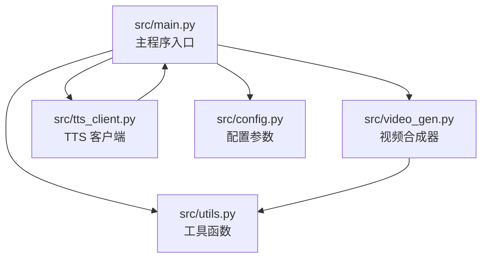
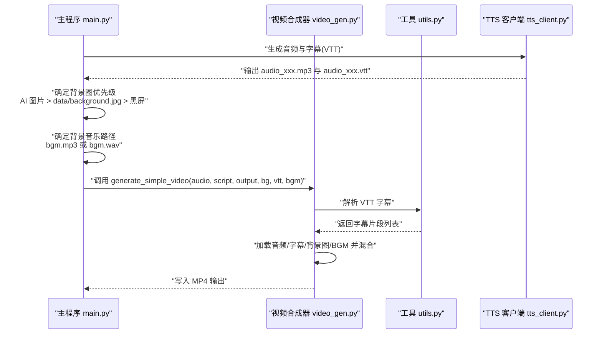
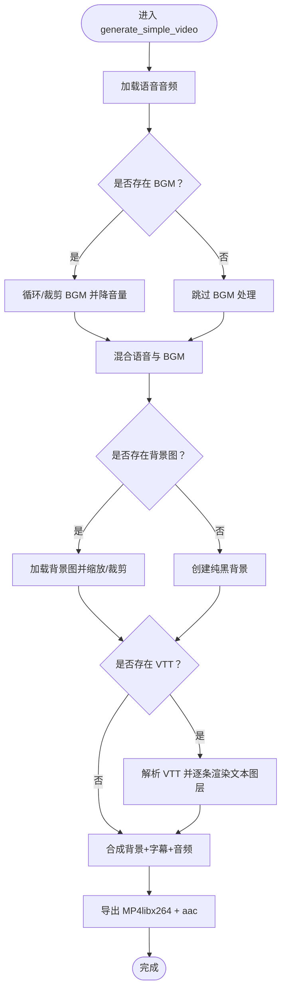
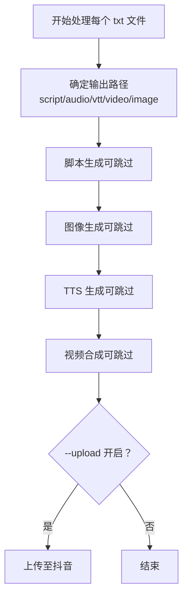
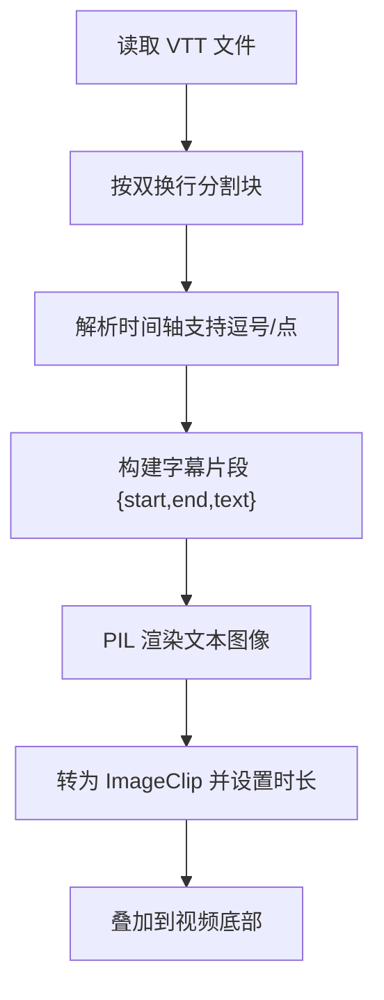
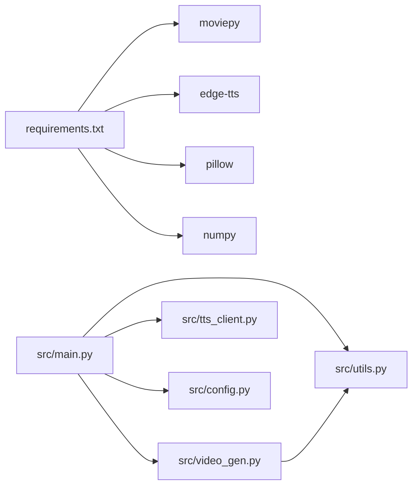

# 视频合成

<cite>
**本文引用的文件列表**
- [src/main.py](file://src/main.py)
- [src/video_gen.py](file://src/video_gen.py)
- [src/utils.py](file://src/utils.py)
- [src/tts_client.py](file://src/tts_client.py)
- [src/config.py](file://src/config.py)
- [README.md](file://README.md)
- [requirements.txt](file://requirements.txt)
</cite>

## 目录
1. [引言](#引言)
2. [项目结构](#项目结构)
3. [核心组件](#核心组件)
4. [架构总览](#架构总览)
5. [详细组件分析](#详细组件分析)
6. [依赖关系分析](#依赖关系分析)
7. [性能考虑](#性能考虑)
8. [故障排查指南](#故障排查指南)
9. [结论](#结论)
10. [附录](#附录)

## 引言
本文件系统性阐述使用 MoviePy 进行自动化视频合成的技术细节，重点围绕以下目标：
- 解释 video_gen.py 中 generate_simple_video 如何整合多个媒体元素：加载 MP3 音频轨道、解析 VTT 字幕并渲染为视频叠加层、设置背景图优先级（AI 生成图 > data/background.jpg > 黑屏）、以及混合背景音乐（bgm.mp3/wav）的音量控制。
- 说明 1080x1920 竖屏布局的设计考量以适配抖音移动端播放。
- 描述 main.py 中如何根据 --skip-video 参数决定是否跳过渲染过程，并处理文件路径依赖关系。
- 提供性能优化建议（如预渲染字幕轨道以减少计算开销）。
- 结合代码示例说明视频合成失败的常见原因（如编解码器缺失、资源占用）及解决方案。

## 项目结构
该项目采用模块化设计，核心流程由主程序驱动，各子模块负责特定阶段的任务。视频合成位于 video_gen.py，主流程在 main.py，字幕解析在 utils.py，TTS 生成在 tts_client.py，配置在 config.py，README 提供使用说明。

图表来源
- [src/main.py](file://src/main.py#L1-L262)
- [src/video_gen.py](file://src/video_gen.py#L1-L162)
- [src/utils.py](file://src/utils.py#L1-L72)
- [src/tts_client.py](file://src/tts_client.py#L1-L80)
- [src/config.py](file://src/config.py#L1-L93)

章节来源
- [src/main.py](file://src/main.py#L1-L262)
- [README.md](file://README.md#L1-L134)

## 核心组件
- 视频合成器 VideoGenerator：封装 MoviePy 的视频合成逻辑，支持背景图、字幕、BGM 的组合与导出。
- 主程序 main：负责扫描输入文件、按步骤生成脚本/图像/音频/字幕，再调用 VideoGenerator 合成视频；支持 --skip-* 参数跳过中间环节。
- 工具函数 utils：提供脚本清洗与 VTT 解析能力。
- TTS 客户端 tts_client：通过 edge-tts 生成 MP3 与 VTT 字幕。
- 配置 config：集中管理 LLM、图像生成、TTS 的参数。

章节来源
- [src/video_gen.py](file://src/video_gen.py#L1-L162)
- [src/main.py](file://src/main.py#L1-L262)
- [src/utils.py](file://src/utils.py#L1-L72)
- [src/tts_client.py](file://src/tts_client.py#L1-L80)
- [src/config.py](file://src/config.py#L1-L93)

## 架构总览
下图展示从主程序到视频合成的关键调用链与数据流。

图表来源
- [src/main.py](file://src/main.py#L200-L246)
- [src/video_gen.py](file://src/video_gen.py#L20-L101)
- [src/utils.py](file://src/utils.py#L24-L72)
- [src/tts_client.py](file://src/tts_client.py#L33-L70)

## 详细组件分析

### 视频合成器 VideoGenerator 与 generate_simple_video
- 初始化：设定输出尺寸为 1080x1920（竖屏），适配抖音移动端。
- 音频处理：
  - 加载语音音频（MP3）。
  - 若存在 BGM（mp3/wav），按视频时长循环或裁剪 BGM，并降低音量（约 10%）后与语音混合。
- 背景图策略：
  - 优先使用 AI 生成的图片；若不存在则回退到 data/background.jpg；若仍不存在则使用纯黑背景。
  - 背景图缩放至填充屏幕并居中裁剪到目标分辨率。
- 字幕渲染：
  - 解析 VTT，逐条生成文本图像（PIL），按时间区间叠加到底部约 20% 的位置。
  - 文本渲染使用 Windows 常用字体（如 msyh.ttc）或回退到系统默认字体。
- 合成与导出：
  - 将背景图、字幕片段与最终音频组合为视频，导出为 MP4（编码器：libx264；音频编码器：aac）。

图表来源
- [src/video_gen.py](file://src/video_gen.py#L20-L101)
- [src/utils.py](file://src/utils.py#L24-L72)

章节来源
- [src/video_gen.py](file://src/video_gen.py#L10-L162)
- [src/utils.py](file://src/utils.py#L1-L72)

### 主程序 main 的路径决策与 --skip-video
- 路径选择：
  - 背景图优先级：AI 生成图片 > data/background.jpg > 黑屏。
  - 背景音乐：优先查找 data/bgm.mp3，不存在则查找 data/bgm.wav，均不存在则无 BGM。
- 跳过策略：
  - --skip-video：若 output/video_xxx.mp4 已存在则直接跳过合成，否则执行合成。
  - --skip-tts：若音频与字幕文件已存在则跳过生成。
  - --skip-image：若图片已存在则跳过生成。
  - --skip-llm：若脚本已存在则跳过生成。
- 上传前置条件：当 --upload 开启且存在视频文件时才尝试上传。

图表来源
- [src/main.py](file://src/main.py#L80-L260)

章节来源
- [src/main.py](file://src/main.py#L1-L262)
- [README.md](file://README.md#L41-L115)

### 字幕解析与文本渲染
- VTT 解析：按块解析时间轴与文本，转换为秒数，形成字幕片段列表。
- 文本渲染：使用 PIL 创建半透明背景的文本图像，按宽度换行，生成 ImageClip 并设置起止时间与位置。

图表来源
- [src/utils.py](file://src/utils.py#L24-L72)
- [src/video_gen.py](file://src/video_gen.py#L72-L90)

章节来源
- [src/utils.py](file://src/utils.py#L1-L72)
- [src/video_gen.py](file://src/video_gen.py#L70-L101)

### TTS 与字幕生成
- 使用 edge-tts 通过命令行生成 MP3 与 VTT，支持音色、语速、音量参数。
- 生成成功后，主程序据此进行视频合成。

章节来源
- [src/tts_client.py](file://src/tts_client.py#L1-L80)
- [src/main.py](file://src/main.py#L190-L207)

## 依赖关系分析
- 外部依赖：MoviePy（视频合成）、edge-tts（语音与字幕）、Pillow（PIL 文本渲染）、numpy（图像数组）。
- 内部依赖：main.py 依赖 video_gen.py、tts_client.py、utils.py、config.py；video_gen.py 依赖 utils.py。

图表来源
- [requirements.txt](file://requirements.txt#L1-L10)
- [src/main.py](file://src/main.py#L1-L60)
- [src/video_gen.py](file://src/video_gen.py#L1-L20)

章节来源
- [requirements.txt](file://requirements.txt#L1-L10)
- [src/main.py](file://src/main.py#L1-L60)
- [src/video_gen.py](file://src/video_gen.py#L1-L20)

## 性能考虑
- 预渲染字幕轨道：将 VTT 解析与文本图像生成提前到独立阶段，缓存中间产物，避免重复计算。
- 合理的背景图尺寸：尽量使用接近 1080x1920 的素材，减少缩放与裁剪开销。
- BGM 循环策略：优先使用 MoviePy 的循环效果或手动拼接，避免多次 I/O 与重复解码。
- 编码器选择：libx264 + aac 是通用方案，若硬件加速可用可考虑启用硬件编码以提升速度。
- 并发与断点：利用 --skip-* 参数实现断点续跑，减少重复生成成本。

## 故障排查指南
- 编解码器缺失
  - 症状：导出失败或报错。
  - 排查：确认系统已安装 ffmpeg（MoviePy 依赖），并确保 libx264 与 aac 编码器可用。
  - 参考路径：导出调用处与依赖声明。
- 字幕渲染异常
  - 症状：字幕不显示或错位。
  - 排查：检查 VTT 时间轴格式（支持逗号/点分隔）与文本块解析逻辑；确认字体路径存在或回退到默认字体。
- 背景音乐问题
  - 症状：BGM 时长不足或音量过大。
  - 排查：确认 bgm.mp3/wav 存在且时长覆盖视频；检查音量缩放比例。
- 资源占用与超时
  - 症状：渲染卡顿或内存溢出。
  - 排查：降低分辨率或帧率（如需要），关闭其他高负载应用，确保磁盘空间充足。
- TTS 失败
  - 症状：音频/字幕生成失败。
  - 排查：检查网络连通性与 edge-tts 安装状态；确认命令行参数正确。

章节来源
- [src/video_gen.py](file://src/video_gen.py#L30-L55)
- [src/utils.py](file://src/utils.py#L24-L72)
- [src/tts_client.py](file://src/tts_client.py#L33-L70)
- [README.md](file://README.md#L126-L134)

## 结论
本项目通过模块化设计与清晰的数据流，实现了从脚本到视频的自动化流水线。VideoGenerator 以 MoviePy 为核心，结合 TTS 与字幕解析，实现了稳定的视频合成能力。配合主程序的路径决策与跳过机制，可在保证质量的同时显著提升效率。针对常见问题与性能瓶颈，文档提供了可操作的排查与优化建议，便于在实际环境中落地。

## 附录
- 关键实现参考路径
  - 视频合成入口：[src/video_gen.py](file://src/video_gen.py#L20-L101)
  - 字幕解析：[src/utils.py](file://src/utils.py#L24-L72)
  - TTS 生成：[src/tts_client.py](file://src/tts_client.py#L33-L70)
  - 主流程与路径决策：[src/main.py](file://src/main.py#L200-L246)
  - 依赖声明：[requirements.txt](file://requirements.txt#L1-L10)