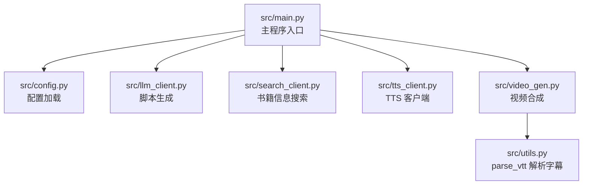
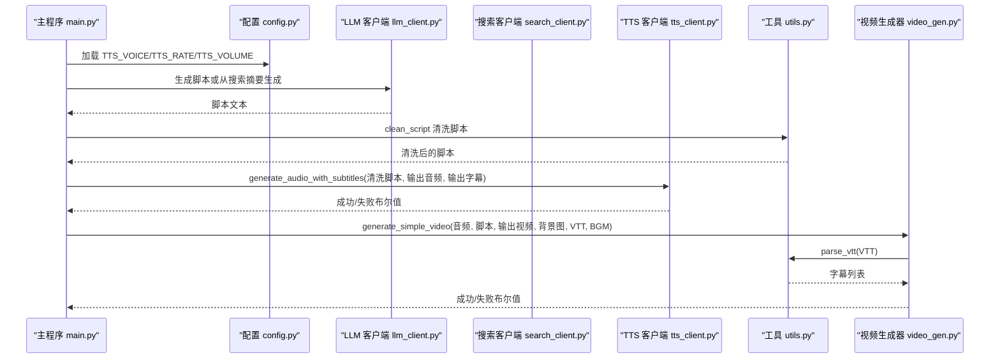
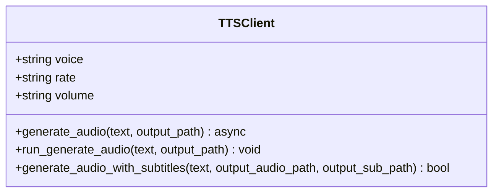
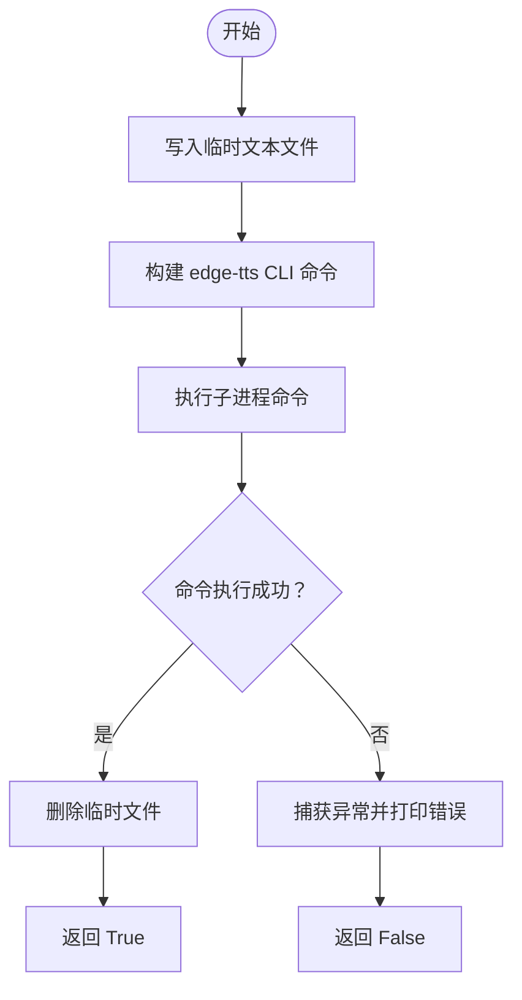
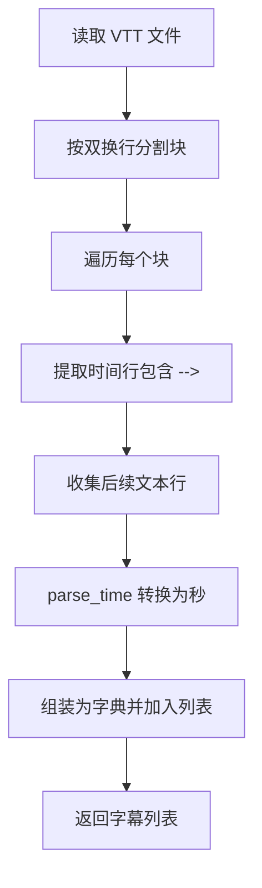
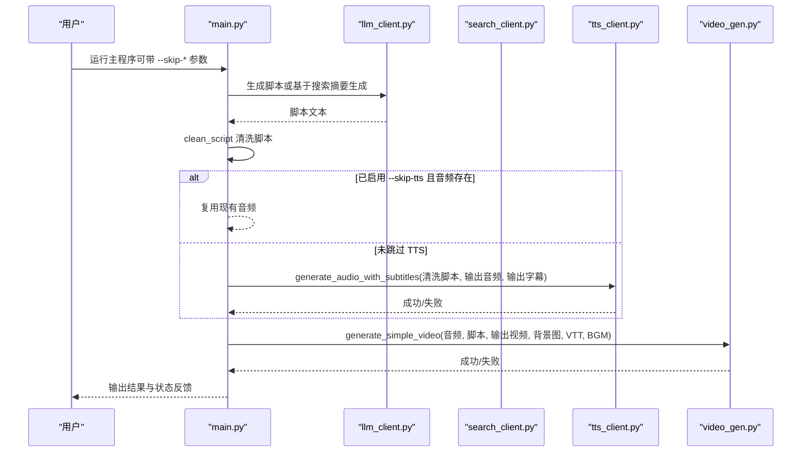
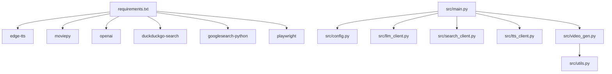

# 语音与字幕生成

<cite>
**本文引用的文件**
- [src/tts_client.py](file://src/tts_client.py)
- [src/main.py](file://src/main.py)
- [src/config.py](file://src/config.py)
- [src/utils.py](file://src/utils.py)
- [src/video_gen.py](file://src/video_gen.py)
- [src/llm_client.py](file://src/llm_client.py)
- [src/search_client.py](file://src/search_client.py)
- [README.md](file://README.md)
- [requirements.txt](file://requirements.txt)
</cite>

## 目录
1. [引言](#引言)
2. [项目结构](#项目结构)
3. [核心组件](#核心组件)
4. [架构总览](#架构总览)
5. [详细组件分析](#详细组件分析)
6. [依赖关系分析](#依赖关系分析)
7. [性能考量](#性能考量)
8. [故障排查指南](#故障排查指南)
9. [结论](#结论)
10. [附录](#附录)

## 引言
本文件围绕基于 Edge-TTS 的语音合成与字幕同步技术进行深入剖析，重点说明以下内容：
- tts_client.py 如何封装 edge-tts 库实现文本到语音的转换，包括音色（TTS_VOICE）、语速（TTS_RATE）和音量（TTS_VOLUME）的配置加载机制；
- generate_audio_with_subtitles 方法如何同时生成 MP3 音频文件和 VTT 字幕文件，并确保时间轴精确对齐；
- VTT 字幕格式在视频叠加中的作用以及 parse_vtt 工具函数如何解析时间码；
- 当音频生成失败时系统的容错处理流程；
- 命令行参数 --skip-tts 的实现原理，支持开发者在调试时复用已有音频文件；
- 结合 main.py 中的调用逻辑，展示从清洗脚本到生成 audio_<book_name>.mp3 和 audio_<book_name>.vtt 的完整数据流，包含异常捕获与状态反馈机制。

## 项目结构
该项目采用模块化设计，围绕“脚本生成 → 图像生成 → 语音与字幕 → 视频合成 → 上传”为主线的自动化流水线。其中与语音与字幕生成直接相关的模块包括：
- 配置模块：加载 TTS 音色、语速、音量等参数；
- TTS 客户端：封装 edge-tts 的异步与同步调用，支持生成带时间轴字幕的音频；
- 工具模块：清洗脚本、解析 VTT 时间码；
- 视频生成器：在合成视频时读取 VTT 并叠加字幕；
- 主程序：串联各模块，提供命令行参数控制跳过步骤与上传行为。

图表来源
- [src/main.py](file://src/main.py#L1-L262)
- [src/config.py](file://src/config.py#L1-L93)
- [src/tts_client.py](file://src/tts_client.py#L1-L80)
- [src/utils.py](file://src/utils.py#L1-L72)
- [src/video_gen.py](file://src/video_gen.py#L1-L162)
- [src/llm_client.py](file://src/llm_client.py#L1-L60)
- [src/search_client.py](file://src/search_client.py#L1-L113)

章节来源
- [src/main.py](file://src/main.py#L1-L262)
- [README.md](file://README.md#L1-L134)

## 核心组件
- 配置模块（src/config.py）：集中管理 TTS 的音色、语速、音量等参数，供主程序与 TTS 客户端使用。
- TTS 客户端（src/tts_client.py）：封装 edge-tts 的异步与同步调用；提供 generate_audio_with_subtitles 方法，借助 edge-tts CLI 生成 MP3 与 VTT，并返回布尔结果用于上层流程控制。
- 工具模块（src/utils.py）：clean_script 用于清洗 LLM 输出的脚本，parse_vtt 用于解析 VTT 时间轴，parse_time 将时间字符串转换为秒数。
- 视频生成器（src/video_gen.py）：在合成视频时读取 VTT，将字幕按时间轴叠加到画面底部区域。

章节来源
- [src/config.py](file://src/config.py#L1-L93)
- [src/tts_client.py](file://src/tts_client.py#L1-L80)
- [src/utils.py](file://src/utils.py#L1-L72)
- [src/video_gen.py](file://src/video_gen.py#L1-L162)

## 架构总览
下图展示了从主程序到 TTS、再到视频合成的整体调用链路，以及 VTT 在视频叠加中的位置。

图表来源
- [src/main.py](file://src/main.py#L1-L262)
- [src/config.py](file://src/config.py#L1-L93)
- [src/llm_client.py](file://src/llm_client.py#L1-L60)
- [src/search_client.py](file://src/search_client.py#L1-L113)
- [src/tts_client.py](file://src/tts_client.py#L1-L80)
- [src/utils.py](file://src/utils.py#L1-L72)
- [src/video_gen.py](file://src/video_gen.py#L1-L162)

## 详细组件分析

### TTS 客户端与配置加载
- 配置加载机制
  - 音色（TTS_VOICE）、语速（TTS_RATE）、音量（TTS_VOLUME）由配置模块集中定义，默认值来自环境变量加载后的全局常量。
  - 主程序在初始化 TTS 客户端时，将上述参数注入构造函数，从而在生成音频时生效。
- 文本到语音的两种方式
  - 异步生成：通过 edge_tts.Communicate 创建任务并保存为 MP3 文件。
  - CLI 生成：通过 subprocess 调用 edge-tts CLI，同时写入媒体文件与字幕文件，便于获得与语音严格对齐的时间轴。
- 容错处理
  - CLI 调用使用 subprocess.run 并设置 check=True，捕获 CalledProcessError 并打印错误信息，返回 False 表示失败；成功时清理临时文本文件。

图表来源
- [src/tts_client.py](file://src/tts_client.py#L1-L80)

章节来源
- [src/config.py](file://src/config.py#L1-L93)
- [src/tts_client.py](file://src/tts_client.py#L1-L80)

### generate_audio_with_subtitles 的工作流与时间轴对齐
- 生成流程
  - 将清洗后的脚本写入临时文本文件；
  - 构建 edge-tts CLI 命令，传入 voice、rate、volume、write-media、write-subtitles 等参数；
  - 执行命令并捕获异常，返回布尔值表示成功与否；
  - 成功后删除临时文件。
- 时间轴对齐
  - 由于使用 edge-tts CLI 的 write-subtitles 功能，生成的 VTT 字幕与音频严格对齐，保证视频合成阶段的字幕时间戳准确。

图表来源
- [src/tts_client.py](file://src/tts_client.py#L1-L80)

章节来源
- [src/tts_client.py](file://src/tts_client.py#L1-L80)

### VTT 字幕格式与 parse_vtt 解析
- VTT 在视频叠加中的作用
  - 视频生成器在合成阶段读取 VTT，将每条字幕按其起止时间映射到画面底部区域，形成逐字出现的字幕效果。
- parse_vtt 的解析逻辑
  - 读取 VTT 文件全文，按双换行分割为字幕块；
  - 遍历块内行，识别时间行（包含 “-->”），提取起止时间字符串；
  - 使用 parse_time 将时间字符串标准化为秒数（支持逗号与点号差异）；
  - 将每条字幕组装为字典列表，包含 start、end、text 三项。

图表来源
- [src/utils.py](file://src/utils.py#L1-L72)
- [src/video_gen.py](file://src/video_gen.py#L1-L162)

章节来源
- [src/utils.py](file://src/utils.py#L1-L72)
- [src/video_gen.py](file://src/video_gen.py#L1-L162)

### 主程序调用链与数据流
- 数据流概览
  - 主程序扫描 data/ 目录下的 .txt 文件，依次处理每个书籍文本；
  - 通过 LLM 生成脚本，或在文本过短时通过搜索客户端联网获取书籍信息后再生成脚本；
  - 使用 clean_script 清洗脚本，随后调用 TTS 客户端生成音频与字幕；
  - 若启用 --skip-tts 且已有音频文件，则直接复用音频；
  - 视频合成阶段读取 VTT 并叠加字幕，最终可选择上传至抖音。
- 异常捕获与状态反馈
  - 初始化客户端失败时打印错误并退出；
  - LLM 生成脚本失败时跳过该文件；
  - TTS 生成失败时记录失败并标记音频不存在；
  - 视频合成失败时记录失败并标记视频不存在；
  - 上传阶段仅在视频存在时执行。

图表来源
- [src/main.py](file://src/main.py#L1-L262)
- [src/llm_client.py](file://src/llm_client.py#L1-L60)
- [src/search_client.py](file://src/search_client.py#L1-L113)
- [src/tts_client.py](file://src/tts_client.py#L1-L80)
- [src/video_gen.py](file://src/video_gen.py#L1-L162)

章节来源
- [src/main.py](file://src/main.py#L1-L262)

### 命令行参数 --skip-tts 的实现原理
- 参数行为
  - 当启用 --skip-tts 且输出目录中已存在对应音频文件时，主程序跳过 TTS 步骤，直接复用现有音频；
  - 若音频不存在，则仍会执行 TTS 生成。
- 与调试的关系
  - 开发者可在多次调试中保留已生成的音频文件，避免重复调用 TTS，提升开发效率。

章节来源
- [src/main.py](file://src/main.py#L1-L262)

## 依赖关系分析
- 外部依赖
  - edge-tts：用于语音合成与字幕生成；
  - moviepy：用于视频合成；
  - openai：用于调用大模型生成脚本；
  - duckduckgo-search、googlesearch-python：用于联网搜索书籍信息；
  - playwright：用于抖音上传（非本次主题，但与整体流程相关）。
- 模块间耦合
  - main.py 依赖 config.py 提供 TTS 参数，依赖 utils.py 提供脚本清洗与 VTT 解析；
  - tts_client.py 依赖 edge-tts CLI 与 subprocess；
  - video_gen.py 依赖 utils.py 的 parse_vtt；
  - llm_client.py 依赖 openai；
  - search_client.py 依赖 duckduckgo-search 与 googlesearch-python。

图表来源
- [requirements.txt](file://requirements.txt#L1-L10)
- [src/main.py](file://src/main.py#L1-L262)
- [src/config.py](file://src/config.py#L1-L93)
- [src/llm_client.py](file://src/llm_client.py#L1-L60)
- [src/search_client.py](file://src/search_client.py#L1-L113)
- [src/tts_client.py](file://src/tts_client.py#L1-L80)
- [src/video_gen.py](file://src/video_gen.py#L1-L162)
- [src/utils.py](file://src/utils.py#L1-L72)

章节来源
- [requirements.txt](file://requirements.txt#L1-L10)

## 性能考量
- TTS 生成耗时
  - 使用 edge-tts CLI 通常比纯 Python 接口更快且更稳定，尤其在生成字幕时能保证时间轴对齐。
- 视频合成耗时
  - 视频渲染涉及音频混合、字幕叠加与画面合成，CPU/GPU 资源占用较高，建议在空闲时段运行或降低分辨率/帧率。
- 字幕解析与渲染
  - parse_vtt 与视频渲染均为顺序处理，复杂度与字幕条目数量近似线性关系；建议在脚本清洗阶段减少冗余段落，提高渲染效率。

## 故障排查指南
- TTS 生成失败
  - 检查网络连接与外网访问能力；
  - 确认 edge-tts CLI 可用且版本兼容；
  - 查看命令行输出的错误信息，定位具体失败原因。
- 字幕时间轴错位
  - 确保使用 generate_audio_with_subtitles 生成的 VTT；
  - 检查 parse_vtt 的时间字符串格式（支持逗号与点号）；
  - 确认视频合成时传入了正确的 VTT 路径。
- 视频合成失败
  - 检查音频与字幕文件是否存在；
  - 确认背景图与背景音乐路径正确；
  - 关注视频生成器的异常输出与回溯信息。
- 上传失败
  - 检查 cookies 文件是否存在且未过期；
  - 必要时重新运行登录脚本以刷新 cookies。

章节来源
- [README.md](file://README.md#L120-L134)
- [src/tts_client.py](file://src/tts_client.py#L1-L80)
- [src/video_gen.py](file://src/video_gen.py#L1-L162)

## 结论
本项目通过模块化设计实现了从脚本到视频的自动化流水线，其中 TTS 与字幕同步是关键环节。TTS 客户端通过配置加载与 edge-tts CLI 实现高质量的语音与字幕生成，并在主程序中以布尔返回值与文件存在性实现可靠的容错与跳过机制。视频生成器利用 parse_vtt 将字幕按时间轴精准叠加，最终形成完整的短视频内容。配合命令行参数 --skip-tts，开发者可以在调试阶段高效复用已有资源，显著提升迭代效率。

## 附录
- 相关文件路径与用途
  - src/tts_client.py：封装 edge-tts，提供音频与字幕生成方法；
  - src/main.py：主程序入口，串联各模块并处理命令行参数；
  - src/config.py：集中管理 TTS 配置参数；
  - src/utils.py：脚本清洗与 VTT 解析；
  - src/video_gen.py：视频合成与字幕叠加；
  - src/llm_client.py：脚本生成与绘画提示词生成；
  - src/search_client.py：书籍信息联网搜索；
  - README.md：使用说明与流程说明；
  - requirements.txt：外部依赖清单。