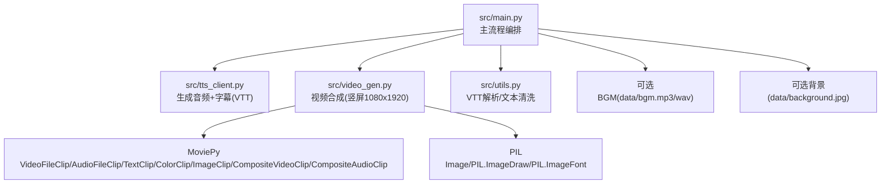
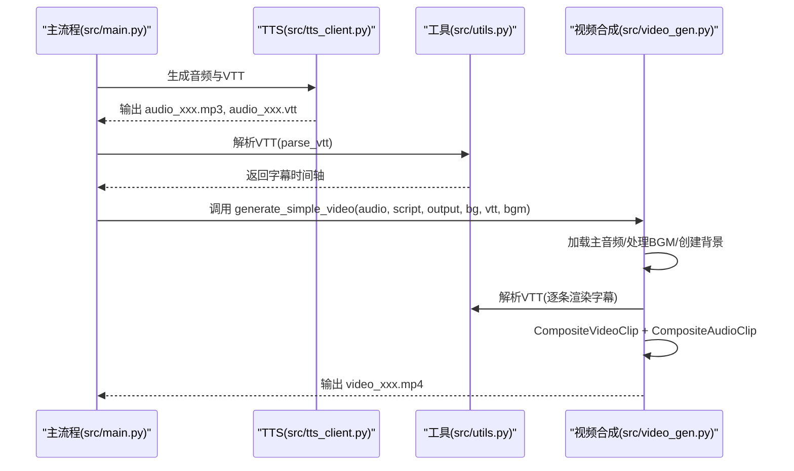
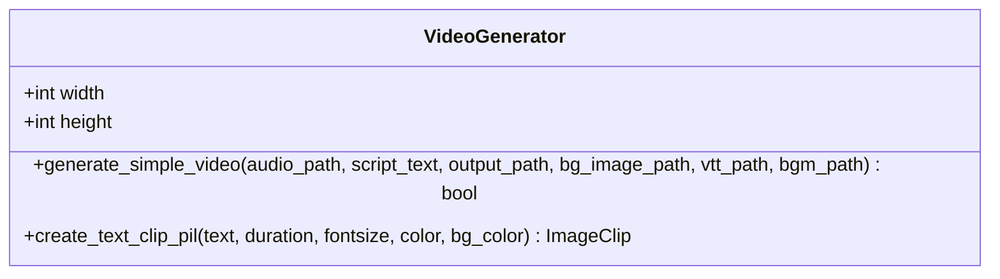
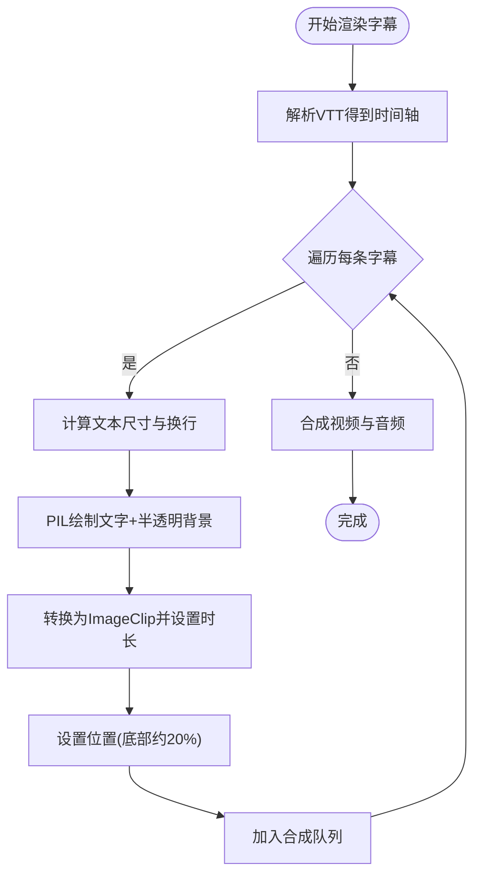
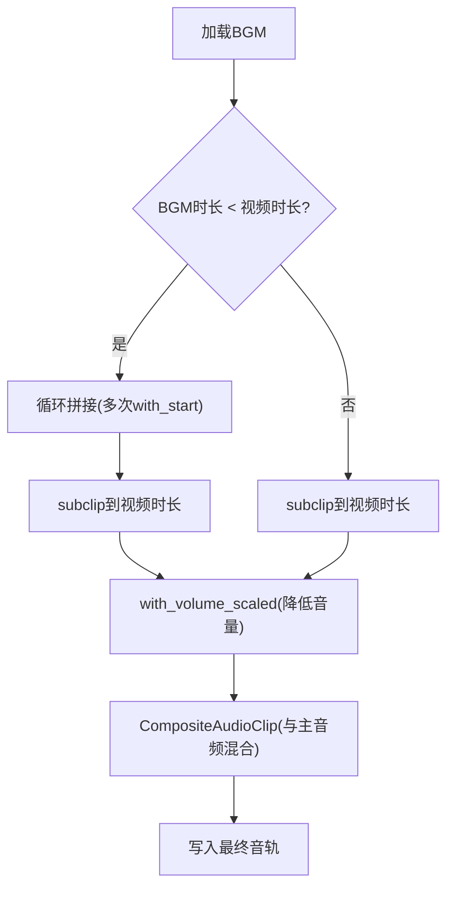
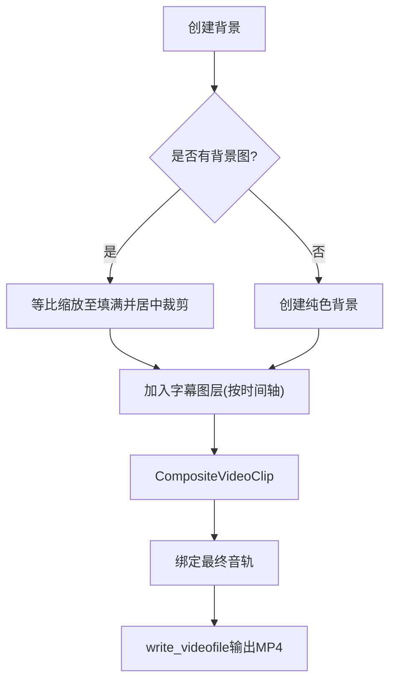
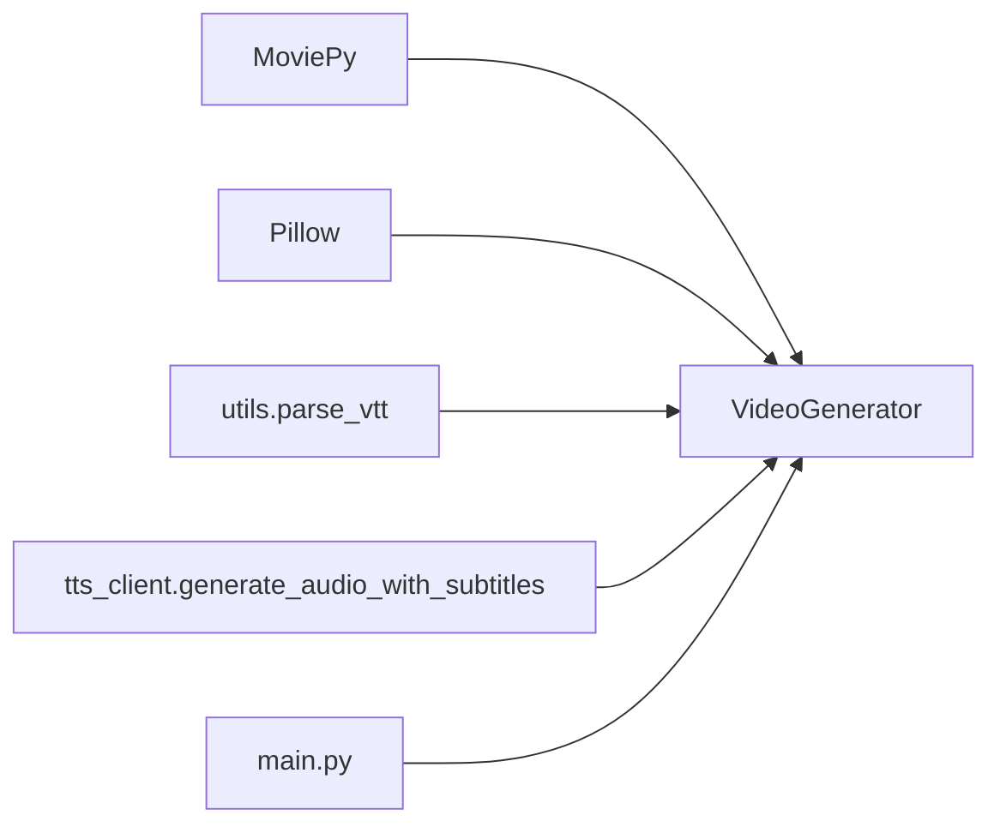

# 视频合成模块

<cite>
**本文引用的文件列表**
- [src/video_gen.py](file://src/video_gen.py)
- [src/utils.py](file://src/utils.py)
- [src/main.py](file://src/main.py)
- [src/tts_client.py](file://src/tts_client.py)
- [requirements.txt](file://requirements.txt)
- [README.md](file://README.md)
</cite>

## 目录
1. [引言](#引言)
2. [项目结构](#项目结构)
3. [核心组件](#核心组件)
4. [架构总览](#架构总览)
5. [详细组件分析](#详细组件分析)
6. [依赖关系分析](#依赖关系分析)
7. [性能考量](#性能考量)
8. [故障排查指南](#故障排查指南)
9. [结论](#结论)
10. [附录](#附录)

## 引言
本文件聚焦于视频合成模块的实现，核心为 src/video_gen.py。该模块基于 MoviePy 库，将多路媒体元素（TTS 音频、VTT 字幕、AI 生成图片或默认背景、可选 BGM）合成为最终的 MP4 视频。文档将详细说明竖屏视频（1080x1920）的构建流程，涵盖视频剪辑的创建、叠加（CompositeVideoClip）以及音轨混合；解释字幕渲染方式（字体、颜色、位置与样式，含关键词高亮思路）；讨论 BGM 的淡入淡出处理与主音频的音量平衡；并引用 src/utils.py 中的 VTT 解析与文本处理辅助函数。同时提供性能优化建议，如 write_videofile 的参数选择以平衡质量与速度。

## 项目结构
视频合成模块位于 src/video_gen.py，负责将上一步生成的音频、字幕、背景图片与背景音乐整合为最终视频。主流程由 src/main.py 调用，TTS 侧由 src/tts_client.py 提供音频与字幕（VTT），字幕解析由 src/utils.py 提供。

图表来源
- [src/main.py](file://src/main.py#L1-L262)
- [src/tts_client.py](file://src/tts_client.py#L1-L80)
- [src/video_gen.py](file://src/video_gen.py#L1-L162)
- [src/utils.py](file://src/utils.py#L1-L72)

章节来源
- [src/main.py](file://src/main.py#L1-L262)
- [README.md](file://README.md#L1-L134)

## 核心组件
- VideoGenerator 类：封装视频合成的完整流程，支持可选背景音乐、字幕与背景图片，输出竖屏 MP4。
- create_text_clip_pil 方法：基于 PIL 生成带半透明背景的文字图像，适配 MoviePy 的 ImageClip。
- generate_simple_video 方法：主流程，负责加载音频、处理 BGM、创建背景、渲染字幕、合成视频并写入文件。

章节来源
- [src/video_gen.py](file://src/video_gen.py#L1-L162)

## 架构总览
视频合成的整体数据流如下：主流程从 data/ 读取可选背景与 BGM，从 output/ 读取音频与字幕，调用 VideoGenerator 生成最终 MP4。字幕通过 VTT 解析得到时间轴，逐条渲染为文字图层并叠加到背景上；BGM 与主音频混合，调整音量后与视频合成。

图表来源
- [src/main.py](file://src/main.py#L190-L239)
- [src/tts_client.py](file://src/tts_client.py#L33-L70)
- [src/utils.py](file://src/utils.py#L24-L72)
- [src/video_gen.py](file://src/video_gen.py#L20-L101)

## 详细组件分析

### VideoGenerator 类
- 初始化：设置输出分辨率（默认竖屏 1080x1920）。
- generate_simple_video：
  - 加载主音频，确定时长。
  - 处理 BGM：若存在且时长短于视频则循环拼接，超过则截断；降低音量后与主音频混合。
  - 创建背景：优先使用提供的背景图片（等比缩放至填充屏幕并居中裁剪），否则使用纯色背景。
  - 渲染字幕：解析 VTT，逐条生成文字图层，设置起止时间与位置（底部约 20% 处），加入合成队列。
  - 合成：CompositeVideoClip + with_audio + with_duration，写入 MP4。
- create_text_clip_pil：
  - 使用 PIL 绘制文字，支持中文字体回退与自动换行，生成半透明背景，返回 ImageClip。

图表来源
- [src/video_gen.py](file://src/video_gen.py#L10-L158)

章节来源
- [src/video_gen.py](file://src/video_gen.py#L10-L158)

### 字幕渲染与样式
- 字幕来源：VTT 文件，由 TTS 侧生成，主流程调用 utils.parse_vtt 解析。
- 渲染策略：
  - 文字绘制：使用 PIL，支持字体路径与回退；按宽度自动换行，计算行高与整体高度。
  - 背景：半透明矩形背景，提升可读性。
  - 位置：相对坐标（中心横向，纵向约 80% 屏幕高度），贴合竖屏底部区域。
  - 时间轴：逐条字幕按 start/end 映射到视频时间轴，确保不超过音频时长。
- 样式与高亮：当前实现为统一字体、颜色与背景；如需关键词高亮，可在生成文字图层前对文本进行标记与拆分，分别绘制不同颜色的文本片段，再合并为同一图层。

图表来源
- [src/utils.py](file://src/utils.py#L24-L72)
- [src/video_gen.py](file://src/video_gen.py#L69-L91)
- [src/video_gen.py](file://src/video_gen.py#L103-L158)

章节来源
- [src/utils.py](file://src/utils.py#L24-L72)
- [src/video_gen.py](file://src/video_gen.py#L69-L91)
- [src/video_gen.py](file://src/video_gen.py#L103-L158)

### BGM 处理与音量平衡
- 循环与截断：当 BGM 时长小于视频时，通过多次 with_start 拼接后 subclip 截取到视频时长；否则直接 subclip 截断。
- 音量控制：将 BGM 音量缩放到较低比例，避免盖过主语音。
- 混音：使用 CompositeAudioClip 将主音频与 BGM 合并，形成最终音轨。

图表来源
- [src/video_gen.py](file://src/video_gen.py#L29-L55)

章节来源
- [src/video_gen.py](file://src/video_gen.py#L29-L55)

### 背景与字幕叠加
- 背景创建：优先使用提供的背景图片，按高度拉伸至至少填满高度，再按宽度拉伸至至少填满宽度，最后以中心裁剪为 1080x1920；否则使用纯色背景。
- 字幕叠加：将背景与字幕图层加入合成队列，使用 CompositeVideoClip 合成；最终视频绑定音频后写入文件。

图表来源
- [src/video_gen.py](file://src/video_gen.py#L56-L95)

章节来源
- [src/video_gen.py](file://src/video_gen.py#L56-L95)

## 依赖关系分析
- 外部库依赖：MoviePy（视频/音频剪辑与合成）、Pillow（图像绘制与字体）。
- 内部依赖：src/utils.py 的 parse_vtt 用于字幕解析；src/main.py 负责编排与参数传递；src/tts_client.py 生成音频与字幕。

图表来源
- [requirements.txt](file://requirements.txt#L1-L10)
- [src/video_gen.py](file://src/video_gen.py#L1-L10)
- [src/utils.py](file://src/utils.py#L24-L72)
- [src/tts_client.py](file://src/tts_client.py#L33-L70)
- [src/main.py](file://src/main.py#L190-L239)

章节来源
- [requirements.txt](file://requirements.txt#L1-L10)
- [src/video_gen.py](file://src/video_gen.py#L1-L10)
- [src/utils.py](file://src/utils.py#L24-L72)
- [src/tts_client.py](file://src/tts_client.py#L33-L70)
- [src/main.py](file://src/main.py#L190-L239)

## 性能考量
- 编码器与帧率：write_videofile 使用 libx264 与 AAC，帧率 24fps；该组合兼顾质量与兼容性。
- 质量与速度权衡：
  - 预设参数已较为均衡；如需更快速度，可考虑降低编码复杂度或使用更高效的预设（需评估质量影响）。
  - 字幕渲染使用 PIL，建议在长文本时减少换行与字号，或采用更高分辨率的字体缓存以减少重复测量。
  - BGM 循环拼接与 subclip 操作在长视频上会产生额外开销，建议尽量使用接近时长的 BGM 或提前裁剪。
- 并发与资源：MoviePy 渲染占用 CPU/GPU，建议在空闲时段运行或减少同时任务数量。

章节来源
- [src/video_gen.py](file://src/video_gen.py#L93-L95)
- [README.md](file://README.md#L120-L134)

## 故障排查指南
- 字幕不显示：
  - 检查 VTT 文件是否存在且格式正确；确认 parse_vtt 能正常解析。
  - 确认字幕时间轴未超出音频时长，且起止时间有效。
- 字体缺失：
  - 当系统字体不可用时，代码会回退到默认字体；建议提前准备可用字体路径或确保系统字体存在。
- BGM 未生效：
  - 确认 bgm.mp3/wav 路径存在且可读；检查音量缩放与混音逻辑是否执行。
- 背景图片尺寸异常：
  - 确保图片能被正确缩放与裁剪；若图片过小，需先放大至至少填满宽或高后再裁剪。
- 写入失败：
  - 检查输出路径权限与磁盘空间；确认 MoviePy 与 Pillow 已正确安装。

章节来源
- [src/utils.py](file://src/utils.py#L24-L72)
- [src/video_gen.py](file://src/video_gen.py#L29-L95)
- [requirements.txt](file://requirements.txt#L1-L10)

## 结论
视频合成模块通过清晰的职责划分与稳健的 MoviePy 接口，实现了从音频、字幕、背景到最终 MP4 的自动化合成。通过对字幕渲染、BGM 处理与音量平衡的细致设计，能够稳定产出竖屏竖版视频。配合主流程的参数控制与错误处理，整体具备良好的可维护性与可扩展性。未来可进一步引入字幕高亮、更丰富的样式与动画效果，以提升视觉表现力。

## 附录
- 关键实现参考路径：
  - 字幕解析：[src/utils.py](file://src/utils.py#L24-L72)
  - 视频合成主流程：[src/video_gen.py](file://src/video_gen.py#L20-L101)
  - 字幕渲染与叠加：[src/video_gen.py](file://src/video_gen.py#L69-L91)
  - BGM 循环与混音：[src/video_gen.py](file://src/video_gen.py#L29-L55)
  - 输出写入参数：[src/video_gen.py](file://src/video_gen.py#L93-L95)
  - 主流程编排与参数传递：[src/main.py](file://src/main.py#L190-L239)
  - TTS 生成音频与字幕：[src/tts_client.py](file://src/tts_client.py#L33-L70)