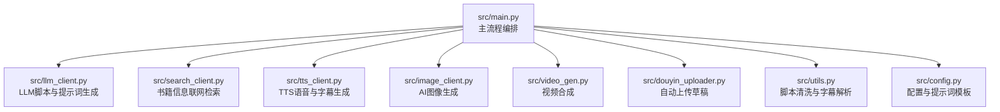
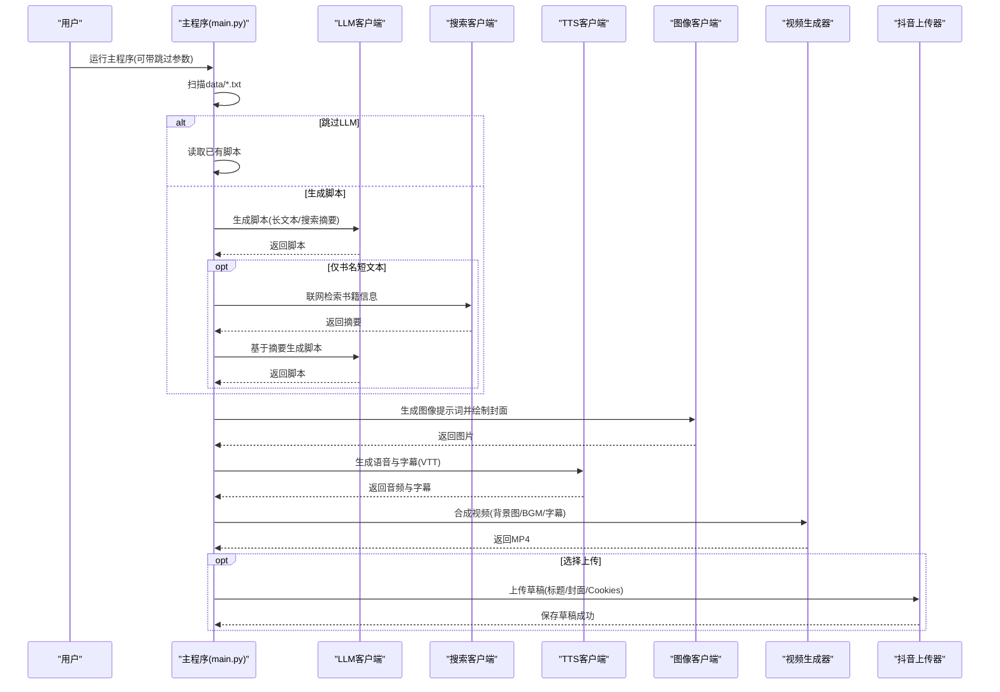
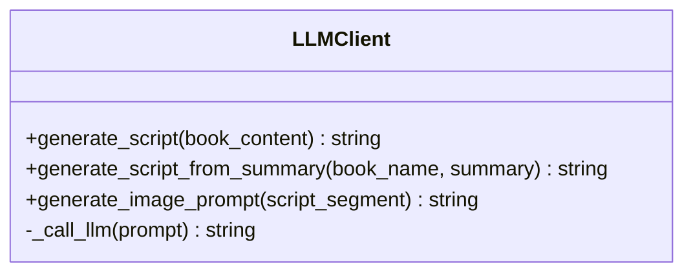
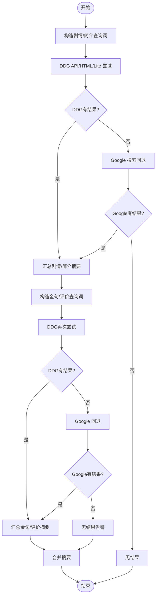
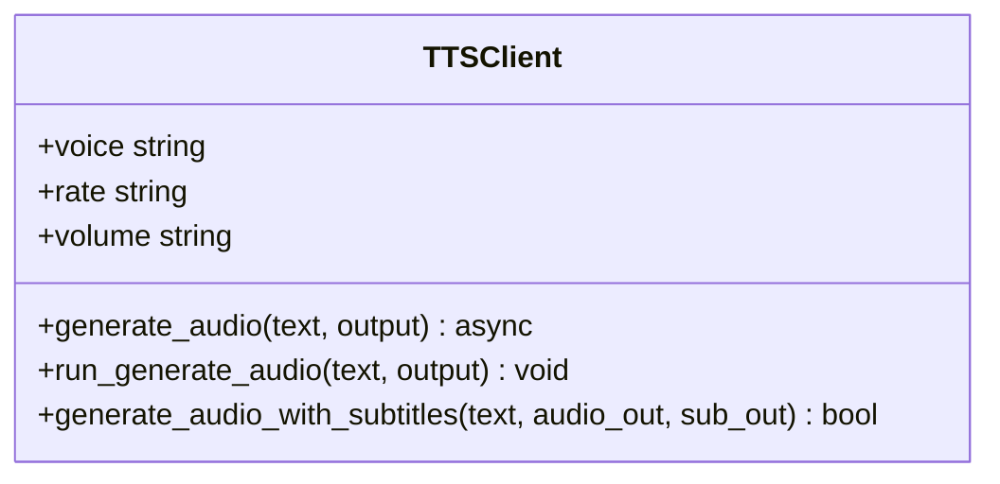
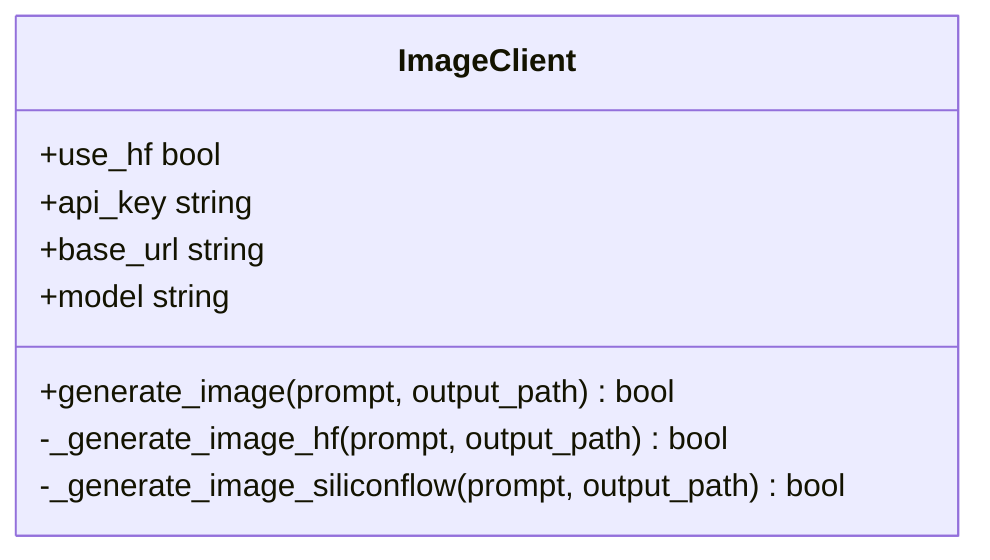
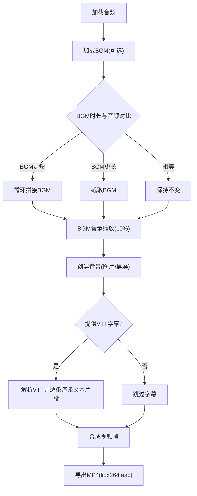
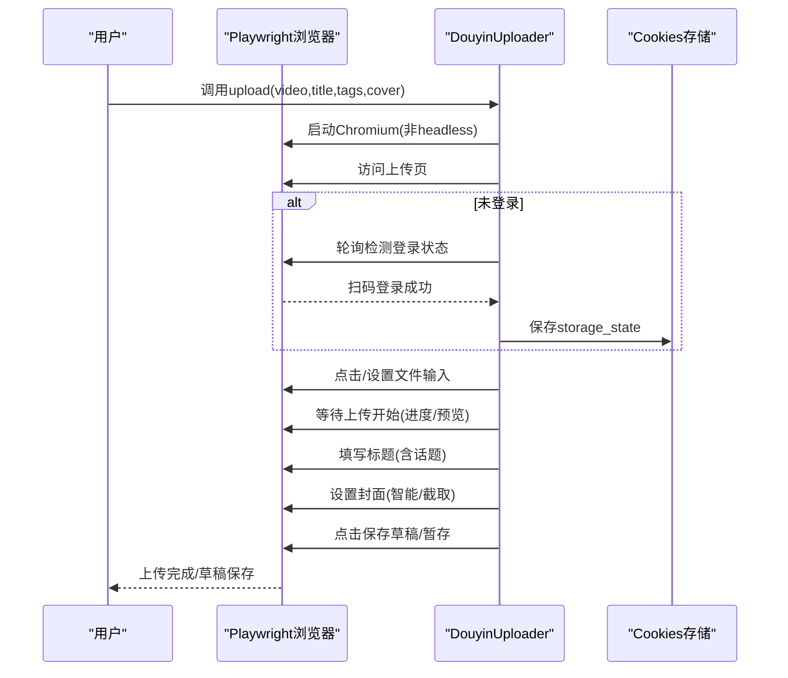
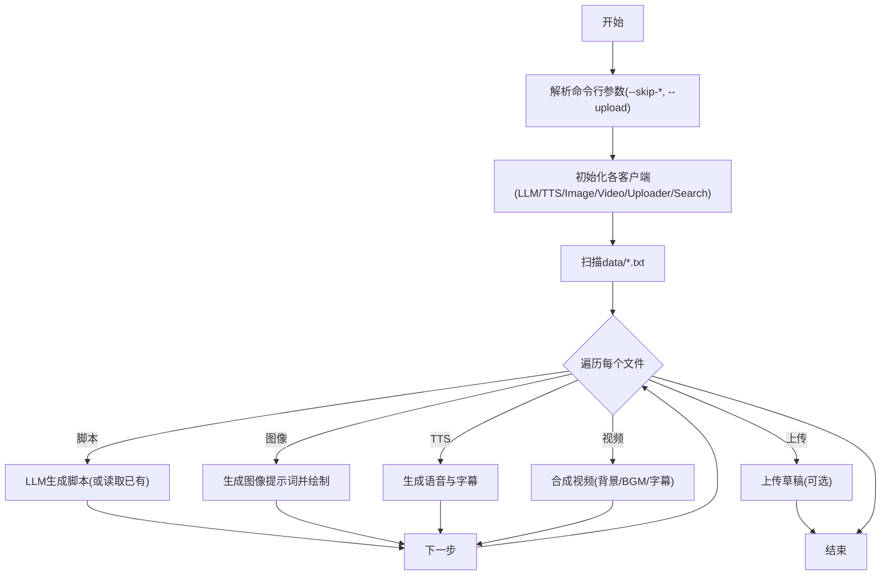
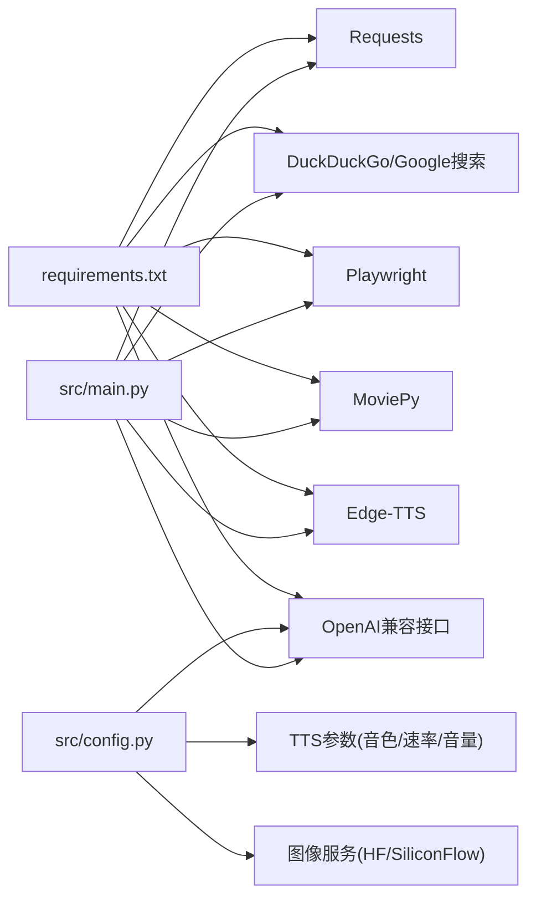

# 项目概述

<cite>
**本文引用的文件**
- [README.md](file://README.md)
- [PD.md](file://PD.md)
- [requirements.txt](file://requirements.txt)
- [src/main.py](file://src/main.py)
- [src/config.py](file://src/config.py)
- [src/utils.py](file://src/utils.py)
- [src/llm_client.py](file://src/llm_client.py)
- [src/tts_client.py](file://src/tts_client.py)
- [src/image_client.py](file://src/image_client.py)
- [src/video_gen.py](file://src/video_gen.py)
- [src/douyin_uploader.py](file://src/douyin_uploader.py)
- [src/search_client.py](file://src/search_client.py)
- [src/login_douyin.py](file://src/login_douyin.py)
</cite>

## 目录
1. [引言](#引言)
2. [项目结构](#项目结构)
3. [核心组件](#核心组件)
4. [架构总览](#架构总览)
5. [详细组件分析](#详细组件分析)
6. [依赖关系分析](#依赖关系分析)
7. [性能考量](#性能考量)
8. [故障排查指南](#故障排查指南)
9. [结论](#结论)
10. [附录](#附录)

## 引言
本项目是一个面向抖音平台的“智能Agent”，目标是将书籍内容自动化转化为适合短视频传播的视频内容。其核心价值在于：降低内容生产门槛、提升内容产出效率，帮助内容创作者与自媒体运营者快速批量生成高质量读书类短视频。项目采用模块化设计，围绕“LLM脚本生成、TTS语音与字幕、AI图像生成、视频合成、自动上传”五大环节构建端到端流水线。

- 目标用户：内容创作者、自媒体运营者
- 核心价值：高效、可定制、可扩展
- 技术选型：LLM（SiliconFlow + Qwen）、TTS（Edge-TTS）、图像（HuggingFace Inference 或 SiliconFlow）、视频合成（MoviePy）、上传（Playwright）

## 项目结构
项目采用“功能模块化 + 入口编排”的组织方式，入口文件负责串联各模块，配置文件集中管理API密钥与提示词，工具函数提供通用处理能力。

图表来源
- [src/main.py](file://src/main.py#L1-L262)
- [src/llm_client.py](file://src/llm_client.py#L1-L60)
- [src/search_client.py](file://src/search_client.py#L1-L113)
- [src/tts_client.py](file://src/tts_client.py#L1-L80)
- [src/image_client.py](file://src/image_client.py#L1-L132)
- [src/video_gen.py](file://src/video_gen.py#L1-L162)
- [src/douyin_uploader.py](file://src/douyin_uploader.py#L1-L380)
- [src/utils.py](file://src/utils.py#L1-L72)
- [src/config.py](file://src/config.py#L1-L93)

章节来源
- [README.md](file://README.md#L98-L134)
- [PD.md](file://PD.md#L65-L101)

## 核心组件
- LLM客户端：负责脚本生成、基于搜索摘要的脚本生成、图像提示词生成
- 搜索客户端：基于DDG与Google双引擎检索书籍信息，汇总为脚本生成输入
- TTS客户端：基于Edge-TTS生成语音与字幕（VTT），支持CLI参数控制音色/语速/音量
- 图像客户端：优先HuggingFace Inference，备选SiliconFlow，支持Stable Diffusion等模型
- 视频生成器：基于MoviePy合成视频，支持BGM混音、字幕渲染、背景图适配
- 抖音上传器：基于Playwright模拟浏览器扫码登录、保存Cookies、上传草稿
- 工具函数：脚本清洗（去除Markdown标记等）、VTT解析（时间轴转结构化）
- 配置与提示词：统一管理LLM、图像、TTS参数与提示词模板

章节来源
- [src/llm_client.py](file://src/llm_client.py#L1-L60)
- [src/search_client.py](file://src/search_client.py#L1-L113)
- [src/tts_client.py](file://src/tts_client.py#L1-L80)
- [src/image_client.py](file://src/image_client.py#L1-L132)
- [src/video_gen.py](file://src/video_gen.py#L1-L162)
- [src/douyin_uploader.py](file://src/douyin_uploader.py#L1-L380)
- [src/utils.py](file://src/utils.py#L1-L72)
- [src/config.py](file://src/config.py#L1-L93)

## 架构总览
整体架构遵循“入口编排 + 模块解耦”的设计，主流程按步骤推进，支持跳过中间步骤以实现断点续跑与调试。

图表来源
- [src/main.py](file://src/main.py#L1-L262)
- [src/llm_client.py](file://src/llm_client.py#L1-L60)
- [src/search_client.py](file://src/search_client.py#L1-L113)
- [src/tts_client.py](file://src/tts_client.py#L1-L80)
- [src/image_client.py](file://src/image_client.py#L1-L132)
- [src/video_gen.py](file://src/video_gen.py#L1-L162)
- [src/douyin_uploader.py](file://src/douyin_uploader.py#L1-L380)

## 详细组件分析

### LLM客户端（脚本与提示词生成）
- 职责：调用OpenAI兼容接口，生成口播脚本、基于摘要生成脚本、生成图像英文提示词
- 关键点：统一提示词模板、错误处理、模型与BaseURL可配置
- 复杂度：O(1)调用，受网络与模型响应影响

图表来源
- [src/llm_client.py](file://src/llm_client.py#L1-L60)
- [src/config.py](file://src/config.py#L1-L93)

章节来源
- [src/llm_client.py](file://src/llm_client.py#L1-L60)
- [src/config.py](file://src/config.py#L1-L93)

### 搜索客户端（书籍信息检索）
- 职责：聚合DDG与Google搜索结果，抽取摘要，形成统一格式供LLM使用
- 关键点：多后端回退、随机延时、异常兜底
- 复杂度：搜索调用次数与结果数量相关，受网络与服务可用性影响

图表来源
- [src/search_client.py](file://src/search_client.py#L1-L113)

章节来源
- [src/search_client.py](file://src/search_client.py#L1-L113)

### TTS客户端（语音与字幕）
- 职责：生成MP3语音与VTT字幕，支持CLI参数控制音色/速率/音量
- 关键点：异步生成封装、临时文件清理、错误捕获
- 复杂度：I/O密集，受网络与外部CLI可用性影响

图表来源
- [src/tts_client.py](file://src/tts_client.py#L1-L80)

章节来源
- [src/tts_client.py](file://src/tts_client.py#L1-L80)

### 图像客户端（AI图像生成）
- 职责：优先HuggingFace Inference，备选SiliconFlow，支持Stable Diffusion等模型
- 关键点：凭据切换、响应格式适配、错误打印与回退
- 复杂度：网络请求与模型推理，受服务可用性与速率限制影响

图表来源
- [src/image_client.py](file://src/image_client.py#L1-L132)
- [src/config.py](file://src/config.py#L1-L93)

章节来源
- [src/image_client.py](file://src/image_client.py#L1-L132)
- [src/config.py](file://src/config.py#L1-L93)

### 视频生成器（合成与渲染）
- 职责：加载音频、混合BGM、适配背景图、渲染字幕、导出MP4
- 关键点：BGM循环与音量缩放、字幕解析与定位、PIL文本渲染
- 复杂度：CPU/GPU密集，受素材大小与字幕数量影响

图表来源
- [src/video_gen.py](file://src/video_gen.py#L1-L162)
- [src/utils.py](file://src/utils.py#L1-L72)

章节来源
- [src/video_gen.py](file://src/video_gen.py#L1-L162)
- [src/utils.py](file://src/utils.py#L1-L72)

### 抖音上传器（自动上传草稿）
- 职责：扫码登录、保存Cookies、上传视频、填写标题与封面、保存草稿
- 关键点：Playwright浏览器自动化、登录状态轮询、文件选择与事件派发、草稿保存
- 复杂度：UI交互与网络请求，受平台前端变化影响

图表来源
- [src/douyin_uploader.py](file://src/douyin_uploader.py#L1-L380)

章节来源
- [src/douyin_uploader.py](file://src/douyin_uploader.py#L1-L380)

### 主流程编排（入口）
- 职责：扫描data/*.txt，按步骤执行，支持跳过与上传开关
- 关键点：断点续跑、路径拼接、输出文件命名、条件分支

图表来源
- [src/main.py](file://src/main.py#L1-L262)

章节来源
- [src/main.py](file://src/main.py#L1-L262)

## 依赖关系分析
- 外部依赖：OpenAI兼容接口、Edge-TTS、MoviePy、Requests、Playwright、DuckDuckGo/Google搜索
- 配置依赖：dotenv加载.env，LLM与图像服务凭据、模型与尺寸、TTS参数
- 模块内聚：各客户端职责单一，通过主流程编排解耦
- 潜在环路：无直接循环依赖，上传器依赖Playwright，其余模块相互独立

图表来源
- [requirements.txt](file://requirements.txt#L1-L10)
- [src/config.py](file://src/config.py#L1-L93)
- [src/main.py](file://src/main.py#L1-L262)

章节来源
- [requirements.txt](file://requirements.txt#L1-L10)
- [src/config.py](file://src/config.py#L1-L93)
- [src/main.py](file://src/main.py#L1-L262)

## 性能考量
- LLM调用：受网络与模型响应影响，建议合理设置温度与最大token，避免超长输入导致溢出
- TTS生成：Edge-TTS CLI稳定，注意网络连通性；字幕对齐依赖CLI输出，建议确保系统可用
- 图像生成：HF与SiliconFlow均有速率限制，建议在无凭据时使用HF公共路由或降低并发
- 视频合成：MoviePy渲染耗时较长，建议使用合适分辨率与字幕数量；BGM循环与音量缩放避免额外开销
- 自动上传：Playwright依赖浏览器与网络，建议在稳定环境下运行，Cookies持久化减少重复扫码

## 故障排查指南
- TTS生成失败：检查网络连通性与Edge-TTS可用性；确认CLI参数正确
- 视频合成缓慢：降低分辨率或字幕数量；确保GPU驱动正常
- 上传失败：确认Cookies有效且未过期；必要时重新扫码登录；检查上传页UI变化
- LLM初始化失败：检查.env中LLM_API_KEY与BaseURL配置；确保模型可用
- 图像生成失败：切换HF公共路由或更换模型；检查网络与凭据
- 搜索失败：切换搜索引擎后端；增加延时与重试；检查网络代理

章节来源
- [README.md](file://README.md#L126-L134)
- [src/tts_client.py](file://src/tts_client.py#L1-L80)
- [src/douyin_uploader.py](file://src/douyin_uploader.py#L1-L380)
- [src/llm_client.py](file://src/llm_client.py#L1-L60)
- [src/image_client.py](file://src/image_client.py#L1-L132)
- [src/search_client.py](file://src/search_client.py#L1-L113)

## 结论
本项目以模块化设计实现了从书籍文本到抖音短视频的自动化流水线，具备良好的扩展性与可维护性。通过LLM、TTS、AI图像生成与视频合成的协同，配合Playwright自动上传，满足内容创作者与自媒体运营者的高效生产需求。未来可在输入解析、脚本Agent优化、Web界面与一键发布等方面持续演进。

## 附录
- 环境准备与安装：参考README中的环境准备与安装步骤
- 使用指南：参考README中的使用指南与命令行参数
- 技术选型说明：参考PD.md中的技术架构规划与实际技术选型

章节来源
- [README.md](file://README.md#L16-L97)
- [PD.md](file://PD.md#L65-L101)